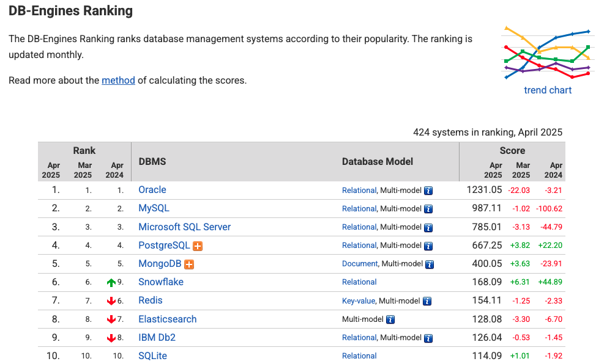

# 1주차

## 서론
DBMS간의 가장 중요한 차이는 두가지, 데이터를 어떻게 데이터를 저장하는지와 어떻게 분배하는지(distribute)지이다.
해당 두 내용이 각각 이번 책의 파트 1, 파트 2가 될 예정이다.
- 파트 1은 node-local processes 와 스토리지 엔진에 초점을 맞춘다. (단일 노드 시스템)
- 파트 2는 multiple node cluster 분산 시스템에 초점을 맞춘다. (다중 노드 클러스터, 분산 시스템)

> 단일 시스템과 분산 시스템의 차이?
> 1. 단일 노드 시스템
>     - 모든 프로세스와 데이터가 하나의 물리적 서버에서 실행
>     - 전체 데이터베이스가 단일 머신에서 관리되고, 모든 데이터가 단일 머신에 저장됨.
>     - 수직적 확장(Scale-up)가 용이, 데이터 일관성 유지가 비교적 간단함.
>     - 단일 서버 성능과 상태에 의존(단일 실패 지점 문제)
>     
> 2. 분산 시스템
>     - 여러 물리적 노드가 네트워크로 연결된 하나의 논리적 시스템
>     - 데이터가 여러 노드에 분산되어 저장되고 관리됨(샤딩, 레플리케이션)
>     - 고 가용성, 읽기 성능 향상, 수평적 확장이 용이함. 고가용성 제공
>     - 저장 공간 중복 & 복제 지연 발생 가능, 분산 트랜잭션 관리가 필요함
>     - 카산드라, DynamoDB, MongoDB 등 샤딩 클러스터 등이 있음

## Part I. Storage Engines (pp. 19 - 26) (8p)
DB는 여러 계층으로 구성되어 있다.
- 전송 계층 (요청, 응답 처리)
- 쿼리 프로세서 (쿼리 최적화)
- 실행 엔진 (쿼리 실행)
- 스토리지 엔진 (데이터 저장)

이 중에서 스토리지 엔진은 DBMS의 핵심 소프트웨어 구성 요소이며,
메모리와 디스크에서 데이터를 저장, 검색, 관리한다.

다양한 스토리지 엔진이 개발되고 사용되어 왔으며, 각각의 스토리지 엔진은 동작 방식에 따라 장단점을 가진다.
따라서 DBMS들은 다양한 스토리지 엔진을 상황에 맞게 선택할 수 있도록 제공하는 중이다.
ex) MySQL은 InnoDB, MyISAM, RocksDB를 선택 가능, 
    MongoDB는 WiredTiger, In-Memory, MMAPv1 선택 가능

### 데이터베이스 비교 (Comparing Databases)
**DB 선택은 장기적으로 시스템에 큰 영향을 끼칠 수 있다**
DB 마이그레이션은 쉽지 않으므로 (경우에 따라 어플리케이션 코드를 크게 변경해야할 가능성) 개발 초기에 DB를 잘 선택하는 것이 좋다. 
모든 DB는 장단점이 존재한다. 큰 비용이 들어가는 마이그레이션에 대한 위험을 줄이기 위해선 DB 선택 전에
해당 DBMS가 어플리케이션의 니즈를 충족할 수 있는지 확인하는 시간을 많이 투자하는 것이 좋다.

 

'전세계 DBMS 점유율 랭킹'과 같은 지표만 보면 성급한 결정을 내릴 수도 있다.
DB가 어떻게 동작하는지와 내부 구현에 대한 깊은 이해가 좋은 비교를 도와준다.

DB를 결정할때 가장 좋은 방법은 실행 계획을 다양한 디비에서 직접 시뮬레이션 해보고, 자료를 수집하고 비교해 보는것이다.
특히 성능과 확장성에 대한 문제는 시간이 지나고 복잡성이 증가한 뒤에야 나타나기 시작한다. 
잠재적인 문제를 감지하기 위해선 테스트를 길게 해보고 가능한 실제와 비슷한 환경으로 세팅해야한다.

[디비를 비교할때 신경쓰면 좋은 유스케이스들]
- 스키마와 레코드 사이즈
- 고객의 숫자
- 쿼리 타입과 접근 방식(key-based, index-based 등)
- 읽기 vs 쓰기 비율
- 위 내용들의 변경 가능성

또 다음 질문에 대답해보는 것도 좋다
- 데이터베이스가 필요한 쿼리를 지원하나요?
- 우리가 적재하길 원하는 양의 데이터를 다룰 수 있나요?
- 얼마나 많은 읽기, 쓰기 연산을 단일 노드에서 처리할 수 있어야 하나요?
- 앞으로 얼마나 많은 노드가 필요해질까요?
- 클러스터를 확장하는 방법이 뭔가요?

이런 대답에 질문해보고 테스트 클러스터를 생성해 시뮬레이션 해보자. 
대부분의 디비는 부하 테스트 도구를 제공한다. 
오히려 원하는 상황을 시뮬레이션 하기 위한 도구가 없다면 그건 위험 신호일 수 있다. 

> 부하 테스트시 신경쓸 것들
> 1. 준비
>     - 어플리케이션과 최대한 비슷한 상황 준비, 테이블을 실제 데이터로 채우기
>     - 메모리 요구사항도 맞추기 (데이터 10%라면, 메모리도 10%만 사용하도록 변경 등)
>     - 최종 디스크 위치에 오브젝트를 배치, 로그 파일 크기 조정 등
> 2. 테스트 작성
>     - 자주 실행되는 명령문 또는 Worst case SQL로 테스트
>     - 대량의 데이터 처리, 시간 제약 존재, 조인이 많은 명령 등
>     - 쿼리 경과 시간을 측정하는 신뢰성 있고 적절한 방법 필요
> 3. 테스트 실행 & 결과 분석
>     - 단일 테스트에는 동일한 값으로 반복 실행 후 평균 성능 구하기
>     - 준비 실행(첫번째 실행)은 버퍼 풀 초기화 등 시간이 보통 오래걸림 - 제외
>     - 테스트 종료 후에는 벤치마크 환경을 원래 상태로 복원하기

은탄환은 없다.
DBMS와 스토리지 엔진은 내부 구현 방식에 따라 장단점이 있으므로 잘 알아보고 결정해야 한다.

## Chapter 1. Introduction and Overview (10p)
DBMS 아키텍쳐에 대해 살펴보고, 시스템 구성요소와 역할에 대해 다룬다.
그리고 메모리,디스크 기반 DB의 차이, column vs row 기반 디비의 차이 등에 대해서 다룰 예정이다.
이는 DBMS의 전체 분류법을 다루는 것이 아니며 실제로는 더 많은 분류 방법이 있다.

예를 들면 다음과 같은 분류도 존재한다.
1. OLTP (Online transaction processing databases)
    - 많은 사용자 요청과 트랜잭션을 다룬다.
    - 쿼리는 종종 미리 정의되고 짧은 실행시간을 가진다.
2. OLAP (Online analytical processing databases)
    - 복잡한 어그리게이션을 다룬다.
    - 분석 , 데이터 웨어하우징(?) 에 사용된다.
    - 복잡하고 길게 실행되는 애드훅 쿼리
3. HTAP (Hibrid transactional and analytical processing)
    - 위의 둘을 결합한 데이터베이스

> 트랜잭션
>
> 여러 작업이 하나의 논리적 단위로 묶여 있는 것
> 트랜잭션을 지원하는 DB는 트랜잭션 단위로 디비에 결과가 반영된다.
> - 한 트랜잭션 내의 쿼리가 모두 성공적 -> 디비에 결과를 반영
> - 특정 시점에서 문제 발생 -> 해당 트랜잭션에서 진행했던 모든 결과 롤백

> ACID
>
> 트랜잭션의 특징
> 1. 원자성(Atomicity) : 트랜잭션은 원자적 작업 단위(전체 성공 or 전체 실패)
> 2. 일관성(Consistency) : 잘못된 디비 내용이 없다면, 트랜잭션 성공 → 결과도 반드시 잘못되지 않은 내용
> 3. 고립성(Isolation) : 여러 트랜잭션이 동시에 수행되도, 다른 작업의 영향을 받으면 안됨, 독립적이어야함
> 4. 지속성(Durability) : 트랜잭션 성공 → 결과는 영구적으로 반영되어야 함
        
> 애드훅 쿼리
>
> 사전에 계획되거나 정의되지 않은, 필요에 따라 즉석에서 생성하여 실행하는 일회성 데이터베이스 질의.
>     ex)
>     - 특정 지역의 지난 분기 매출을 분석하기 위한 일회성 쿼리
>     - 특정 기간 동안 로그인한 사용자 수를 확인하는 쿼리
>     - 비정상적인 데이터 패턴을 조사하기 위한 탐색 쿼리
>         
> 애드훅 쿼리는 데이터 분석, 문제 해결과 같은 다양한 상황에서 유용하게 활용됨.
> 데이터베이스 시스템이 이러한 예측 불가능한 쿼리를 얼마나 효율적으로 처리할 수 있는지가 중요한 성능 지표가 된다.

그 외에도 Key-value 저장소, 관계형 데이터베이스, 문서지향 저장소 (document-oriented stores), 그래프 디비 등이 있다. 
그러나 이 책에선 이러한 내용은 독자가 모두 알 것이라 이해하고 넘어 가며, 광범위하게 적용 가능한 개념들에 대해 논의할 예정이라 복잡하고 자세한 분류는 중요하지 않다.

### Ch 1-1. DBMS Architecture (pp. 29 - 32) (4p)
앞서 설명했듯이 디비 설계에 은탄환은 없다. 모든 DBMS는 다르게 구현된다.
그러나 다음 그림에서 나타날 구조는 대부분의 디비에서 공통적으로 나타난다.

1. **전송 계층 (Transport)**

   DBMS는 클라이언트/서버 모델을 사용하는데, 디비 인스턴스(노드)가 서버 역할을 하고, DB를 사용하는어플리케이션이 클라이언트 역할을 맡는다.
   전송 계층이 클라이언트 요청을 전달받는다. 이때 요청들은 대부분 쿼리 언어 형태로 들어온다. 
   또한 전송 계층은 또한 다른 데이터베이스 클러스터의 노드와의 통신 역할도 담당한다.

2. **쿼리 프로세서**

   전송 계층은 요청을 받은 후 쿼리를 쿼리 프로세서로 전달한다. 
   쿼리 프로세서는 쿼리를 해석하고, 검증한다. 액세스 컨트롤(접근 제어)은 쿼리 해석이 완벽하게 끝난 후에야 수행될 수 있으므로 나중에 수행된다. 

   이렇게 펄스된 쿼리는 쿼리 옵티마이저 (최적화 담당)로 전달된다. 
   옵티마이저는 먼저 불가능하거나 중복되는 쿼리를 제거하고, 쿼리를 가장 효율적으로 실행하는 방법을 찾는다. 
   내부 정보 (인덱스 차수, 근사 교집합 크기 등) 와 데이터의 저장 위치(어떤 노드가 데이터를 저장하고 있고, 그걸 교체하는데 드는 비용 등)을 고려한다. 
   옵티마이저는 쿼리 결정에 필요한 관계형 연산을 다루고, 그리고 인덱스 오더링, 차수 계산, 접근 명령어등을 선책하며 최적화한다.
   동일한 쿼리도 상황에 따라 효율이 달라지므로, 다른 실행계획을 반환할 수 있고, 가장 효율적인 계획을 반환한다.

> 근사 교집합 크기(approximate intersection size)란?
>
> 두 데이터 집합이 공유하는 요소의 수를 정확히 계산하지 않고 대략적으로 추정한 값을 의미.
> 이러한 근사치를 계산하기 위해 데이터베이스는 다양한 통계적 기법과 샘플링 방법을 사용함.
> 히스토그램, 블룸 필터(Bloom filter), 하이퍼로그로그(HyperLogLog) 같은 알고리즘을 활용하여 정확한 계산 없이도 합리적인 추정치를 얻음.
>
> JOIN 시에 교집합 크기(매칭되는 레코드 수)를 알면 최적화에 도움이 됨
> - 조인 알고리즘 선택:
>     - 교집합이 작을 경우(매칭 레코드가 적을 경우) → Nested Loop Join이 효율적
>     - 교집합이 클 경우 → Hash Join이나 Merge Join이 더 효율적
> - 조인 순서 결정:
>     - 여러 테이블을 조인할 때, 먼저 더 작은 결과셋을 생성하는 조인을 수행하면 전체 쿼리 성능이 향상
>     - 교집합 크기 추정을 통해 어떤 테이블 조합이 더 작은 중간 결과를 생성할지 예측 가능
> - 테이블 스캔 방법 선택:
>     - 교집합 크기에 따라 인덱스 스캔을 할지, 전체 테이블 스캔을 할지 결정
>     - 매칭되는 레코드가 적으면 인덱스 스캔이 유리하고, 많으면 전체 테이블 스캔이 더 효율적

3. **실행 엔진 (Execution Engine)**

   최적화된 쿼리는 보통 실행 계획의 형태로 표현된다.
   이러한 실행 계획이 실행 엔진에서 처리된다. 실행 엔진은 로컬 혹은 원격 실행 결과를 수집해 기록한다.
   이때 로컬 쿼리, 원격 쿼리를 구분하여 실행한다.

   로컬 쿼리들은 클라이언트에서 바로 오거나, 다른 노드에서 온 쿼리이며, 스토리지 엔진에서 실행된다
   원격 쿼리는 다른 클러스터, 레플리카의 노드 데이터의 읽기 와 쓰기를 포함하는 쿼리이다.

4. **스토리지 엔진 (Storage Engine)**

   스토리지 엔진은 다양한 구성 요소로 이루어져 있다.
   - 트랜잭션 매니저
     - 트랜잭션을 예약하고, 논리적으로 일관되지 않은 상태로 디비를 떠나지 않도록 관리 (일관성이 깨진 상태로 응답되지 않도록 인듯)
   - 락 매니저
     - 실행중인 디비 오브젝트에 대한 락을 관리해 동시 실행이 물리적 데이터 무결성을 위반하지 않도록 함
   - 액세스 메소드
     - 디스크의 데이터 접근과 organizing을 관리한다. 힙 파일들과 B-tree , LSM 트리 같은 스토리지 구조를 포함한다.
   - 버퍼 매니저
     - 메모리에 데이터 캐싱한다
   - 리커버리 매니저
     - 명령어 로그를 저장하고, 실패한 경우 시스템 상태를 복구한다.

   트랜잭션, 락 매니저는 동시성 제어를 함께 담당한다. 가능한 효율적으로 동시 실행 환경에서 논리적, 물리적 데이터 무결성을 보장한다.

## Ch 1-2. Memory- Versus Disk-Based DBMS (pp. 33 - 36) (4p)
보통 데이터는 디스크 혹은 메모리에 저장된다. 인 메모리 데이터베이스는 데이터를 메모리에 중심적으로 저장하고 디스크를 복구나 로깅 용도로만 사용한다. 
디스크 기반 디비는 대부분의 데이터를 디스크에 저장하고, 디스크 내용을 캐싱하는 임시 저장소 정도로 사용한다. 
두 유형 모두 디스크를 사용하지만 메모리 디비는 대부분의 내용을 램에 저장한다.

주요 데이터를 메모리에 저장하는 이유는 퍼포먼스, 낮은 접근 비용 등이다.
메모리에 접근하는 것은 디스크보다 몇배는 빠르지만, SSD, HDD가격보다 여전히 비싸다는 문제가 있다.

메모리 디비는 디스크 기반 디비와 용어, 기본 저장 매체 뿐 아니라, 사용하는 데이터 구조, 구성, 최적화 기술까지 다르다.
그리고 디스크에 저장하는것보다 프로그래밍도 간단하다.

인메모리 디비의 단점(성장을 제한하는 요인)은 램 변동성(내구성 부족)과 비용이다. 
램은 영구적이지 않고 데이터가 손실될 가능성이 충분히 존재한다. 무정전 전원 공급, 백업 램 등도 있지만, 추가적인 리소스와 운영 전문 지식이 필요함.
결국엔 디스크가 유지관리가 더 쉽고 가격이 훨씬 저렴하다.

### Durability in Memory-Based Stores
메모리 디비는 디스크에 백업을 유지하는 경우가 보통이지만 일부는 내구성을 보장하지 않는다. (이 경우는 책에선 안 다룸)

데이터베이스 작업이 완료되기 위해서는 그 결과가 순차적 로그 파일에 먼저 기록되어야 한다(쓰기 우선 로그/write-ahead log 방식). 
시스템 시작이나 충돌 후 모든 로그를 다시 재생하는 것을 피하기 위해, 인메모리 저장소들은 백업 복사본을 유지한다.
이 백업 복사본은 정렬된 디스크 기반 구조로 유지되며, 수정사항은 종종 비동기적으로(클라이언트 요청과 분리되어) 처리되고 I/O 작업 수를 줄이기 위해 일괄적으로 적용된다. 
복구 시에는 백업과 로그를 통해 데이터베이스 내용을 복원할 수 있다.

디스크 기반 디비는 보통 특수한 스토리지 구조를 사용한다. 메모리는 포인터와 무작위 액세스를 사용하므로 디스크보다 훨씬 빠르게 데이터 액세스가 가능하다.
또 메모리 기반 구조는 트리 형태 뿐 아니라 더 다양한 자료구조를 선택할 수 있고, 디스크에서 불가능하거나 구현하기 어려운 최적화를 수행 가능하다.
특히 가변 크기 데이터 처리는 디스크는 힘들지만, 메모리에선 포인터를 이용해 쉽게 가능

일부 유스케이스에선 전체 데이터 셋을 메모리에 올려놓고 사용하는 것이 충분히 효율적일 수 있다.
ex) 현실에서 물리적 제약이 있는 데이터 (학생 수, 온라인 상점 재고 등등) → 몇 kb 안됨