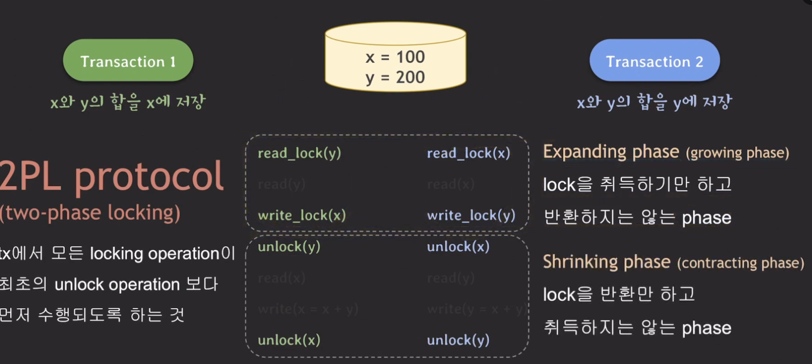
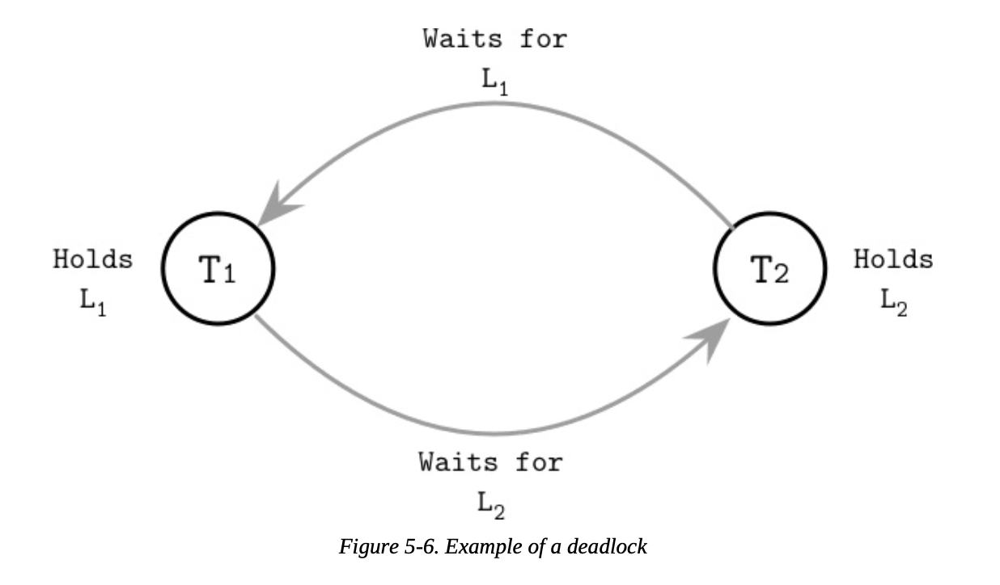
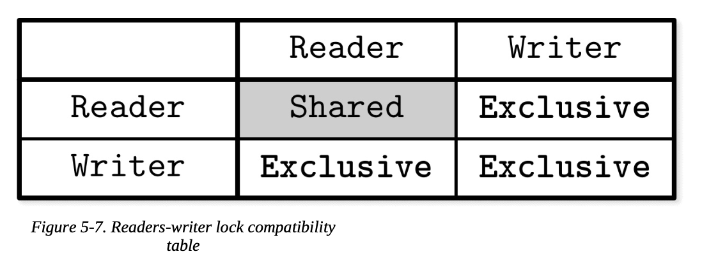
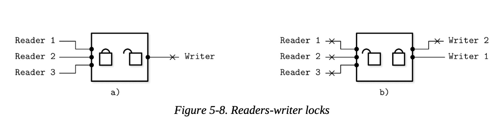
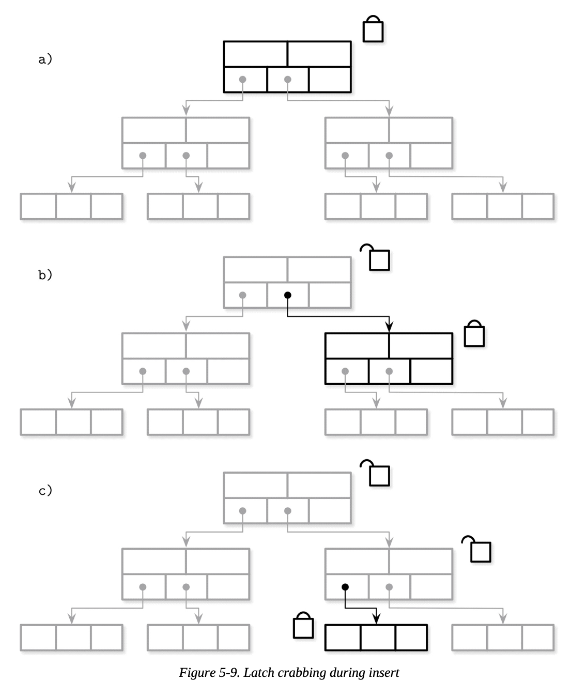

### **Optimistic Concurrency Control**

> 왜 낙관적 동시성 제어라고 불리는가?
> 

대부분의 케이스에서 충돌이 없을거라고 가정하는 방식임.

충돌이 자주 일어나는 경우에는 성능이 떨어질 수 있음.

OCC는 **트랜잭션 충돌이 드물게 일어날 것을 가정**하고, 락을 사용해 트랜잭션 실행을 블록킹하는 대신 결과를 커밋하기 전에 검사한다. (동시에 실행중인 다른 트랜잭션과 read/write 충돌을 방지하고 serializability를 보장하기 위해) 종합적으로, 트랜잭션 실행이 세가지 단계로 나뉘어진다.

1. Read phase (읽기 단계)
    1. 트랜잭션은 다른 트랜잭션에게는 어떠한 변경사항도 보이지 않도록 하면서 내부적으로 단계별로 실행된다(private context). 이 단계 이후에 모든 트랜잭션의 의존성 (read set)과 해당 트랜잭션이 만들어내는 사이드 이펙트 (write set) 가 기록진다.
2. Validation phase (검증 단계)
    1. 트랜잭션의 읽기 및 쓰기 집합을 확인하여 직렬화 가능성을 위반할 수 있는 잠재적 충돌 여부를 검사한다. 만약 트랜잭션이 읽고 있던 데이터 중 일부가 이제는 오래되었거나, 읽기 단계 중에 트랜잭션 커밋에 의해 일부 값을 덮어쓰여질 경우, 해당 트랜잭션의 내부 데이터들은 지워지고 읽기 단계가 다시 시작된다. 즉 검증 단계는 트랜잭션 커밋이 ACID 속성을 지키는지 여부를 결정한다.
3. Write phase (쓰기 단계)
    1. 검증 단계에서 충돌이 확인되지 않으면, 트랜잭션은 쓰기 집합들을 내부에서 데이터베이스로 커밋할 수 있다.

> read set & write set
> 

트랜잭션이 읽기 단계에서 자체 프라이빗 컨텍스트 내에서 읽어 들인 모든 데이터 항목(레코드)과 변경하거나 새로 생성한 모든 데이터 항목(레코드)의 모음. 

보통 메모리나 로그에 일시적으로 저장한다. DB 별로 구현 방식이 다양한 듯

검증은 이미 커밋된 트랜잭션과의 충돌을 확인하여 수행할 수 있으며(backward-oriented) 현재 검증 단계에 있는 트랜잭션과의 충돌을 확인하여 수행할 수도 있다. (forward-oriented). 검증 및 쓰기 단계는 원자적(atomically)으로 수행되어야 한다. 즉 “**다른 트랜잭션이 검증 중인 동안에는 어떤 트랜잭션도 커밋할 수 없다**”. 검증 및 쓰기 단계가 일반적으로 읽기 단계보다 짧기 때문에 어느 정도 타협한 방식이다. 

Backward-oriented 동시성 제어는 어떠한 트랜잭션 페어 (T1, T2)도 후술할 속성들을 지키는 것을 보장한다. (T2가 커밋될때 이미 커밋된 T1과의 충돌을 검증, 아래 속성을 지키는 경우 T2가 커밋 가능하고 ACID를 보장한다.)

- T1이 T2의 읽기 단계 전에 커밋된 경우
- T1은 T2의 쓰기 단계 전에 커밋되고, T1의 write set이 T2의 read set과 겹치지 않는 경우(다른말로 T1은 T2가 조회한 어떠한 값들도 쓰지 않음)
- T1의 읽기 단계가 T2의 읽기 단계 전에 완료되고, T2의 쓰기 write set이 T1의 read, write set과 겹치지 않는 경우 (다른말로 트랜잭션이 완전히 독립된 데이터 세트에서 작업함)

> forward-oritented 방식은?
> 

반대 방향으로 검증. 즉 커밋하려는 트랜잭션이 현재 활성화된 트랜잭션과 충돌하지 않는지 검증.

- T1의 write set이 실행중인 모든 다른 트랜잭션의 read set과 겹치지 않아야 커밋 가능

만약 검증이 대부분 성공하고, 트랜잭션들이 재시도 될 필요가 없으면 이러한 접근법은 효율적이다. 재시도는 퍼포먼스에 굉장히 부정적인 영향을 끼친다. 당연하게도 낙관적 동시성 제어는 트랜잭션이 한 번에 하나씩만 들어갈 수 있는 임계 구역(critical section)을 여전히 가지고 있다. 일부 작업에 비 배타적 소유권을 허용하는 또 다른 접근 방식은 readers-writer locks (reader만 공유 액세스 허용) 및 upgradeable locks (필요할 때 공유 락을 독점 락으로 변환 허용)을 사용하는 것입니다

> critical section?
> 

위에서 언급한 것 처럼, 검증 단계는 원자적으로 이루어진다. 즉 다른 트랜잭션이 검증을 하는 동안에는 어떤 트랜잭션도 커밋이 불가능하다. 즉 모든 트랜잭션이 하나씩 진행되는 구간이 있는데 이를 critical section 이라고 부른 듯 하다.

> readers-writer locks? upgradeable locks?
> 

reader-writer lock 방식 (아래 챕터에서 후술)

- 읽기 작업은 여러 트랜잭션이 동시에 수행할 수 있음 (shared access)
- 쓰기 작업은 한 번에 하나의 트랜잭션만 수행 가능 (exclusive access)
- 읽기와 쓰기는 동시에 수행될 수 없음

upgradeable lock 방식

- 처음에는 읽기 잠금으로 시작
- 필요에 따라 쓰기 잠금으로 업그레이드 가능 (데이터 수정이 필요한 상황이면)
- 읽기에서 쓰기로 변환할 때 데드락 방지 (불필요한 쓰기 락 방지)

### **Multiversion Concurrency Control**

MVCC 는 여러 개의 레코드 버전을 허용하고 단조 증가하는 트랜잭션 ID 또는 타임스탬프를 사용하여 트랜잭션 일관성을 달성하는 방법이다. 이는 읽기 및 쓰기 작업이 저장소 수준에서 최소한의 조정을 통해 진행될 수 있도록 한다. 왜냐하면 읽기 작업은 새 값이 커밋될 때까지 이전 값에 계속 접근할 수 있기 때문이다.

- 트랜잭션 커밋시마다 레코드에 버전을 기록한다 (타임스탬프 사용)
- 읽기/쓰기 시 타임스탬프를 기반으로 어떤 버전을 읽을지 결정한다.

MVCC는 커밋된 버전과 커밋되지 않은 버전을 구분하는데, 이는 각각 커밋된 트랜잭션과 커밋되지 않은 트랜잭션의 값 버전에 해당한다. 값의 마지막 커밋된 버전이 현재 버전으로 간주된다. 일반적으로 이 경우 트랜잭션 관리자의 목표는 한 번에 최대 하나의 커밋되지 않은 값만 있도록 하는 것이다.

DBMS가 구현하는 격리 수준에 따라, 읽기 작업은 커밋되지 않은 값에 접근하는 것이 허용되거나 허용되지 않을 수 있다. MVCC 는 잠금, 스케줄링 및 충돌 해결 기술(ex: two-phase locking) 또는 타임스탬프 순서 지정을 사용하여 구현될 수 있다. MVCC의 주요 사용 사례 중 하나는 스냅샷 격리(snapshot isolation)를 구현하는 것이다.

DB별로, 격리 수준 별로 MVCC를 구현하는 방법이 조금씩 다르다.

MySQL(InnoDB) : Undo Log와 타임스탬프를 사용하여 구현한다. 테이블에는 최신 버전의 데이터를 저장해두고, 언두 로그에 이전 버전들을 체인 형태로 저장한다. 

- trx_id : 마지막 변경 트랜잭션 ID
- roll_pointer : Undo log를 가리키는 포인터

PostgreSQL : 테이블에 트랜잭션 버전을 기록해둔다. 

- xmin: 생성 tid, xmax: 삭제 tid
- 수정은 삭제 후 생성과 동일하다.

- Uncommited Read
    - 사실상 뭐 아무것도 보장을 안하는 수준
    - MVCC를 사용하지 않는다(mysql)
    - PostgreSQL은 지원도 안한다
- Read Committed
    - MVCC를 사용하는 격리 수준
    - 각 명령마다 새로운 스냅샷 생성
    - 읽기 시점을 기준으로 가장 최근 버전의 데이터를 조회한다
- Repeatable Read (기본)
    - 트랜잭션 시작 시점을 기준으로 가장 최근 버전 데이터를 조회한다
    - PostgreSQL은 이 레벨에서도 Phantom Read를 방지한다
    - Consistent Mode vs Current Mode
        - Consistent Read : 앞서 설명한 방식, 시작 시점 커밋 데이터 조회
        - Current Mode : 시작 이후에 커밋된 데이터 조회
            - 락을 사용하는 읽기의 경우 사용됨 (locking read라고도 함)
            - select … for update
            - select … lock in share mode
            - 읽은 데이터를 gap lock, next-key rock 등을 사용함
    - **Mysql은 Gap Lock**과 **Next-Key Lock**을 사용해 Phantom Read 방지 (특정 조건에서만 작동)
        - select … for update
        - select … lock in share mode
        - batch update / delete + 범위 조건
        - 인덱스 사용 (안하면 테이블락)
- Serializable
    - MySQL : 모든 SELECT 문에 공유 잠금(Shared Lock)을 자동으로 걸어 완전한 직렬화를 보장
    - PostgreSQL : 트랜잭션간 상호작용까지 검증함. 직렬화 충돌이 발생할 것 같은 케이스에선 트랜잭션 하나를 강제로 중단 시킴 (write skew까지 막음)
        - OCC와 유사하게 낙관적 접근, 커밋 시점 접근, 사후 중단
        - 그러나 여러 버전 데이터 기록, 커밋 이전에도 감지

https://jaeyeong951.medium.com/mvcc-%EC%9D%98-%EC%82%AC%EC%8B%A4%EA%B3%BC-%EC%98%A4%ED%95%B4-5f480b06cea6

https://gisungcu.tistory.com/565

https://www.youtube.com/watch?feature=shared&v=wiVvVanI3p4

https://m.blog.naver.com/PostView.naver?isHttpsRedirect=true&blogId=seuis398&logNo=220434402234

https://m.blog.naver.com/PostView.naver?blogId=seuis398&logNo=70117922756&proxyReferer=https:%2F%2Fm.blog.naver.com%2FPostView.naver%3FisHttpsRedirect%3Dtrue%26blogId%3Dseuis398%26logNo%3D220434402234&trackingCode=blog_postview

### **Pessimistic Concurrency Control**

> 왜 비관적이라고 할까?
> 

트랜잭션 충돌이 자주 발생할 것이라고 가정하는 (비관적 가정) 기법

Pessimistic Concurrency Control (비관적 동시성 제어)는 OCC (**낙관적 제어) 보다 더 보수적이다.** 이 방식들은 **트랜잭션이 실행되는 도중에 충돌을 감지하고, 실행을 차단하거나 중단시킨다.**

락 없이 비관적 동시성 제어를 구현하는 방식 중 가장 간단한 방법은 타임스탬프 순서 지정(timestamp ordering)이다. 여기서 **각 트랜잭션은 타임스탬프를 가진다.** 트랜잭션 작업의 실행 허용 여부는 **더 이른 타임스탬프를 가진 트랜잭션이 이미 커밋되었는지 여부**에 따라 결정된다. 이를 구현하기 위해, 트랜잭션 매니저는 값 당 max_read_timestamp와 max_write_timestamp를 유지해야 한다. 이 타임스탬프들은 동시 실행 중인 트랜잭션에 의해 실행된 읽기 및 쓰기 작업이 있음을 설명한다.

max_write_timestamp보다 낮은 타임스탬프를 가진 값을 읽으려는 읽기 연산은 **해당 트랜잭션을 중단시킨다.** 이미 새로운 값이 존재하며, 이 작업을 허용할 경우 트랜잭션 순서가 위반되기 때문이다.

유사하게, max_read_timestamp보다 낮은 타임스탬프를 가진 쓰기 연산은 더 최근의 읽기 작업과 충돌한다. 

그러나 max_write_timestamp보다 낮은 타임스탬프를 가진 쓰기 작업은 **허용된다**. 이는 오래된 쓰여진 값들을 안전하게 무시할 수 있기 때문이다. 이러한 추측은 일반적으로 “토마스의 쓰기 규칙(Thomas Write Rule)”이라고 불린다. 

읽기 또는 쓰기 작업이 수행되는 즉시, 해당 최대 타임스탬프 값들은 업데이트된다. 중단된 트랜잭션은 새로운 타임스탬프로 다시 시작된다. 그렇지 않으면 반드시 다시 중단되기 때문이다.

> 토마스의 쓰기 규칙이란?
> 

max_write_timestamp보다 낮은 타임스탬프를 가진 쓰기 작업을 허용하는 방식. 어차피 조회 시에는 가장 최신의 타임스탬프 값만 조회할거기 때문. 즉 불필요한 쓰기 오버헤드를 감수하고, 트랜잭션 중단 및 재시도의 복잡성을 줄이는 것. 대신 정합성 문제가 생길 가능성이 있음 (해당 쓰기는 lost update가 됨)

### **Lock-Based Concurrency Control**

락 기반 동시성 제어 기술은 비관적 동시성 제어(pcc)의 한 형태이다. (타임스탬프 순서 지정처럼 스케링 방식 대신 데이터베이스 객체에 대한 명시적인 락을 사용하는) 락을 사용함으로 오는 몇가지 단점들은 경쟁과 확장성 문제이다.

가장 널리 퍼져있는 락 기반 기술은 two-phase locking(2PL, 2단계 잠금)이다. 이는 락을 두 단계에 걸쳐서 관리한다.

1. growing phase (expanding phase) : 확장 단계, 트랜잭션에 의해 요구되는 모든 락들이 획득되는 동안 어떤 락도 해제되지 않는다.
2. shrinking phase : 수축 단계, 확장 단계에서 획득한 모든 락들이 해제된다.

이 두 정의에서 파생되는 규칙은 **트랜잭션이 한 번이라도 락을 해제하면 더 이상 새로운 락을 획득할 수 없다**는 것이다. 2PL은 트랜잭션의 실행 단계에 제한을 두지 않지만, 보수적 2PL과 같은 일부 변형은 이러한 제한을 부과한다. 

> WARNING
> 

비슷한 이름이지만 2PL(2단계 잠금)은 Two-Phase Commit, (2PC, 2단계 커밋)과는 완전히 다른 개념이다. 2PC는 분산 트랜잭션 환경에서 사용되는 프로토콜이고 2PL은 직렬화 가능성(serializability)을 구현하는 데 사용되는 동시성 제어 메커니즘이다.

### Deadlocks

락 프로토콜에서 트랜잭션은 데이터베이스 객체에 대한 락을 획득하려고 시도하며, 락이 즉시 부여되지 않으면 락이 해제될 때까지 기다려야 한다. 그에 따라 두 개의 트랜잭션이 연산 수행 순서에 따라 필요한 락을 획득하려고 시도했지만 서로 반대쪽이 필요한 상황에서 둘 다 락을 해제하지 않아서 기다리는 상황이 발생할 수 있다. 이러한 상황을 교착 상태(*deadlock*)이라고 부른다.

그림은 데드락의 예시를 보여준다. T1이 락 L1을 잡고 있고, L2가 풀리기를 기다린다. 반면 T2는 락 L2를 잡고 있고 L1이 풀리기를 기다린다.

데드락을 관리하는 가장 간단한 방법은 타임아웃을 설정하고 오래 지속되는 트랜잭션은 데드락 상황이라고 추정하고 취소시키는 것이다. 다른 전략인 보수적인 2PL(conservative 2PL) 은 트랜잭션이 연산을 실행하기 전에 모든 락을 획득해야 하며, 획득할 수 없으면 중단되는 방식이다. 그러나 이러한 접근방법은 시스템 동시성을 매우 크게 제한하고, DB 시스템은 트랜잭션 매니저를 대부분 데드락을 감지하고 회피(예방)하는데 사용해야 한다.

데드락을 감지하는 것은 일반적으로 대기-그래프(*waits-for graph*)를 사용해 수행된다. (실행중인 트랜잭션들 사이의 관계를 추적하고, 대기 관계(*waits-for relactionship)* 를 설립한다)

그래프의 사이클은 데드락을 가리킨다. (트랜잭션 T1이 T2를 기다리고 T2가 다시 T1을 가리키면 사이클, 데드락) 데드락 감지는 주기적으로(간격을 두고 한 번씩) 혹은 지속적으로 (waits-for graph가 업데이트 될 때마다) 진행될 수 있다. 감지되면 트랜잭션 중 하나(보통은 더 최근에 락을 요구한 트랜잭션)는 취소된다.

- 데드락을 막기
- 데드락이 되지 않을 상황에선 자유롭게 락 획득하게 하기

이 두 가지를 모두 구현하기 위해 트랜잭션 매니저는 우선순위를 지정하는 타임 스탬프를 사용할 수 있다. 
더 낮은 타임스탬프가 보통 더 높은 우선순위를 의미한다.

만약 데드락이 발생할 수 있는 상황, 트랜잭션 T1이 T2가 잡고있는 락을 요구하는 상황을 예시로 들어보자. 이때 T1이 더 높은 우선순위를 가진다. (T1은 T2 이전에 시작) 우리는 후술할 제한사항들을 사용해 데드락을 피할 수 있다.

- Wait-die
    - T1의 우선순위가 더 높으면 T1은 차단되고 락을 기다릴 수 있다. 반대의 경우 경우 (T1이 우선순위가 더 낮은 경우) T1은 취소되고 재시작된다. 다른말로 트랜잭션은 더 높은 타임스탬프를 가진 트랜잭션에 의해서만 중단된다. → 더 높은 우선순위인 경우 기다림, 낮을 경우 본인이 중단
- Wound-wait
    - T2가 취소되고 재시작된다. (T1이 T2를 wound , 상처입힌다) 반대의 경우 (T2가 T1 전에 시작한 경우) T1은 대기할 수 있다. 다른말로 트랜잭션은 더 낮은 타임스탬프를 가진 트랜잭션에 의해서만 중단된다. → 더 높은 우선순위인 경우 상대를 종료, 낮은 경우 기다림

트랜잭션 처리는 데드락을 다루는 스케줄러를 필요로한다. 반면 Latch는 프로그래머에게 의존하며, 데드락 회피 메커니즘에 의존하지 않는다.

### Locks

두 트랜잭션이 동시에 데이터의 중첩된 세그먼트를 수정하는 경우, 어느 한쪽도 다른 쪽의 부분적인 결과를 관찰해서는 안 된다. 즉 논리적 일관성이 유지되어야 한다. 비슷하게 하나의 트랜잭션에서 두개의 스레드는 같은 데이터베이스 내용을 관측해야하고, 서로의 데이터에 접근이 가능해야 한다. 

트랜잭션 처리중에 데이터 정합성을 보장하기 위한 논리적 메커니즘과 물리적 메커니즘 사이에 차이점이 있다. 논리적, 그리고 물리적 정합성을 책임지는 두 개념들은 lock과 latches이다. 여기서 래치라고 부르는 것들을 시스템 프로그래밍에선 일반적으로 락이라고 부르기 때문에 네이밍이 조금 불편한 면이 있다. 그러나 이 섹션에서는 그 차이점과 의미를 명확하게 할 예정이다.

락은 덮어씌우는 트랜잭션들을 고립시키고, 스케줄링하기 위해 사용되며, 데이터베이스 내용들을 관리하지만, 스토리지 내부 구조는 관여하지 않으며, 키를 필요로 한다. 락은 키가 존재하든 존재하지 않든 명시된 키 혹은 키의 범위를 보호한다. 락은 일반적으로 트리 구현 바깥에 저장되고 관리되며, 디비 락 매니저에 의해 관리되는 고수준 개념으로 표현된다.

락은 래치보다 더 무겁고 트랜잭션의 진행 기간동안 유지된다.

### Latches

반면 래치는 물리적인 표현을 보호한다. 예를 들면 리프 페이지 내용은 삽입, 수정, 삭제 연산시 변경된다. 리프가 아닌 페이지 내용과 트리 구조는 리프에서 전파되는 분할과 병합 연산에 의해 변경된다. 래치는 이러한 연산들이 진행되는동안 물리적인 트리 표현 (페이지 내용과 트리 구조)를 보호하고 페이지 레벨에서 획득된다. 페이지에 안전하게 동시 액세스하려면 필요한 모든 페이지를 래치해야 한다. 락 없는 동시성 제어 기술은 여전히 래치를 사용해야 한다. (OCC, MVCC, PCC도 결국 물리적 데이터 보호를 위해 래치가 필요하다)

리프 레벨에서의 단일 변경도 더 높은 B-Tree 레벨로 전파될 수 있기 때문에 래치는 여러 레벨에 걸쳐 획득되어야 한다. 쿼리를 실행할 때는 데이터베이스 페이지가 일관되지 않은 상태를 보면 안 된다. 예를 들어, 쓰기 작업이 완료되지 않았거나 노드 분할이 진행 중인 상황에서는 데이터가 원본 노드와 새로운 노드 양쪽에 동시에 존재하거나, 상위 노드에 아직 반영되지 않은 상태일 수 있는데, 이런 중간 상태를 쿼리가 관찰해서는 안 된다는 의미이다.

같은 규칙이 부모와 형제 포인터 업데이트시에도 적용된다. 일반적인 규칙은 동시성을 위해 래치를 최대한 짧은 기간동안만 유지하는 것이다. 

동시 작업 간의 간섭은 대략 세 가지 그룹으로 나눌 수 있다.

- *Concurrent reads* : 여러 스레드가 수정 없이 같은 페이지에 접근
- *Concurrent updates :* 여러 스레드가 같은 페이지 수정을 시도
- *Reading while writing* : 어떤 스레드가 페이지 수정을 시도 할 때, 다른 스레드가 접근 시도

이 시나리오들은 데이터베이스 유지보수 작업에도 적용된다.

### Readers-writer lock

가장 간단하게 래치를 구현하는 방법은 요청하는 스레드 전부에게 배타적 읽기/쓰기 권한을 부여하는 것이다.  그러나 대부분의 경우, 우리는 모든 프로세스(스레드?)를 서로 격리할 필요가 없다. 예를 들어, 읽기는 어떤 문제도 일으키지 않고 페이지에 동시에 접근할 수 있다. 따라서 우리는 여러 동시 쓰기가 오버랩 되거나, 읽기와 쓰기가 겹치지 않도록만 확인하면 된다. 이러한 세분화된 레벨을 구현하기 위해 reader-writer lock (RW lock)을 사용할 수 있다.

RW 락은 여러개의 읽기 요청이 같은 객체에 동시에 접근하는 것을 허용한다. 그리고 오직 쓰기 요청(보통 읽기에 비해 더 적은) 만 오브젝트에 대해 배타적 접근 권한을 얻는다.  그림은 RW lock의 compatibility table(호환성 테이블? 접근 표?)를 보여준다. 오직 읽기 요청들만 서로의 락 소유권을 공유한다. 다른 모든 읽기/쓰기 조합은 소유권을 배타적으로 가져야 한다.

위의 그림처럼 여러 Reader가 같은 객체에 접근할때, Writer는 Reader가 페이지에 접근하는 동안 수정할 수 없기 때문에 차례를 기다린다. 또 오른쪽처럼 writer는 객체에 대한 배타적인 락을 가지므로, 다른 writer와 세개의 reader는 기다려야 한다. 

같은 페이지에 접근하려는 두 개의 겹치는 읽기 작업은 페이지 캐시에서 디스크로부터 페이지를 두 번 가져오는 것을 방지하는 것 외에는 동기화가 필요하지 않으므로, 읽기 작업들은 공유 모드에서 안전하게 동시에 실행될 수 있다. 그러나 쓰기 작업이 개입되는 순간, 동시에 실행되는 읽기 작업들과 다른 쓰기 작업들로부터 해당 객체를 격리해야 한다.

> BUSY-WAIT AND QUEUEING TECHNIQUES
> 

페이지에 대한 공유 접근을 관리하기 위해, 스레드를 스케줄링에서 제외하고 진행 가능할 때 깨우는 블로킹 알고리즘을 사용하거나, busy-wait 알고리즘을 사용할 수 있다. busy-wait 알고리즘은 스케줄러에게 제어권을 넘겨주는 대신 스레드가 짧은 시간 동안 대기할 수 있도록 한다. 

>> busy wait 반대 개념으로 블로킹 알고리즘이 있다. 스레드가 자원을 못 쓰는 상황이면 sleep으로 넘어감. CPU 자원 절약 but 컨텍스트 스위칭 오버헤드 발생

큐잉은 보통 CAS(compare and swap) 명령어를 사용해서 구현되며, 이는 락 획득과 큐 업데이트의 원자성을 보장하는 연산을 수행하는 데 사용된다. 큐가 비어있으면 스레드는 즉시 접근 권한을 얻는다. 그렇지 않으면, 스레드는 자신을 대기 큐에 추가하고 큐에서 자신보다 앞에 있는 스레드만이 업데이트할 수 있는 변수를 스핀(반복)하면서 기다린다. 이는 락 획득과 해제를 위한 CPU 트래픽의 양을 줄이는 데 도움이 된다.

>> 여러 스레드가 같은 자원을 대기 할때 큐에 넣고 순서대로 대기시킨다. 기아 상태 방지와 CPU 연산 줄이는데 도움을 준다. (자기 앞에 것만 확인, 동시에 모든 락이 해제되지 않도록 함 → CPU 사용량 폭증 방지)

### Latch crabbing

래치 획득을 구현하는 가장 직접적인 방식은 루트에서 대상 리프까지 가는 길에 모든 래치를 잡는 것이다. 이는 동시성 병목을 발생시키며 이는 사실 대부분의 경우 피할 수 있는 상황이다. 래치가 유지되는 최대한 짧아야 한다. 이를 달성하기 위해 사용할 수 있는 최적화 중 하나는 latch crabbing 또는 latch coupling 이라고 불리는 방법이다.

Latch crabbing은 간단한 방법이다. 래치를 더 짧은 시간 동안 유지하고, 실행 중인 작업에 더 이상 필요하지 않다는 것이 명확해지자마자 래치를 즉시 해제한다. 읽기 경로에서는 자식 노드를 찾고 자식 노드 래치가 획득하는 즉시 부모 노드의 래치를 해제할 수 있다.

>> 게 걸음처럼 옆으로 한 칸씩 이동한다고 해서 crabbing이다 ㅋㅋ

삽입 연산 중에는 작업이 부모 페이지로 전파될 수 있는 변경을 일으키지 않는 것이 보장되면 바로 부모 래치를 해제할 수 있다. 다른 말로 부모 노도의 래치는 자식 노드가 가득 차지 않는다면 바로 해제될 수 있다. 

비슷하게, 삭제 중에는 만약 자식 노드가 충분한 요소를 보유하고 있고 작업이 형제 노드를 병합하지 않을 경우, 부모 노드에 대한 래치를 해제한다.

그림은 삽입 시 루트에서 리프로 가는 경로를 보여준다.

1. 쓰기 래치가 루트 레벨에 적용된다
2. 다음 레벨 노드를 가리키고, 쓰기 래치가 적용된다. 해당 노드의 구조 변경 가능성을 확인한다. 만약 노드가 다 차지 않았다면 부모 래치는 해제된다.
3. 연산은 다음 레벨로 내려간다. 쓰기 래치가 적용되고, 목표 리프 노드의 구조 변경 가능성을 확인하고, 래치가 해제된다.

이 접근법은 낙관적이다. 대부분의 삽입과 삭제 연산은 여러 레벨에 전파되는 구조 변경을 일으키지 않는다. 그리고 구조 변경 가능성은 부모 노드에 가까워질 수록 적어진다. 대부분의 연산은 오직 타깃 노드(목표 리프 노드)에만 적용되고, 대부분의 경우 부모 노드 래치를 유지해야 하는 경우는 매우 적다.

자식 페이지가 페이지 캐시에 아직 로드되지 않은 경우, 우리는 미래에 로드될 페이지에 래치를 걸거나, 부모 래치를 해제하고 페이지가 로드된 후 루트에서 리프로 가는 경로를 다시 시작하여 경쟁을 줄일 수 있다. 루트에서 리프로의 탐색을 다시 시작하는 것은 다소 비용이 많이 들지만, 실제로는 매우 드물게 수행되며, 탐색 시점 이후 상위 수준에서 구조적 변경이 있었는지 감지하는 메커니즘을 사용할 수 있다.

>> 메모리 단에서 래치를 유지하는데, 아직 메모리에 페이지가 없는 상황에선 두 가지 선택지가 있다. 1. 일단 래치를 유지하면서 디스크에서 페이지를 가져오기 2. 래치 초기화하고, 페이지 로드 후 탐색 재시작하기

> **LATCH UPGRADING AND POINTER CHASING**
> 

탐색 중에 즉시 배타적 모드로 래치를 획득하는 대신, **래치 업그레이드**를 사용할 수 있다. 이 접근법은 탐색 경로를 따라 공유 락을 획득하고, 필요할 때 이를 배타적 락으로 **업그레이드**하는 방식이다.

쓰기 작업은 처음에는 리프 레벨에서만 배타적 락을 획득한다. 리프가 분할되거나 병합되어야 하는 경우, 알고리즘은 트리를 거슬러 올라가며 부모가 보유한 공유 락을 **업그레이드**하려고 시도하여, 트리의 영향받는 부분(즉, 해당 작업의 결과로 분할되거나 병합될 노드들)에 대한 배타적 래치 소유권을 획득한다. 여러 스레드가 상위 레벨 중 하나에서 배타적 락을 획득하려고 시도할 수 있으므로, 그 중 하나는 대기하거나 재시작해야 한다.

지금까지 설명한 메커니즘들이 모두 루트 노드에서 래치를 획득하는 것으로 시작한다는 점을 눈치챘을 것이다. 모든 요청이 루트 노드를 거쳐야 하므로, 루트 노드는 빠르게 병목점이 된다. 동시에, 루트는 항상 마지막에 분할되는데, 이는 모든 자식 노드들이 먼저 가득 차야 하기 때문이다. 이는 루트 노드가 **항상** 낙관적으로 래치될 수 있음을 의미하며, 재시도의 비용(**포인터 체이싱**)을 지불하는 경우는 드물다.

### **Blink-Trees**

Blink-Tree는 B*-Tree, 노드 하이 키, 형제 링크 포인터 위에 세워진 개념이다. 노드 하이키는 서브트리가 가질 수 있는 가장 높은 키 값을 가리켰다. Blink-Tree의 모든 루트가 아닌 노드는 두개의 포인터를 가진다. 

- 부모로부터 내려오는 자식 포인터
- 같은 레벨의 왼쪽 노드를 가리키는 형제 링크

> B*-Tree가 뭐였더라?
> 

Rebalancing에서 다뤘던 개념. 리밸런싱 비용을 줄이기 위해, 최대한 리밸런싱을 늦추는 기법.

이웃한 두 노드가 모두 가득차면 3개로 나누는 알고리즘을 사용했다.

Blink-Tree는 반 분할(*half-split)*이라는 상태를 허용한다. 이는 노드가 이미 형제 포인터에 의해선 참조중이지만 부모 노드의 자식 포인터에는 연결되지 않은 상태를 의미한다. Half split은 노드 하이키를 확인함으로서 시작된다. 만약 검색하려는 키가 노드의 high key를 초과하는 경우(high key 불변량을 초과하는 경우), 탐색 알고리즘은 구조가 동시에 변경되었다고 결론짓고, 형재 포인터를 따라 검색한다.

포인터는 최상의 성능을 보장하기 위해 부모에게 **빠르게 추가**되어야 하지만, 트리 내의 모든 요소에 접근할 수 있으므로 검색 프로세스를 중단하거나 다시 시작될 필요는 없다. 여기서 장점은 자식 노드가 분할될 경우에도 자식 레벨로 내려갈 때 부모 락(lock)을 유지할 필요가 없다는 것이다. 새로운 노드를 형제 노드 링크를 통해 볼 수 있게 하고 정확성을 희생하지 않으면서 부모 포인터를 **느리게 업데이트**할 수 있다.

이것은 부모로부터 직접 내려가는 것보다 약간 비효율적이며 추가적인 페이지 접근이 필요하지만, **동시 접근을 단순화**하면서 정확한 루트-리프 하강을 가능하게 한다. 분할은 상대적으로 드물게 발생하는 작업이고 B-Tree는 거의 축소되지 않으므로, 이 경우는 예외적이며 그 비용은 미미하다. 이 접근 방식은 다음과 같은 여러 이점을 제공한다.

- **경합을 줄이고**, 분할 중에 부모 락을 유지할 필요가 없으며, 트리 구조 수정 중 유지되는 락의 수를 **상수로 줄인다.**
- 더 중요한 것은, 트리 구조 변경과 동시적인 읽기를 허용하고, 부모 노드로 올라가는 동시 수정으로 인해 발생할 수 있는 **교착 상태를 방지한다.**

## Summary

---

이 장에서는 트랜잭션 처리 및 복구를 담당하는 스토리지 엔진 구성 요소에 대해 설명했다. 트랜잭션 처리를 구현할 때 두 가지 문제가 발생한다.

- 효율성을 높이려면 동시 트랜잭션 실행을 허용해야 한다,
- 정확성을 유지하려면 동시에 실행되는 트랜잭션이 ACID 속성을 보존하도록 해야 한다.

동시 트랜잭션 실행은 다양한 종류의 읽기 및 쓰기 이상 현상을 일으킬 수 있다. 이러한 이상 현상의 존재 여부는 다양한 격리 수준을 구현함으로써 제한된다. 동시성 제어 접근 방식은 트랜잭션이 예약되고 실행되는 방식을 결정한다.

페이지 캐시는 디스크 액세스 횟수를 줄이는 역할을 한다. 페이지 캐시는 메모리에 페이지를 캐시하고 읽기 및 쓰기 액세스를 허용한다. 캐시가 용량에 도달하면 페이지가 제거되고 디스크 에 다시 플러시된다. 노드 충돌 시 플러시되지 않은 변경 내용이 손실되지 않도록 하고 트랜잭션 롤백을 지원하기 위해 WAL를 사용한다. 페이지 캐시와 WAL은 force 및 steal 정책을 사용하여 조정되므로 모든 트랜잭션이 내구성 저하 없이 효율적으로 실행되고 롤백될 수 있다.