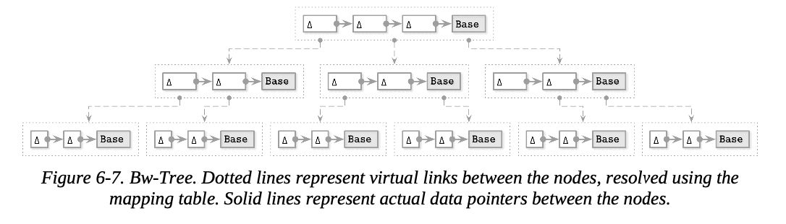
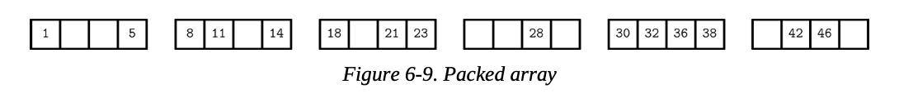

**Bw-트리 (Bw-Trees)**
Microsoft 에서 제시한 새로운 자료구조 (latch free b-tree)
https://www.microsoft.com/en-us/research/wp-content/uploads/2016/02/bw-tree-icde2013-final.pdf

B-Tree의 in-place update 구현에서 여러 문제가 발생한다.

1.  쓰기 증폭(Write amplification): B-Tree 페이지에 대한 연속적인 업데이트 시 매 업데이트마다 디스크 페이지 사본을 업데이트해야 한다.
2. 공간 증폭(space amplification): 이는 향후 쓰기를 위해 B-트리 노드에 추가 공간을 예약해둬야 한다. 즉, 요청된 데이터를 전송할 때마다 페이지의 나머지 부분도 함께 전송해야 한다.
3. 세 번째 문제는 동시성 문제 해결 및 래치(latch) 처리의 복잡성

이 세 가지 문제를 한꺼번에 해결하려면 기존에 논의했던 방식과는 전혀 다른 접근 방식이 필요하다. 버퍼링은 쓰기 및 공간 증폭에는 도움이 되지만, 동시성 문제에 대한 해결책은 제시하지 않는다.

append-only 스토리지를 사용하고 노드끼리 체인으로 연결하며, CAS 연산으로 노드 간의 포인터를 설치할 수 있는 인메모리(in-memory) 데이터 구조를 사용하여 다른 노드에 대한 업데이트를 일괄 처리할 수 있다. 이 접근 방식을 **버즈워드-트리(Buzzword-Tree), 즉 Bw-트리(Bw-Tree)**라고 한다.

> 앞의 3개의 개념 Copy-on-write, Lazy B-Tree, FD-Tree의 구현 전략을 짬뽕한 느낌이 든다. Cow의 수정 후 포인터 CAS 연산, Lazy B-Tree의 수정 버퍼링 및 읽기 과정에서의 통합, FD-Tree의 삭제 플래그 등
> 

### **Update Chains**

Bw-트리는 기본 노드(base node)와 수정 사항을 분리해서 기록한다. 수정 사항(델타 노드)은 체인 형태로 구현된다. (최신 수정 사항부터 오래된 수정사항을 거쳐 마지막에 기본 노드가 있는 링크드 리스트 형태) 각 업데이트는 디스크의 기존 노드를 다시 작성할 필요 없이 별도로 저장될 수 있다. 델타 노드(delta nodes)는 삽입, 업데이트(삽입과 구별할 수 없음), 또는 삭제를 나타낼 수 있다.

기본 노드와 델타 노드의 크기가 페이지 정렬(page aligned)될 가능성이 낮으므로, 이들을 연속적으로 저장하는 것이 합리적이다. 또한, 업데이트 중에 기본 노드나 델타 노드가 수정되지 않기 때문에(모든 수정 사항은 기존 연결 목록에 노드를 추가(prepend)할 뿐이므로 추가 공간을 예약할 필요가 없다.

노드를 물리적 엔티티가 아닌 논리적 엔티티로 보는 것은 흥미로운 패러다임의 변화이다. 우리는 공간을 미리 할당하거나, 노드가 고정된 크기를 가져야 하거나, 심지어 연속된 메모리 세그먼트에 보관해야 할 필요가 없다. 물론 이는 단점이 있습니다. 읽기 시에는 실제 노드 상태를 재구성하기 위해 모든 델타를 순회하여 기본 노드에 적용해야 한다. 이는 LA-트리("Lazy-Adaptive Tree" 섹션 참조)가 하는 것과 유사하다. 즉, 업데이트를 메인 구조와 분리하여 읽기 시에 처음부터 읽는다.

### **Taming Concurrency with Compare-and-Swap**

자식 노드에 항목을 선행 추가할 수 있는 온디스크(on-disk) 트리 구조를 유지하는 것은 매우 비용이 많이 들 것이다. 이는 부모 노드에 최신 델타를 가리키는 포인터를 끊임없이 업데이트해야 하기 때문이다. 그래서 Bw-트리 노드들은 논리적 식별자를 가지고 있으며, 식별자에서 디스크의 위치로의 인메모리 매핑 테이블(in-memory mapping table)을 사용한다. 이 매핑을 사용하면 래치를 없앨 수 있다. 쓰기 시 독점적인 소유권을 가지는 대신, Bw-트리는 매핑 테이블의 물리적 오프셋에 대해 CAS 연산을 사용한다.

그림은 간단한 Bw-트리를 보여준다. 각 논리적 노드는 단일 기본 노드와 여러 개의 연결된 델타 노드로 구성된다.

Bw-트리 노드를 업데이트하기 위해 알고리즘은 다음 단계를 실행한다.

1. 루트에서 리프까지 트리를 탐색하여 대상 논리적 리프 노드를 찾는다. 매핑 테이블에는 대상 기본 노드 또는 업데이트 체인의 최신 델타 노드에 대한 가상 링크가 포함되어 있다.
2. 1에서 찾은 기본 노드(또는 최신 델타 노드)에 대한 포인터가 있는 새 델타 노드를 생성
3. 2에서 생성된 새 델타 노드에 대한 포인터로 매핑 테이블을 업데이트

3에서의 업데이트 작업은 원자적 연산(atomic operation)인 CAS 연산을 사용하여 수행된다. 따라서 포인터 업데이트와 동시에 발생하는 모든 읽기 작업은 읽기 또는 쓰기를 차단하지 않고 쓰기 이전 또는 이후에 정렬된다. 쓰기 이전에 정렬된 읽기 작업은 새 델타 노드가 아직 추가되지 않았기 때문에 이전 포인터를 따라 새 델타 노드를 보지 않는다. 쓰기 이후에 정렬된 읽기 작업은 새 포인터를 따르며 업데이트 결과를 관찰한다. 두 스레드가 동일한 논리적 노드에 새 델타 노드를 설치하려고 시도하면, 그 중 하나만 성공할 수 있으며, 다른 하나는 작업을 재시도해야 한다.

### **Structural Modification Operations**

Bw-트리는 논리적으로 B-트리처럼 구성되어 있다. 이는 노드가 여전히 너무 커지거나(오버플로우) 거의 비어있게 수축(언더플로우)할 수 있으며, 분할 및 병합과 같은 구조적 수정 작업(Structural Modification Operations, SMO)가 필요하다는 것을 의미한다. 여기서 분할 및 병합의 의미는 B-트리와 유사하지만("B-Tree Node Splits" 및 "B-Tree Node Merges" 섹션 참조), 구현은 다르다.

분할 SMO는 분할되는 노드의 논리적 내용을 통합하고, 델타를 기본 노드에 적용하며, 분할 지점 오른쪽에 있는 요소를 포함하는 새 페이지를 생성하는 것으로 시작한다. 그 후 프로세스는 두 단계로 진행된다.

1. **Split** : 진행 중인 분할을 읽기 프로그램에게 알리기 위해 특별한 분할 델타 노드가 분할되는 노드에 추가된다. 분할 델타 노드는 분할되는 노드의 레코드를 무효화하는 중간 분리 키 와 새 논리적 형제 노드에 대한 링크를 포함한다.???
2. **Parent update :** 이 시점에서 노드는 형제 포인터를 통해 이미 참조되지만, 부모의 자식 포인터에 의해 참조되지 않으므로 Blink-트리의 half-split과 유사한 상황이다. 읽기 연산은 새롭게 생성된 형제 노드에 도달하기 위해 이전 노드를 거쳐 형제 포인터를 따라가야 한다. 새 노드는 부모 노드의 자식으로 추가되어 읽기 프로그램이 분할 노드를 통해 리다이렉트 되지 않고 직접 도달할 수 있도록 하며, 분할이 완료된다.

부모 포인터 업데이트는 성능 최적화이다. 부모 포인터가 전혀 업데이트되지 않아도 모든 노드와 그 요소는 계속 접근 가능하다. Bw-트리는 latch-free이므로, 어떤 스레드라도 불완전한 SMO를 만날 수 있다. 해당 스레드는 진행하기 전에 multistep SMO를 선택하여 완료해야 합다. 다음 스레드는 설치된 부모 포인터를 따르며 형제 포인터를 거칠 필요가 없다.

병합 SMO는 유사한 방식으로 작동한다.

1. **Remove sibling :** 특별한 remove 델타 노드가 오른쪽 형제 노드에 추가된다. 이는 병합 SMO의 시작을 나타내고 오른쪽 형제 노드에 삭제를 표시한다.
2. **Merge**— 병합 델타 노드가 왼쪽 형제 노드에 생성된다. 이 노드는 오른쪽 형제의 내용을 가리키고 이후 논리적으로 왼쪽 형제노드의 일부로 만드는 과정을 수행한다.
3. **Parent update** : 이 시점에서 오른쪽 형제 노드의 내용은 왼쪽 노드에서 접근할 수 있다. 병합 프로세스를 완료하려면 오른쪽 형제에 대한 링크를 부모에서 제거해야 한다.

동시 SMO는 동시 분할 및 병합을 방지하기 위해 부모에 추가적인 중단 델타 노드(abort delta node)를 설치해야 합다. 중단 델타는 쓰기 락과 유사하게 작동한다. 즉, 한 번에 하나의 스레드만 쓰기 접근할 수 있으며, 이 델타 노드에 새 레코드를 추가하려는 스레드는 중단된다. SMO 완료 시, 중단 델타는 부모에서 제거될 수 있다.

Bw-트리의 높이는 루트 노드 분할 중에 증가한다. 루트 노드가 너무 커지면 두 개로 분할되고, 이전 루트 자리에 새로운 루트가 생성되며, 이전 루트와 새로 생성된 형제 노드가 새로운 루트의 자식이 된다.

### **Consolidation and Garbage Collection**

델타 체인은 추가 작업 없이도 임의로 길어질 수 있다. 델타 체인이 길어질수록 읽기 비용이 증가하므로, 델타 체인 길이를 합리적인 범위 내로 유지해야 한다. 구성 가능한 임계값(*configurable threshold*)에 도달하면, 기본 노드 내용과 모든 델타를 병합하여 노드를 재구성하고 하나의 새로운 기본 노드로 통합한다. 새로운 노드는 디스크의 새 위치에 기록되고, 매핑 테이블의 노드 포인터는 이를 가리키도록 업데이트된다. 이 프로세스에 대해서는 "LLAMA and Mindful Stacking"에서 더 자세히 논의한다. 이는 log-structured storage 가 가비지 컬렉션, 노드 통합 및 재배치를 담당하기 때문이다.

노드가 통합되면, 그 이전 내용(기본 노드와 모든 델타 노드)은 더 이상 매핑 테이블에서 주소 지정되지 않는다. 그러나 이러한 메모리는 현재 진행 중인 작업에서 여전히 사용될 수 있으므로 즉시 해제할 수는 없다. 읽기 프로그램이 래치를 보유하지 않으므로(노드에 접근하기 위해 어떤 종류의 장벽도 통과하거나 등록할 필요가 없었기 때문에), 활성 페이지를 추적하는 다른 방법이 필요하다.

특정 노드를 접했을 수 있는 스레드와 전혀 보지 못했을 스레드를 분리하기 위해 Bw-트리는 에포크 기반 회수(*epoch-based reclamation*)라는 기술을 사용한다. 특정 epoch 중에 노드 통합으로 인해 일부 노드와 델타가 매핑 테이블에서 제거된 경우, 원래 노드는 동일한 epoch  또는 이전 epoch 에서 시작된 모든 읽기 프로그램이 완료될 때까지 보존된다. 그 후에는 안전하게 가비지 컬렉션될 수 있다. 왜냐하면 이후 읽기 프로그램은 그들이 시작할 때 해당 노드들이 주소 지정 불가능했으므로, 그 노드들을 절대 보지 못했음이 보장되기 때문이다.

Bw-트리는 쓰기 증폭, 비차단(nonblocking) 접근, 캐시 친화성 등 여러 중요한 측면에서 개선을 이룬 흥미로운 B-트리 변형이다. 수정된 버전은 실험적인 저장 엔진인 Sled에 구현되었다.CMU 데이터베이스 그룹은 Bw-트리의 인메모리 버전인 OpenBw-Tree를 개발하고 실제 구현 가이드를 발표했다.

이 장에서는 Bw-트리와 관련된 더 높은 수준의 B-트리 개념만을 다루었으며, "LLAMA and Mindful Stacking"에서  log-structured storage에 대한 논의를 포함하여 계속해서 논의할 예정이다.

> 루트 노드 생성 시에는 어떻게?
> 

책에선 없는데 index term delta라는 노드가 추가적으로 존재

이 delta가 구분키와 포인터를 포함하고 있음

만약 분할된 왼쪽 노드가 루트일 경우 → 부모 노드 새로 생성

> 왜 분할 시 삭제 델타를 먼저?
> 

어차피 원자적 연산으로 나뉘어져 있고, 중간에 만난 다른 스레드가 작업을 이어서 진행하기 때문에 상관 없음

> 왜 락이 아니라 다음 스레드가 이어받음?
> 

**비효율적인 검색 경로, 구조적 불완전성 및 복잡성, 직렬화 보장을 위해서**

어차피 델타 노드 추가하는건 다 CAS 연산이라 동시성 걱정 안해도 됨

그리고 논문에선 “잘 일어나지 않는다” 라고 이야기

## **Cache-Oblivious B-Trees**

---

디스크 블록 크기, 노드 크기, 캐시 라인 정렬과 같은 설정 가능한 매개변수들은 B-트리 성능에 영향을 미친다. 캐시 비인지(*cache-oblivious*) 구조라고 불리는 새로운 유형의 자료 구조는 메모리 계층과 매개변수를 튜닝할 필요 없이 점근적으로 최적의 성능을 제공한다. 이는 알고리즘이 캐시 라인, 파일 시스템 블록 및 디스크 페이지의 크기를 알 필요가 없음을 의미한다. 캐시 비인지 구조는 다른 구성의 여러 머신에서도 수정 없이 잘 작동하도록 설계되었다.

지금까지는 대부분 B-Tree를 2단계 메모리 계층의 관점에서 살펴봤다. (Copy-on-Wreite에서 LMDB에 대한 논의를 제외하고) B-Tree 노드는 디스크 상주 페이지에 저장되며, 페이지 캐시는 메인 메모리에서 효율적인 접근을 위해 사용된다.

이 2 단계 계층 구조는 페이지 캐시(더 빠르지만 공간 제한)와 디스크(일반적으로 느리지만 용량이 더 큼) 라고 불렀다. 여기에는 두 가지 매개변수만 있으므로, 각 레벨에 관련된 모든 세부 사항을 처리하는 두 가지 코드 모듈만 있으면 되기 때문에 알고리즘을 설계하기가 비교적 쉽다.

디스크는 블록으로 분할되며, 데이터는 디스크와 캐시 간에 블록 단위로 전송됐다. (알고리즘이 블록 내의 단일 아이템을 찾으려고 할 때도 전체 블록을 가져와야 한다) 이러한 접근 방식이 캐시 인지(*cache-aware*) 방식이다.

성능이 매우 중요한 소프트웨어를 개발할 때, 우리는 종종 더 복잡한 모델을 프로그래밍한다. (CPU 캐시와 때로는 핫/콜드 스토리지 또는 HDD/SSD/NVM 계층을 구축하고 데이터를 한 레벨에서 다른 레벨로 옮기는 등의 디스크 계층도 고려한다) 대부분의 경우 이러한 노력은 일반화하기 어렵다. "*Memory Versus Disk-Based DBMS*" 챕터에서 디스크 접근이 메인 메모리 접근보다 훨씬 느리다는 사실에 대해 논의했으며, 이는 데이터베이스 구현자들에게 이 차이를 최적화하도록 동기부여했다.

캐시-비인지 알고리즘은 2단계 메모리 모델의 용어로 자료 구조를 추론할 수 있게 해주면서 다단계 계층 모델의 이점을 제공한다. 이러한 접근 방식은 플랫폼별 매개변수 없이도 두 계층 간의 전송 횟수가 상수 요인 내에 있음을 보장한다. 데이터 구조가 어떤 두 메모리 계층 레벨에서도 최적으로 작동하도록 최적화되어 있다면, 인접한 두 계층 레벨에서도 최적으로 작동한다. 이는 가장 높은 캐시 레벨에서 가능한 한 많이 작동함으로써 달성된다.

### **van Emde Boas Layout**

cache-oblivious B-Tree는 정적 B 트리(*static B-Tree*)와 압축된 배열(*packed array*) 구조로 구성된다. 정적 B 트리는 *van Emde Boas* 레이아웃을 사용하여 구성된다. 이 레이아웃은 트리를 엣지의 중간 레벨에서 분할한다. 그 다음 각 서브트리는 유사한 방식으로 재귀적으로 분할되어 결과적으로 sqr(N) 의 서브트리가 된다. 이 레이아웃의 핵심 아이디어는 어떤 재귀 트리도 연속적인 메모리 블록에 저장된다는 것이다.

그림 에서 van Emde Boas 레이아웃의 예시를 보여준다. 논리적으로 함께 그룹화된 노드들은 서로 가깝게 배치된다. 위쪽에는 논리적 레이아웃 표현(즉, 노드가 트리를 형성하는 방식)이, 아래쪽에는 트리 노드가 메모리와 디스크에 어떻게 배치되는지 볼 수 있다.

자료구조를 동적으로 만들기 위해(즉, 삽입, 업데이트 및 삭제를 허용하기 위해), 캐시-비인지 트리는 압축된 배열(packed array) 데이터 구조를 사용하는데, 이는 요소를 저장하기 위해 연속적인 메모리 세그먼트를 사용하지만, 향후 삽입될 요소를 위한 공간을 미리 만들어 간격을 둔다. 간격은 밀도 임계값(*density threshold*) 을 기준으로 만들어진다. 아래 그림은 요소들이 간격을 만들기 위해 배치된 압축된 배열 구조를 보여준다.

이러한 접근 방식은 더 적은 재배치로 항목을 트리에 삽입할 수 있도록 한다. 새로 삽입된 요소에 대한 간격이 이미 존재 없다면, 항목은 간격을 만들면서 재배치된다. 압축된 배열이 너무 밀집되거나 드문드문 채워지면, 배열을 늘리거나 줄이기 위해 구조를 재구축해야 한다.

정적 트리는 하위 레벨의 압축된 배열의 인덱스로서 사용되며, 하위 레벨 요소가 재배치되면 업데이트되어야 한다.

이것은 흥미로운 접근 방식이며, 여기서 나온 아이디어는 효율적인 B-트리 구현을 위해 사용된다. 이는 메인 메모리 구조를 구축하는 방식과 매우 유사하게 디스크 상주 구조를 구축할 수 있게 해준다. 그러나, 이 글을 쓰는 시점에는 필자가 아는 한 비학술적인 캐시-비인지 B-트리 구현은 없다.

한 가지 가능한 이유는 캐시 로딩이 추상화되어 있지만, 데이터가 블록 단위로 로드되고 다시 기록될 때도 페이징과 제거가 결과에 부정적인 영향을 미친다는 가정 때문이다. 또 다른 가능한 이유는 블록 전송 측면에서 캐시-비인지 B-트리의 복잡성이 캐시-인지 B-트리와 동일하다는 것 때문이다. 이는 더 효율적인 비휘발성 바이트-주소 지정 가능 스토리지 장치가 더 널리 보급되면 바뀔 수도 있다.

## Summary

---

원래 B-트리 설계에는 몇 가지 단점이 있다. 회전 디스크에서는 잘 작동했을 수 있지만, SSD에서는 효율성이 떨어진다. B-트리는 높은 쓰기 증폭 (페이지 재작성으로 인해 발생)과 높은 공간 오버헤드를 가진다. 이는 B-트리가 향후 쓰기를 위해 노드에 공간을 예약해야 하기 때문이다.

- 쓰기 증폭은 버퍼링을 사용하여 줄일 수 있습니다. WiredTiger 및 LA-Tree와 같은 Lazy B-Trees는 개별 노드 또는 노드 그룹에 인메모리 버퍼를 연결하여 메모리에서 페이지에 대한 후속 업데이트를 버퍼링함으로써 필요한 I/O 작업 수를 줄인다.
- 공간 증폭을 줄이기 위해 FD-트리(FD-Trees)는 불변성(immutability)을 사용한다. 데이터 레코드는 불변 정렬 런(immutable sorted runs)에 저장되며, 가변 B-트리의 크기는 제한된다.
- Bw-트리(Bw-Trees) 또한 불변성을 사용하여 공간 증폭 문제를 해결한다. B-트리 노드와 이에 대한 업데이트는 별도의 디스크 상 위치에 저장되며 log-structured store에 유지된다. 단일 논리 노드에 속하는 내용을 조정하는 빈도가 비교적 낮기 때문에 원래 B-Tree 설계에 비해 쓰기 증폭이 줄어든다. Bw-트리는 논리 노드 간의 가상 포인터가 메모리에 저장되므로 동시 접근으로부터 페이지를 보호하기 위한 래치(latches)가 필요하지 않다.