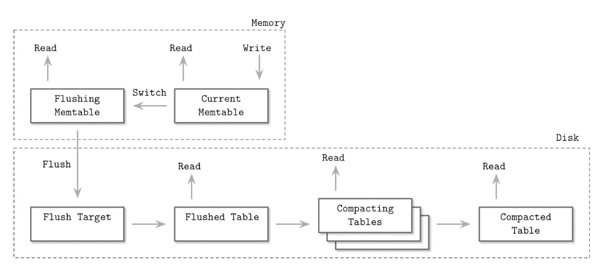

## **Chapter 7. Log-Structured Storage**

---

> Accountants don’t use erasers or they end up in jail. (Pat Helland)
회계사는 지우개를 사용하지 않는다
> 

**회계사들이 레코드를 수정할때, 기존 값드을 지우는 대신, 수정된 새로운 레코드를 생성한다. 분기별 보고서가 발행될 때, 기존 보고서들을 수정하는 작은 변경사항들이 포함될 수 있다. 최종 결과를 도출하려면 우린 모든 레코드를 거쳐 최종 결과를 계산해야 한다.**

비슷하게 불변 저장 구조는 기존 값의 수정을 허락하지 않는다. 테이블에 단 한 번만 쓰여지고, 다시는 수정되지 않는다. 대신, 새 레코드는 새 파일에 추가되며, 최종 값을 찾거나 값이 없음을 결론 내리려면 여러 파일에서 레코드를 재구성해야 한다. 

높은 수준에서, 데이터가 스토리지 구조 내부에서 처리되는 방식과 외부에서 처리되는 방식 사이에 엄격한 구분이 있다. 내부적으로 불변 파일은 여러 복사본을 가질 수 있으며, 최신 복사본이 이전 복사본을 덮어쓴다. 반면, 가변 파일은 보통 최신 값만 저장한다. 접근 시, 불변 파일은 처리되어 중복 복사본들이 조정(reconcile)되고 가장 최근값만 클라이언트에 반환된다.

>> 불변 구조에선 외부에선 데이터를 수정한다고 알지만, 내부에선 항상 데이터가 새롭게 생성된다. 조회시에 조정(reconcile) 프로세스를 통해 최근 값만 반환한다.

다른 책과 논문처럼, 우리는 가변 구조의 전형적인 예로 B-트리를 사용하고, 불변 구조의 예로 *Log-Structured Merge Trees (LSM Trees)* 를 사용한다. 불변 LSM 트리는 append-only 저장소와 병합 조정 (*merge reconciliation*)  방식을 사용하지만 B-트리는 디스크에서 데이터 레코드를 찾아 파일의 원본 오프셋에 있는 페이지 내용을 직접 수정한다.

inplace update 스토리지 구조는 읽기 성능에 최적화되어 있다. 디스크에서 데이터를 찾은 후 레코드를 클라이언트에 바로 반환될 수 있다. 대신 이는 쓰기 성능을 희생한다. 데이터 레코드를 제자리에서 업데이트하려면 먼저 디스크에서 위치를 찾아야 한다. 반면에, 추가 전용 저장소는 쓰기 성능에 최적화되어 있다. 쓰기는 디스크에서 레코드를 찾아 덮어쓸 필요가 없다. 그러나 이는 여러 데이터 레코드 버전을 검색하고 조정해야 하므로 읽기에 더 많은 비용이 든다.

>> inplace-update는 읽기 최적화, append-only는 쓰기 최적화

지금까지 우리는 주로 가변 저장 구조에 대해 이야기했다. 우리는 **copy-on-write B-Tree**, **FD-Trees**, **Bw-Trees** 를 논의하면서 불변성에 대해 잠시 다루었다. 하지만 불변 구조를 구현하는 방법은 더 많다.

가변 B-Tree의 구조 및 구성 접근 방식 때문에, 읽기, 쓰기, 유지 보수 중 발생하는 대부분의 I/O 작업은 랜덤이다. 각 쓰기 작업은 먼저 데이터 레코드를 포함하는 페이지를 찾아야만 수정할 수 있다. B-Tree는 이미 작성된 레코드를 재배치하는 노드 분할 및 병합을 필요로 한다. 시간이 지나면 B-Tree 페이지는 유지 보수가 필요할 수 있다. 페이지는 고정 크기이며, 향후 쓰기를 위해 일부 여유 공간이 예약된다. 또 다른 문제는 페이지 내의 단일 셀만 수정해도 전체 페이지를 다시 작성해야 한다는 것이다. 

>> 가변 B-Tree는 쓰기 증폭, 읽기 증폭, 랜덤 I/O 같은 문제가 발생했다.

이러한 문제를 완화하고, 일부 I/O 작업을 순차적으로 만들고, 수정 시 페이지 재작성을 피할 수 있는 대체 접근 방식이 있다. 이 중 하나는 불변 구조를 사용하는 것입니다. 이 장에서는 LSM 트리에 중점을 둘 것이다. LSM 트리가 어떻게 구현되는지, 어떤 특성을 가지는지, 그리고 B-트리와 어떻게 다른지에 대해 다룰 예정이다.

## LSM Trees

---

가장 인기있는 불변 디스크 기반 스토리지 구조는 LSM-Tree이다. 이는 버퍼링과 순차 쓰기를 위한 append-only 스토리지를 사용한다. LSM Tree는 B-Tree와 비슷한 디스크기반 구조의 변형으로 노드가 완전히 채워지고, 순차적 접근에 최적화되어 있다. 이러한 개념은 “Patrick O’Neil” 과  “Edward Cheng”의 논문에서 처음으로 소개됐다. Log-structured merge Tree는 log-structured 파일 시스템에서 이름을 따왔다. 이 파일 시스템은 모든 수정을 디스크 로그처럼 기록한다.

> LSM 트리는 불변 파일을 작성하고 시간이 지남에 따라 이를 병합한다. 이 파일들은 일반적으로 독자가 데이터를 효율적으로 찾을 수 있도록 자체 인덱스를 포함한다. LSM 트리는 종종 B-트리의 대안으로 제시되지만, LSM 트리의 불변 파일에 내부 인덱싱 구조로 B-트리가 사용되는 경우가 흔하다.
> 

LSM Tree의 merge 라는 단어는 불변성으로 인해 트리 내용이 merge sort와 유사한 접근 방식을 사용하여 병합됨을 나타낸다. 이는 중복 복사본이 차지하는 공간을 회수하기 위한 유지 보수 중에 발생하며, 콘텐츠가 사용자에게 반환되기 전 읽기 중에도 발생한다.

>> 트리 내용을 합칠 때 merge sort 처럼 기존 값들은 냅두고 별도의 공간을 만들어서 복사한 후 합친다. 

LSM Tree는 데이터 파일 쓰기를 연기하고 변경 사항을 메모리 테이블에 버퍼링한다. 이 변경 사항들은 내용을 디스크 불변 파일에 쓰면서 전파된다. 모든 데이터 레코드들은 파일들이 전부 영속화되기 전까지 메모리에서 접근 가능하다.

데이터 파일을 불변으로 유지하는 것은 순차 쓰기에 유리하다. 데이터는 디스크에 단일 패스로 기록되고 파일은 추가 전용이다. 가변 구조는 단일 패스로 블록을 미리 할당할 수 있지만(색인 순차 액세스 방법(ISAM)), 후속 액세스는 여전히 랜덤 읽기와 쓰기가 필요하다. 불변 구조는 단편화를 방지하기 위해 데이터 레코드를 순차적으로 배치할 수 있게 해준다. 또한 불변 파일은 더 높은 밀도를 가진다. 나중에 작성될 데이터 레코드를 위한 추가 공간이나 업데이트된 레코드가 원래 작성된 것보다 더 많은 공간을 필요로 하는 경우를 위한 예비 공간을 미리 예약하지 않는다.

>> 불변 구조는 순차 쓰기에 좋다. 가변 구조는 미리 필요한 공간을 할당해둘 수 있지만, 랜덤 읽기, 쓰기는 예측 불가

>> 단편화 방지와 공간 오버헤드에도 불변 구조가 더 좋다.

읽기 및 쓰기 작업은 설계상 서로 교차(*intersect*)하지 않으므로, 디스크의 데이터를 락 혹은 래치 없이 읽고 쓸 수 있어 동시 접근을 크게 단순화한다. 대조적으로, 가변 구조는 디스크 상의 데이터 구조 무결성을 보장하기 위해 계층적 락 및 래치를 사용하며, 여러 동시 읽기 작업을 허용하지만 쓰기 작업을 위해서는 독점적인 서브트리 소유권을 요구한다. LSM 기반 저장 엔진은 데이터 및 인덱스 파일의 선형 가능한 인메모리 뷰를 사용하며, 이를 관리하는 구조에 대한 동시 접근만 보호하면 된다. (Bw Tree의 PID 테이블 CAS 연산 관리 처럼)

B-트리와 LSM 트리 모두 성능 최적화를 위해 어느 정도의 정리 작업(*housekeeping*)이 필요하지만, 이유가 다르다. 할당된 파일의 수가 꾸준히 증가하기 때문에 LSM 트리는 읽기 중에 접근하는 파일의 수를 최소화하기 위해 파일을 병합하고 다시 작성해야 한다. 요청된 데이터 레코드가 여러 파일에 분산될 수 있기 때문이다. 반면에, 가변 파일은 단편화를 줄이고 업데이트되거나 삭제된 레코드가 차지하는 공간을 회수하기 위해 부분적으로 또는 전체적으로 다시 작성해야 할 수 있다. 물론, 정리 작업의 정확한 범위는 구체적인 구현에 따라 크게 달라진다.

### **LSM Tree Structure**

우리는 먼저 파일에 정렬된 데이터 레코드가 저장되는 정렬된 LSM 트리로 시작한다. 나중에 "Unordered LSM Storage"에서 데이터 레코드를 삽입 순서로 저장할 수 있는 구조에 대해서도 논의할 것이다. 이는 쓰기 경로에서 몇 가지 특별한 장점이 있다.

앞서 논의했듯이, LSM 트리는 작은 메모리 기반 요소와 큰 용량의 디스크 기반 요소로 구성된다. 불변 파일 내용을 디스크에 기록하려면 먼저 메모리에 버퍼링하고 내용을 정렬해야만 한다.

메모리 기반 요소(종종 memtable 이라고 불림)는 가변적이다. 데이터 레코드를 버퍼링하고 읽기 및 쓰기 연산의 대상이 된다. 메모리 테이블 내용은 구성 가능한 임계값까지 크기가 커지면 디스크에 영구 저장된다. 메모리 테이블 업데이트는 디스크 접근을 유발하지 않으며 관련 I/O 비용이 없다. "Recovery" 챕터에서 논의한 것과 유사하게, 데이터 레코드의 내구성을 보장하기 위해 별도의 WAL 파일이 필요하다. 데이터 레코드는 로그에 추가되고 작업이 클라이언트에 승인되기 전에 메모리에 커밋된다.

>> memtable에 변경 사항을 미리 저장해두고, 일정 크기 이상 쌓이면 디스크로 flush. 변경사항은 WAL에 저장해둬서 영속성 보장

버퍼링은 메모리에서 이루어진다. 모든 읽기 및 쓰기 작업은 동시 접근을 허용하는 정렬된 데이터 구조, 일반적으로 인메모리 정렬 트리 또는 유사한 성능을 제공할 수 있는 자료 구조를 유지하는 memtable에 적용된다.

디스크 기반 요소는 메모리에 버퍼링된 내용을 디스크에 플러시하여 구성된다. 디스크 기반 요소는 읽기에만 사용된다. 버퍼링된 내용은 영구 저장되며 파일은 절대 수정되지 않는다. 이러한 방법은 연산을 간단하게 생각할 수 있게 해준다. 인메모리 테이블에 대한 쓰기, 디스크 및 메모리 기반 테이블에 대한 읽기, 병합 및 파일 제거.

이 장에서는 "테이블"이라는 단어를 디스크 상주 테이블의 약어로 사용할 것입니다. 스토리지 엔진에서의 의미를 이야기하고 있기 때문에 이 용어는 데이터베이스 관리 시스템의 더 넓은 문맥에서 테이블 개념과 모호하지 않다.

### **Two-component LSM Tree**

우리는 two-component, multiple-component LSM Tree를 구분한다. Two-component LSM Trees는 불변 세그먼트로 구성된 오직 한 개의 디스크 컴포넌트를 가진다. 이 디스크 컴포넌트는 100 퍼센트 밀도와 읽기 전용 페이지로 구성된 B-Tree로 구성되어 있다.

메모리 계층 트리 내용들은 디스크에 부분적으로 플러시된다. 플러시하는 동안, 플러시되는 각 인메모리 서브 트리에 대해 디스크에서 해당 서브트리를 찾아 메모리 상주 세그먼트와 디스크 상주 서브트리의 병합된 내용을 디스크의 새 세그먼트에 기록한다.

서브트리가 플러시된 후, 대체된 메모리와 디스크의 서브트리는 제거되고 머지된 결과로 대체된다. 해당 결과는 디스크 기반 트리의 기존 위치에서 접근 가능해진다. 그림은 이미 디스크의 새 위치에 기록되어 트리의 나머지 부분에 연결된 머지 프로세스의 결과를 보여준다. 

>> 서브 트리 단위로 메모리 테이블 데이터를 디스크 서브트리와 합친 후 새로운 서브트리를 디스크에 저장하고 부모 노드 B-Tree 포인터를 변경한다.

병합은 디스크 상주 리프 노드와 인메모리 트리의 내용을 동시에 읽는 이터레이터를 진행함으로써 구현될 수 있다. 두 소스 모두 정렬되어 있으므로, 정렬된 병합 결과를 생성하기 위해 병합 프로세스의 각 단계에서 두 이터레이터의 현재 값만 알면 된다.

>> LSM Tree의 리프 노드 내부 값들은 모두 정렬되어 있다. 메모리 트리와 디스크 트리의 내용을 합칠 때 이터레이터 2개를 돌리면서 내부 값을 정렬해 새로운 트리를 만든다. → merge sort의 merge 방식

서브트리의 머지와 플러시를 구현할 때 우리는 아래의 3가지 항목을 보장해야 한다.

1. 플러시 프로세스가 시작하자마자 모든 새로운 쓰기는 새로운 memtable에 쓰여야 한다
2. 서브 트리가 플러시 되는 동안 디스크와 플러시되는 메모리 서브트리 둘 다 읽기 접근이 가능해야 한다.
3. 플러시가 종료된 후, 머지된 내용을 공개하기 전에, 디스크와 메모리에 머지되지 않은 내용들을 지우는 작업은 원자적으로 수행되어야 한다.

two-component LSM Tree가 인덱스 파일을 유지하는데 유용하다고 하더라도, 현재 저자가 아는 한 구현된 예는 없다. 이는 이 접근 방식의 쓰기 증폭 특성으로 설명될 수 있다. 병합이 메모리 테이블 플러시에 의해 트리거되므로 비교적 빈번하게 발생한다.

>> 병합이 자주 발생하는 특성상 비효율적이라 실제로 구현해서 사용하는 DBMS는 없다

### **Multicomponent LSM Trees**

이제 two component LSM 트리와는 달리, 여러 디스크 상주 테이블을 갖는 Multicomponent **LSM 트리를 고려해보자**. 이 경우, 전체 메모리 테이블 내용이 한 번의 실행으로 플러시된다.

>> 메모리 테이블 내용을 서브 트리 단위로 플러시하는게 아니라, 전체를 새로운 파일에 플러시한다. (합치는 과정 x)

여러 번의 플러시 후에는 여러 디스크 상주 테이블이 생겨나며, 그 수가 시간이 지남에 따라 증가할 것이라는 점이 금방 분명해집니다. 어떤 테이블이 필요한 데이터 레코드를 포함하고 있는지 항상 정확히 알 수 없기 때문에, 검색된 데이터를 찾기 위해 여러 파일에 접근해야 할 수도 있다.

>> 전체 트리가 계속 플러시되므로. 이 경우 흩어져있는 여러 트리(파일)에서 검색을 하는 과정이 필요해짐

하나의 소스에서만 읽는 대신 여러 소스에서 읽어야 하는 것은 비용이 많이 들 수 있다. 이 문제를 완화하고 테이블 수를 최소화하기 위해 압축(compaction)이라고 하는 주기적인 병합 프로세스가 트리거된다. 압축은 여러 테이블을 선택하고, 내용을 읽고, 병합하고, 병합된 결과를 새 결합 파일에 기록한다. 이전 테이블은 새 병합된 테이블이 나타남과 동시에 폐기된다. 

>> 여러 파일에 흩어진 데이터를 합치는 과정이 필요 이를 압축(compaction)이라고 부름

### In-memory tables

메모리 테이블 플러시는 주기적으로 트리거되거나 크기 임계값을 사용하여 트리거될 수 있다. 플러시되기 전에 메모리 테이블은 전환되어야 한다. 새 메모리 테이블이 할당되고 모든 새 쓰기 작업의 대상이 되며, 이전 메모리 테이블은 플러시 상태로 이동한다. 이 두 단계는 **원자적으로** 수행되어야 한다. 플러시 중인 메모리 테이블은 내용이 완전히 플러시될 때까지 읽기 접근이 가능하다. 이 후, 이전 메모리 테이블은 새로 작성된 디스크 상주 테이블을 위해 폐기되며, 새 테이블 접근이 가능해진다

>> 새 메모리 테이블을 생성하고 기존 메모리 테이블을 플러시 상태로 변경하는건 CAS 연산으로 이루어져야함



그림에서 LSM 트리의 구성 요소, 구성 요소 간의 관계 및 전환을 수행하는 작업을 볼 수 있다.

- Current memtable
    - 쓰기 요청을 받고 읽기 요청을 서비스한다.
- Flushing memtable
    - 읽기 접근만 가능하다
- On-disk flush target
    - 읽기에 참여할 수 없고, 내용이 불완전하다.
- Flushed Tagle
    - 플러시된 메모리 테이블이 제거되자마자 읽기가 가능해진다
- Compacting tables
    - 현재 디스크 상주 테이블을 병합 중이다
- Compacted tables
    - flushted table 또는 다른 compated table에서 생성된다.

메모리 테이블이 완전히 플러시될 때까지, 그 내용의 유일한 디스크 상주 버전은 WAL에 저장됩니다. 메모리 테이블 내용이 디스크에 완전히 플러시되면, 로그를 잘라낼 수 있으며, 플러시된 메모리 테이블에 적용된 작업을 포함하는 로그 섹션은 폐기될 수 있다. 

>> 디스크 플러시가 종료된 후에 WAL에서 해당 작업 로그들은 지울 수 있다.

### **Updates and Deletes**

LSM Tree에서 삽입, 수정, 삭제 연산은 디스크의 데이터 접근을 필요로 하지 않는다. 대신 중첩된 레코드가 읽기 중 조정된다. 

memtable에서 데이터 레코드를 삭제하는것은 충분하지 않다. 다른 디스크나 메모리 테이블에서 같응ㄴ 키로 데이터를 저장하고 있을 수도 있다. 만약 우리가 삭제를 메모리 테이블의 아이템을 지우는것으로만 구현하면, 효과가 없거나 이전 값을 되살리는 삭제로 끝날 것이다.

예시를 하나 들어보자. 플러시된 디스크 테이블이 k1 을 키로 가지는 v1 레코드를 포함한다. 그리고 메모리 테이블은 새로운 값 v2를 저장한다.

```jsx
Disk Table        Memtable
| k1 | v1 |       | k1 | v2 |
```

v2를 메모리 테이블에서 제거하고 플러시하기만 하면, v1 되살리게 된다. 왜냐하면 v1이 해당 키와 연결된 유일한 값이 되기 때문이다.

```jsx
Disk Table       Memtable 
| k1 | v1 |        ∅
```

따라서 삭제는 명시적으로 기록되어야 한다. 이는 특정 키와 연결된 데이터 레코드의 제거를 나타내는 특수 삭제 항목(tombstone 또는 dormant certificate 라고도 불림)을 삽입함으로써 수행될 수 있다

```jsx
Disk Table        Memtable
| k1 | v1 |       | k1 | <tombstone> |
```

재조정 프로세스(읽기)는 tombstone을 주워 해당 값을 가릴 것이다.

때로는 단일 키가 아닌 연속적인 키 범위를 제거하는 것이 유용할 수 있다. 이는 조건부 삭제(predicate deletes)를 사용하여 수행할 수 있으며, 이는 일반적인 레코드 정렬 규칙에 따라 정렬되는 조건과 함께 삭제 항목을 추가하는 방식으로 작동한다. 조정(reconciliation) 과정에서 조건과 일치하는 데이터 레코드들은 건너뛰어지고 클라이언트에게 반환되지 않는다.

조건은 `DELETE FROM table WHERE key ≥ "k2" AND key < "k4"`와 같은 형태를 취할 수 있으며, range matcher를 받을 수 있다.  아파치 카산드라는 이 접근 방식을 구현하고 이를 range tombstones이라고 부른다. 범위 툼스톤은 단일 키가 아닌 키 범위를 포괄한다.

범위 툼스톤을 사용할 때는 중복 범위 및 디스크 상주 테이블 경계로 인해 범위를 신중하게 고려해야 한다. 예를 들어, 다음 조합은 `k2`와 `k3`와 연관된 데이터 레코드를 최종 결과에서 숨길 것이다.

```jsx
Disk Table 1            Disk Table 2
| k1 | v1 |            | k2 | <start_tombstone_inclusive> |
| k2 | v2 |            | k4 | <end_tombstone_exclusive>   |
| k3 | v3 |
| k4 | v4 |
```

### **Merge-Iteration**

디스크 테이블의 내용이 **정렬되어 있기 때문에**, multiway merge-sort algorithm를 사용할 수 있다. 예를 들어, 두 개의 디스크 상주 테이블과 하나의 메모리 테이블이라는 세 가지 소스가 있다고 가정해 보자. 일반적으로 스토리지 엔진은 파일 내용을 탐색하기 위한 커서(cursor) 또는 이터레이터(iterator)를 제공한다. 이 커서는 마지막으로 소비된 데이터 레코드의 오프셋을 보유하며, 반복이 완료되었는지 확인할 수 있고 다음 데이터 레코드를 검색하는 데 사용될 수 있다.

multiway merge-sort algorithm은 최소 힙과 같은 우선순위 큐를 사용한다. 이 큐는 최대 N개의 요소(여기서 N은 이터레이터의 수)를 보유하며, 내용을 정렬하고 다음에 반환될 가장 작은 요소를 준비한다. 각 이터레이터의 헤드는 큐에 삽입됩다. 큐의 헤드에 있는 요소는 모든 이터레이터 중에서 가장 작은 값이다.

가장 작은 요소가 큐에서 제거되면, 해당 요소와 연관된 이터레이터는 다음 값을 위해 확인되고, 이 값은 다시 큐에 배치된 후 순서 유지를 위해 재정렬된다.

모든 이터레이터의 내용이 정렬되어 있기 때문에, 이전의 가장 작은 값을 보유했던 이터레이터에서 값을 다시 삽입해도 큐가 여전히 모든 이터레이터에서 가장 작은 요소를 보유한다는 불변성이 유지된다. 이터레이터 중 하나가 소진되면, 다음 이터레이터 헤드를 다시 삽입하지 않고 알고리즘이 진행된다. 알고리즘은 쿼리 조건이 충족되거나 모든 이터레이터가 소진될 때까지 계속된다.

예시를 단계별로 살펴보자. 인풋 데이터로 두 개의 디스크 상주 테이블에 대한 이터레이터가 주어진다.

```jsx

  Iterator 1:         Iterator 2:
  {k2: v1} {k4: v2}   {k1: v3} {k2: v4} {k3: v5}
```

이터레이터 헤드를 통해 우선순위 큐가 채워진다.

```jsx

  Iterator 1:         Iterator 2:         Priority queue:
  {k4: v2}            {k2: v4} {k3: v5}   {k1: v3} {k2: v1}
```

키 k1이 가장 작은 키이며 결과에 추가된다. k1은 이터레이터 2에서 왔으므로, 2에서 다시 큐를 채운다.

```jsx

Iterator 1:         Iterator 2:         Priority queue:        Merged Result:
{k4: v2}            {k3: v5}            {k2: v1} {k2: v4}      {k1: v3}
```

이제 큐에 k2 키에 대한 두 개의 레코드가 있다. 앞서 언급한 불변성 때문에 어떤 이터레이터에도 동일한 키를 가진 다른 레코드가 없음을 확신할 수 있다. 동일한 키 레코드는 병합되어 결과에 추가된다.

큐는 다시 두 이터레이터의 데이터로 채워진다.

```jsx
Iterator 1:         Iterator 2:         Priority queue:        Merged Result:
{}                  {}                  {k3: v5} {k4: v2}       {k1: v3} {k2: v4}
```

이제 모든 이터레이터가 비어 있으므로 남은 큐 내용을 출력에 추가한다.

```jsx
Merged Result:
{k1: v3} {k2: v4} {k3: v5} {k4: v2}
```

복잡성 측면에서, 이터레이터 병합은 정렬된 컬렉션을 병합하는 것과 동일하다. 이는 N이 이터레이터의 수인 경우 O(N) 메모리 오버헤드를 가진다. 이터레이터 헤드의 정렬된 컬렉션은 평균 O(log N) 으로 유지된다

### **Reconciliation**

merge-iteration은 여러 소스에서 데이터를 병합하기 위해 수행해야 하는 일 중 한 가지 측면에 불과하다. 또 다른 중요한 측면은 동일한 키와 연관된 데이터 레코드들의 조정(reconciliation) 및 충돌 해결이다.

서로 다른 테이블에는 업데이트되거나 삭제된 것과 같은 동일한 키에 대한 데이터 레코드가 포함될 수 있으며, 이러한 내용들은 조정되어야 한다. 이전 예시에서 사용된 우선순위 큐(priority queue) 구현은 동일한 키와 연관된 여러 값을 허용하고 조정을 트리거할 수 있어야 한다.

> 데이터베이스에 레코드를 삽입하거나, 존재하지 않으면 삽입하고 존재하면 업데이트하는 작업은 업서트(upsert)라고 부른다. LSM 트리에서 삽입 및 수정 작업은 본질적으로 구분할 수 없는데, 이는 이들이 이전에 존재했던 모든 소스에서 해당 키와 연관된 데이터 레코드를 찾아 값을 재할당하려고 시도하지 않기 때문이다. 따라서 LSM 트리에서는 기본적으로 레코드를 업서트(upsert)한다고 볼 수 있다.
> 

데이터 레코드를 조정하려면 어떤 레코드가 우선권을 가지는지 이해해야 한다. 데이터 레코드는 타임스탬프와 같이 필요한 메타데이터를 포함하고 있어 항목들 간의 순서를 설정하고 최신 항목을 식별할 수 있다. 더 높은 타임스탬프를 가진 레코드에 의해 가려진(shadowed) 레코드는 클라이언트에게 반환되지 않거나 조정 중에 삭제된다.

### **Maintenance in LSM Trees**

가변(mutable) B-트리와 유사하게, LSM 트리도 유지보수가 필요하다. 이러한 프로세스의 특성은 알고리즘이 보장하는 불변성의 영향을 많이 받는다.

B-트리에서 유지보수 프로세스는 참조되지 않는 셀을 수집하고 페이지 조각을 모아 제거되거나 가려진 레코드들이 차지하는 공간을 회수한다. LSM 트리에서는 디스크 상주 테이블의 수가 지속적으로 증가하지만, 주기적인 통합(*Compaction*)을 통해 줄일 수 있다.

통합은 여러 디스크 상주 테이블을 선택하여, 앞서 언급한 병합(merge) 및 조정(reconciliation) 알고리즘을 사용하여 전체 내용을 반복 처리하고, 그 결과를 새로 생성된 테이블에 작성한다.

디스크 상주 테이블의 내용은 정렬되어 있고 병합 정렬(merge-sort) 방식이기 때문에, 통합은 이론적으로 메모리 사용량에 상한선이 있는데, 이는 메모리에 오직 이터레이터 헤드만 유지하면 되기 때문이다. 모든 테이블 내용은 순차적으로 소비되며, 병합된 결과 데이터도 순차적으로 작성된다. 이러한 세부 사항은 추가적인 최적화로 인해 구현마다 다를 수 있다.

통합 중인 테이블은 프로세스가 완료될 때까지 읽기 작업에 계속 사용될 수 있다. 이는 통합 중인 테이블을 작성하기 위한 충분한 여유 디스크 공간이 확보되어야 함을 의미한다.

어떤 시점에서든 시스템에서 여러 통합이 동시에 실행될 수 있다. 그러나 이러한 동시 통합은 일반적으로 교차하지 않는 테이블 집합에서 작동한다. Compaction writer는 여러 테이블을 하나로 병합하거나 하나의 테이블을 여러 테이블로 분할할 수 있다.

> 툼스톤(Tombstones) 및 통합(Compaction)
> 

툼스톤은 정확한 조정(reconciliation)에 필요한 중요한 정보이다. 왜냐하면 다른 테이블에 툼스톤에 의해 가려진 오래된 데이터 레코드가 여전히 존재할 수 있기 때문이다.

통합 중에도 툼스톤은 즉시 제거되지 않는다. 대신, 동일한 키에 대한 더 작은 타임스탬프를 가진 데이터 레코드가 다른 어떤 테이블에도 존재하지 않는다고 스토리지 엔진이 확신할 수 있을 때까지 보존된다.

RocksDB는 툼스톤을 가장 하위 레벨에 도달할 때까지 유지한다. Apache Cassandra는 데이터베이스의 최종 일관성(eventually consistent) 특성 때문에 GC (가비지 컬렉션) 유예 기간이 도달할 때까지 툼스톤을 유지하여 다른 노드들이 툼스톤을 관찰하도록 보장한다. 통합 중에 툼스톤을 보존하는 것은 데이터 부활(data resurrection)을 방지하기 위해 중요하다.

### Leveled compaction

통합은 최적화를 위한 여러 기회를 제공하며, 다양한 통합 전략이 있다. 자주 구현되는 전략 중 하나는 단계적 통합(*leveled compaction*)이다. 예시로 RocksDB에서 사용되는 중이다.

단계별 통합은 디스크 상주 테이블을 레벨로 분리한다. 각 레벨은 목표 크기를 가지며, 해당레벨 번호(식별자)를 가진다. 조금 비직관적이지만, 가장 높은 인덱스를 가진 레벨이 가장 하위 레벨이라고 불린다. 이 섹션에서는 혼란을 피하기 위해 “높은” 및 "낮은" 레벨 대신 레벨 인덱스와 비슷한 의미의 단어를 사용할 것이다. 즉, 2는 1보다 크므로 레벨 2는 레벨 1보다 높은 인덱스를 가진다. "이전" 및 "다음"이라는 용어도 레벨 인덱스와 동일한 순서 의미를 가진다.

레벨 0 테이블은 메모리 테이블 내용을 플러시하여 생성된다. 레벨 0의 테이블은 키 범위가 중복될 수 있다. 레벨 0의 테이블 수가 임계값에 도달하면, 해당 내용이 병합되어 레벨 1에 대한 새 테이블을 생성한다.

레벨 1과 그보다 높은 인덱스를 가진 모든 레벨의 테이블은 키 범위가 중복되지 않는다. 따라서 레벨 0 테이블은 통합 중에 분할되어 범위로 나누어지고, 해당하는 키 범위를 가진 테이블과 병합되어야 한다. 또는, 컴팩션은 모든 레벨 0 및 레벨 1 테이블을 포함한 후 분할된 레벨 1 테이블을 출력할 수 있어야 한다.

더 높은 인덱스를 가진 레벨에서의 컴팩션은 겹치는 범위를 가진 두 연속 레벨에서 테이블을 선택하고 더 높은 레벨에 새 테이블을 생성한다. 그림은 통합 프로세스가 레벨 간에 데이터를 어떻게 이동하는지 개략적으로 보여준다. 레벨 1과 레벨 2 테이블을 통합하는 과정은 레벨 2에 새 테이블을 생성한다. 테이블이 어떻게 분할되는지에 따라 한 레벨에서 여러 테이블이 통합에 선택될 수 있다.

별도의 테이블에 다른 키 범위를 유지하면 읽기 시 접근하는 테이블 수가 줄어든다. 이는 테이블 메타데이터를 검사하고 검색된 키를 포함하지 않는 테이블을 필터링하여 수행된다.

각 레벨에는 테이블 크기와 최대 테이블 수에 대한 제한이 있다. 레벨 1 또는 그보다 높은 인덱스를 가진 레벨의 테이블 수가 임계값에 도달하면, 현재 레벨의 테이블은 겹치는 키 범위를 가진 다음 레벨의 테이블과 병합된다.

레벨 간에 크기는 기하급수적으로 증가한다. 즉, 다음 레벨의 테이블은 이전 레벨의 테이블보다 기하급수적으로 커진다. 이렇게 하여 가장 최신 데이터는 항상 가장 낮은 인덱스를 가진 레벨에 있고, 오래된 데이터는 점차적으로 더 높은 레벨로 이동한다.

### **Size-tiered compaction**

또 다른 인기 있는 통합 전략은 크기 기반 통합(size-tiered compaction)이다. 크기 기반 통합에서는 디스크 상주 테이블을 레벨별로 그룹화하는 대신 크기별로 그룹화한다. 작은 테이블은 작은 테이블과 그룹화되고, 큰 테이블은 큰 테이블과 그룹화된다.

레벨 0은 memtable에서 플러시되거나 통합 프로세스 의해 생성된 가장 작은 테이블을 보유한다. 테이블이 컴팩션될 때, 결과로 생성된 병합된 테이블은 해당 크기의 테이블을 보유하는 레벨에 기록된다. 이 프로세스는 재귀적으로 레벨을 증가시키며, 더 큰 테이블을 통합하고 더 높은 레벨로 승격시키고, 더 작은 테이블을 낮은 레벨로 강등시킨다.

> **WARNING**
> 

크기 기반 통합의 문제점 중 하나는 테이블 기아(table starvation)이다. 통합 후에도 통합된 테이블이 여전히 충분히 작다면 (예: 레코드가 툼스톤에 의해 가려져 병합된 테이블에 포함되지 않은 경우), 더 높은 레벨은 통합에서 제외될 수 있으며 해당 툼스톤이 고려되지 않아 읽기 비용이 증가할 수 있다. 이 경우, 해당 레벨이 충분한 테이블을 포함하지 않더라도 통합을 강제해야 한다.

다른 일반적으로 구현되는 통합 전략들도 있으며, 이는 다른 워크로드에 최적화될 수 있다. 예를 들어, Apache Cassandra는 time window compaction 전략도 구현하는데, 이는 수명이 설정된 레코드 (즉, 특정 시간 후에 만료되어야 하는 항목)가 있는 시계열 워크로드에 특히 유용하다.

time window compaction 전략은 쓰기 타임스탬프를 고려하여 이미 만료된 시간 범위의 데이터를 포함하는 전체 파일을 통합하고 내용을 다시 기록할 필요 없이 삭제할 수 있도록 한다.