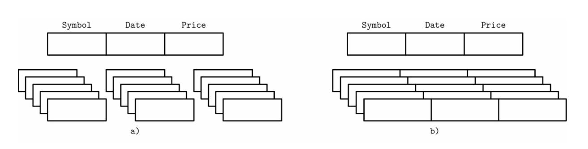
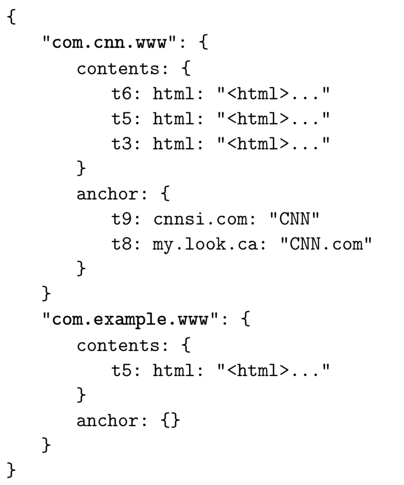
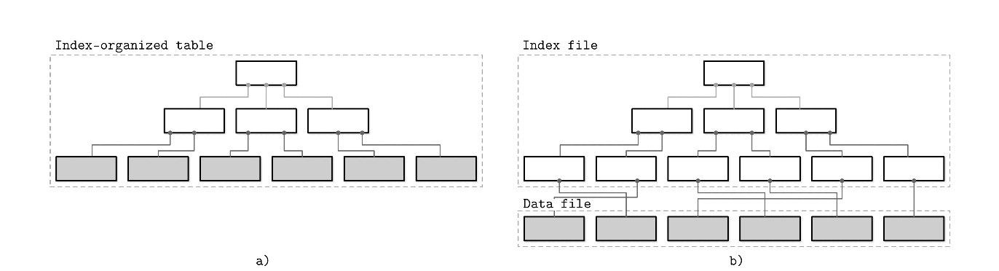
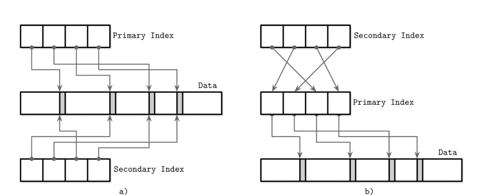

# 열 vs 행 중심 DBMS

데이터베이스 시스켐은 테이블의 열, 행으로 구성된 데이터 레코드 집합을 저장.
필드 = 열과 행의 교차점 즉 특정 유형의 단일 값.

- 같은 열 = 같은 데이터 유형
- 같은 행 = 논리적으로 동일한 레코드에 속하는 값들

## 보조 기억 장치에 데이터를 저장하는 방법
    
메모리와 디스크는 많은 차이를 보인다. 

HDD는 물리적으론 플래터(원판) → 트랙 (동심원) → 섹터 단위로 나누어짐

파일 시스템은 섹터를 묶어서 블록 단위로 I/O 처리 (파일 시스템의 논리적 최소 단위)

데이터베이스의 블록은 DBMS의 버퍼 크기를 설정함 → 디스크 클러스터 혹은 OS 블록 크기의 배수로 설정하는 것이 일반적, DBMS 별로 부르는 이름이 조금씩 다르지만 보통 블록, 혹은 페이지라고 부름

보통 DBMS는 파일 시스템 위에서 동작하지만, 이를 우회하여 직접 디스크에 I/O 하는 경우나 옵션도 존재 (raw device)

DBMS는 데이터가 디스크에 저장되는 방식에 따라 분류 가능하다.
테이블은 수평 분할, 혹은 수직 분할을 할 수 있다. (열 기반 저장 , 행 기반 저장)

행 기반 디비는 우리가 사용하는 대부분의 전통적 관계형 데이터베이스들
열 기반 디비는 대표적으로 MonetDB와 C-Store(Vertica의 오픈소스 전신)

> 이러한 분류 방법은 RDB에서만 속하는 것인가?

RDB의 하위 개념이라고 볼 수 있지만, 반드시 RDB에만 해당하는 것이라고는 볼 수 없음.

"데이터를 어떻게 저장하는가?"에 대한 분류라고 한다면, Cassandra 같은 경우 RDB가 아닌 열 중심 데이터베이스라고 볼 수도 있음

## 행 지향 데이터 레이아웃

행 기반 디비는 데이터를 레코드 또는 행에 저장한다. 표 형태의 데이터 표현과 매우 유사한 구조
"이름, 생년월일, 전화번호를 포함하는 사용자 항목" 과 같은 데이터를 효율적으로 저장 가능

이 방식은 유니크하게 정의된 키에 따라서 (식별자) 다양한 필드를 구성하는 경우에 잘 작동한다.

- 모든 필드가 자주 함께 읽혀지는 경우. (사용자 단위로)
- 그러나 각 필드가 개별적으로 수정이 가능해야 함

> 그니까 모든 데이터 값의 형식이 저장되어 있고(변화할 일이 없음), 개별 논리적 레코드가 이 항목을을 가지면서 자주 함께 조회되는 데이터 셋을 저장하는데 유리하다.

> 스키마는 항상 일정하게 유지되는 경우, 트랜잭션이 중요한 경우, SQL 사용해야 하는 경우 등 → 행 중심 디비 매우 유리

행 중심 저장소는 당연히 행 단위로 데이터에 접근해야 하는 시나리오에서 가장 유용함.
전체 행을 함께 저장하면 공간적 지역성이 향상된다.

> **공간적 지역성**
> 
> 인접한 위치에 같이 조회되는 애들을 넣으면, 읽기 성능 향상이 가능하다는 뜻

디스크와 같은 영구 매체 데이터는 일반적으로 블록 단위로 액세스 된다. (최소 단위가 블록이다.)
그래서 보통 단일 블록에 모든 열 데이터가 포함해서 저장함.

이는 전체 사용자 정보를 가져오는 경우 유용.

but 여러 사용자의 개별 필드를 가져오는 경우 다른 데이터도 paged 되고 비용이 더 많이 듦

## 열 중심의 데이터 레이아웃

데이터를 행 단위로 저장하는 대신 세로로(열 단위로) 파티션함. 동일한 열의 값은 디스크에 연속적으로 저장 됨. ex) 과거 주식 시세를 저장하는 경우 시세들이 연속적으로 저장 됨.

열 중심 저장소는 추세 찾기, 평균값 계산 등과 같이 집계를 계산하는 워크로드에 적합함.
논리 레코드에 여러 필드가 있지만, 그 중 일부의 중요도가 다르고, 함께 사용되는 경우 복잡한 집계 처리에 용이함 

**OLTP와 OLAP**

OLTP → 트랜잭션 기반 처리, 행 중심에 좋음
OLAP → 매출 추이 분석 등 읽기 기반 쿼리, 열 중심이 좋음 

열 중심 디비도 논리적 관점에서 보면 여전히 표 형식으로 표현이 가능함. 그러나 실제 데이터를 저장하는 레이아웃은 완전히 다르게 보임. → 같은 행 데이터가 가깝게 저장

조인, 필터링 등 다중 행 집계를 사용하려면 (행 단위로 조회가 필요한 상황이 되면) 열 수준에서 다른 열의 어떤 데이터와 어떻게 연결되어있는지 식별이 가능해야 함. 
이를 명시적으로 수행하면, 각 값들이 모두 키를 보유해야 하고, 중복 데이터가 생김

이를 해결하기 위해 일부 열 저장소는 가상 ID를 사용, 값의 위치(오프셋)을 사용하여 관련 값에 다시 매핑하기도 함. >> 오프셋 이용하여 조인, 필터링 등 행 단위 집계시 같은 행 데이터 조회

지난 몇 년 동안 증가하는 데이터 셋에 대한 복잡한 쿼리를 실행하려는 수요 증가 → Apache Parquet, Apache ORC, RCFile과 같은 새로운 열 지향 파일 형식과 Apache Kudu, ClickHouse와 같은 열 지향 저장소[ROY12]가 많이 등장

## 차이점 및 최적화

행 기반, 열 기반 저장소의 구분은 데이터 저장 방식만 다른것이 아님. 데이터 레이아웃은 최적화 단계중 하나에 불과. 

한 번의 실행으로 동일한 열의 여러 값을 읽어오면 캐시 사용률, 계산 효율성이 크게 향상.
최신 CPU는 벡터화된 명령어를 사용하여 단일 CPU 명령어로 여러 데이터 포인트를 처리할 수 있다.

> **벡터화된 처리**
현대 CPU는 SIMD(Single Instruction, Multiple Data) 같은 벡터 연산을 지원. 
이는 하나의 명령어로 동일한 연산을 동시에 수행. 
열 지향 데이터베이스에서는 같은 타입의 데이터가 연속적으로 저장되므로 이러한 벡터화 연산의 이점을 극대화 가능.

이러한 최적화는 특히 대량의 데이터를 분석하는 OLAP(Online Analytical Processing) 쿼리에서 중요한 성능 향상을 가져올 수 있다.

데이터 유형이 같은 값을 함께 저장하면 압축률이 더 높아짐. 

데이터 유형에 따라 다른 알고리즘을 사용 가능하며 각 경우에 따라 가장 효과적인 압축 방법을 선택 가능.

**요약**

- 최근 CPU는 반복 연산 같은 경우 벡터연산, 즉 병렬 처리를 지원해줌. 
열 지향 DB는 전부 같은 타입 데이터를 다루기 때문에 이러한 이점을 극대화 하는것이 가능하다.
- 또 같은 데이터 유형을 같은 위치에 연속적으로 저장, 조회하기 때문에 압축률을 극대화하는 것이 가능함.

열 중심 저장소를 사용할지, 행 중심 저장소를 사용할 지 결정하려면 액세스 패턴을 이해해야 함.

- 레코드 중심 조회, 포인트 쿼리와 범위 스캔 → 행 중심
- 스캔이 여러 행에 걸쳐있거나, 하위 집합에 대한 집계 계산 → 열 중심

## 와이드 컬럼 스토어

데이터가 다차원 맵으로 표시, 열 패밀리로 그룹화 (같은 유형의 데이터 저장), 열 패밀리 내부에 데이터가 행 단위로 저장되는 BigTable, Wide column store와 열 중심 디비 헷갈리지 말기.

이 레이아웃은 키 또는 키 시퀀스로 검색된 데이터를 저장하는데 가장 적합.

BigTable의 가장 표준적인 예는 웹 테이블. 
웹 테이블은 특정 타임스탬프의 웹 페이지 콘텐츠와 속성, 관계에 대한 스냅샷 저장. 
페이지는 반전된 URL로 식별, 모든 속성은 스냅샷이 생성된 타임 스탬프로 식별.

데이터는 계층적 인덱스가 있는 다차원 정렬 맵에 저장. 특정 웹 페이지와 관련된 데이터는 반전된 URL, 콘텐츠나 앵커는 타임스탬프로 찾을 수 있음.

각 행은 row key로 인덱스를 만듬. 관련 열은 열 패밀리 (콘텐츠 및 앵커) 에서 함께 그룹화되어 디스크에 별도로 저장. 열 패밀리의 각 열은 패밀리 이름, 한정자의 조합인 열 키로 식별. 열 패밀리는 여러 버전의 데이터를 타임스탬프 별로 저장. 이 레이아웃 사용 → 상위 수준의 항목, 매개변수 등 찾기 쉬움

와이드 컬럼 디비의 개념적인 표현은 이거지만, 실제 레이아웃은 다소 다르다. 
개략적으로 동일한 키의 데이터는 함께 저장된다.

# 데이터 파일과 인덱스 파일

디비의 주요 목표는 데이터를 저장하고, 빠르게 액세스 할 수 있도록 하는 것.

데이터베이스 시스템은 데이터를 저장하기 위해 파일을 사용함.

그러나 레코드를 찾기 위해 디렉터리와 파일 시스템 계층 구조에 의존 x, 특별한 구현 형식 사용.

- 스토리지 효율성
  - 데이터 레코드당 저장 오버헤드를 최소화
- 액세스 효율성
  - 가능한 최소한 단계로 읽기 가능
- 수정 효율성
  - 디스크 내용 변경을 최소화하는 방식으로 수행

디비는 여러 필드로 구성된 데이터 레코드를 테이블에 저장, 보통 테이블 별로 별도 파일 사용.
테이블의 각 레코드는 "검색 키"를 사용해 조회. 레코드를 찾을때마다 전체 테이블을 스캔하지 않도록 인덱스를 사용함. 인덱스는 레코드 식별 필드의 하위 집합을 사용해 구축

디비는 일반적으로 데이터 파일과 인덱스 파일로 구분, 데이터 파일은 레코드를 직접 저장, 인덱스 파일은 메타데이터를 저장, 데이터 파일에서 레코드 조회하는데 사용. 일반적을 데이터 파일보다 작음. 파일은 일반적으로 단일 또는 여러 디스크 블록 크기인 페이지로 분할.

새 레코드 삽입과 기존 레코드 업데이트는 키/값 쌍으로 표현됨. 대부분 최신 스토리지는 삭제를 구현 안함. 대신 삭제 마커를 사용함. 업데이트 혹은 삭제 마커에 의해 가려진 레코드가 차지하는 공간은 가비지 컬렉션에 의해 회수됨(페이지 조회, 새 레코드 추가, 섀도우 삭제 등에 의해 트리거되는듯)

## 데이터 파일

데이터 파일은 인덱스로 구성된 테이블 (IOT), 힙 기반 테이블, 해시 기반 테이블 등으로 구현한다.

힙 기반 테이블 레코드는 특정 순서를 따르지 않음, 쓰기 순서대로 배치. → 새 페이지 추가해도 재구성 x

대신 인덱스 이용 검색시에 데이터 레코드가 저장된 위치를 가리키는 추가 인덱스가 필요함.

해시 기반 테이블은 레코드를 버킷에 저장. 키의 해시 값에 따라 위치 결정. 버킷 추가 순서대로 저장하거나, 키별로 정렬 → 조회 속도 향상 가능

인덱스 구성 케이블은 인덱스 자체에 데이터 레코드 저장. 레코드 자체가 키 순서대로 저장되므로, 범위 스캔은 내용을 순차대로 스캔 → 매우 빨라질듯?

또 인덱스 탐색 후 별도의 주소 탐색이 필요 없음 → 디스크 검색 횟수 최소 한 번 줄일 수 있음

레코드가 별도 파일에 저장되는 경우 인덱스 파일은 데이터 엔트리들을 보관. (식별자와 데이터 파일에서 레코드를 조회하기 위한 정보)

ex) 파일 오프셋(행 로케이터?)는 데이터 파일 내의 레코드 저장 위치, 혹은 해시 기반 테이블의 버킷 ID를 저장함. 인덱스 기반 테이블은 데이터 엔트리가 실제 레코드를 보유.

## 인덱스 파일

인덱스는 효율적인 검색을 용이하게 디스크의 데이터 레코드를 구성하는 구조. 인덱스 파일은 데이터를 식별하는 키와 매핑되거나 기본키를 저장하는 구조로 구성됨.

기본 데이터 파일의 인덱스를 기본 인덱스(프라이머리 인덱스) 라고 부름. 대부분의 경우 기본 키 또는 기본 식별자 집합 위에 구축된다고 가정. 그 외 나머지 모든 인덱스를 보조 인덱스(세컨더리 인덱스) 라고 부름.

보조 인덱스는 데이터 레코드를 직접 가리키거나 기본키를 가짐. 데이터 레코드에 대한 포인터는 힙 기반 테이블이나 인덱스 기반 테이블의 경우 오프셋을 포함할 수도 있음. 또 여러 보조 인덱스가 동일 레코드를 가리킬 수 있음 → 하나의 레코드가 여러 인덱스에 의해 지정되는 것이 허용된다. 기본 인덱스 파일은 검색 키 하나당 고유한 항목을 보유, 보조 인덱스는 검색 키 한개 → 여러 항목 보유 가능

데이터 레코드 순서가 검색 키 순서와 동일 → 이 인덱스를 clusterd되었다 혹은 clustring이라고 함.
이 경우 데이터 레코드는 같은 파일에 저장되거나, 키 순서가 유지되는 clusterd file에 저장됨.
데이터가 별도의 파일에 저장되고, 저장 순서와 키 순서가 다르는 경우 이 비 클러스터형 인덱스라고 함.

인덱스 기반 테이블과 분리 테이블 혹은 레코드 저장 순서에 따른 차이

1. 두 개의 인덱스가 세컨더리 인덱스에서 바로 데이터 엔트리를 참조
2. 세컨더리 인덱스에서 계층을 하나 거쳐서 데이터 참조

많은 디비에는 고유하고 명시적인 기본키 존재. 기본키가 없는 경우 암시적 기본키(*implicit* primary key) 생성 가능. 이 용어는 다양한 데이터 베이스 시스템에서 사용됨. 

## 방향성으로서의 기본 인덱스

데이터베이스 커뮤니티에선 아래 구조에 대한 다양한 의견이 존재.

- 데이터 레코드를 직접 참조(파일 오프셋 이용)
- 기본 키 인덱스를 한 번 거쳐서 참조

두 방식 모두 장단점이 존재하며 완전한 구현 범위에서 논의하는 것이 좋음.

- 데이터를 직접 참조 → 디스크 검색 횟수를 줄일 수 있음, 레코드 생성, 수정시 포인터 업데이트 비용 지불
- 기본 키 인덱스를 이용한 방법은 포인터 업데이트 횟수 줄이지만, 읽을 때 비용 증가

포인터 업데이트는 워크로드가 읽기 위주 구성인 경우 효과적이지만, 여러 인덱스가 존재하는 쓰기 위주 워크로드에선 별로임. 포인터 업데이트에 대한 비용을 줄이기 위해, 일부 구현에선 페이로드 오프셋 대신 기본키를 방향 지정에 사용함.

예를 들어 MySQL InnoDB는 보조 인덱스 한 번, 기본 인덱스 한 번 → 두번 조회를 수행함. 

하이브리드 접근 방식 → 데이터 파일 오프셋과 기본 키 모두 저장도 가능.
먼저 오프셋 유효성 확인, 변경된 경우 새로운 기본 키 인덱스 확인, 새로운 오프셋 찾은 후 업데이트.

# 버퍼링, 불변성 및 순서 지정

스토리지 엔진은 몇 가지 자료구조를 기반으로 함. 

다음 장에서 B-tree에 대한 논의를 시작, 왜 그렇게 많은 B-tree가 존재하는지, 왜 새로운 저장 구조가 계속 등장하는지 설명할 것.

스토리지 자료 구조는 3가지 공통 변수가 존재.

- 버퍼링
- 불변(immutable) 파일
- Ordering (값을 순서대로 저장)

## 버퍼링

스토리지가 데이터를 디스크에 넣기 전에 일정량 데이터를 메모리에 담아둘지 여부 정의.
모든 디스크의 데이터 전송 최소 단위는 블록, 전체 블록을 모두 사용하는게 바람직하므로 어느 정도는 버퍼링을 사용해야만 함. 그러나 피할 수 있는 버퍼링에 대해 이야기할 것.

(비 트리 노드에 인메모리 버퍼를 추가해 I/O 비용을 삭감 → Lazy B-Tree)

이게 버퍼링을 선택할 수 있는 유일한 방법은 아니다. Tow Componenet LSM 트리는 버퍼링을 완전히 다르게 사용함.

## 불변성

데이터 업데이트 시 동일한 자리에 덮어쓰기 vs 새로운 자리에 쓰기 에 대한 내용. 후자의 경우 한 번 쓴 파일 내용은 수정되지 않음. (불변성)

복사 후 쓰기 방식으로도 불변성 구현 가능. → 원본 변경 x, 전체 복사 후 필요한 부분 바꿔서 새로 생성

## 오더링

데이터 레코드가 디스크 페이지에 키 순서대로 저장되는 지 여부. 즉 키 순서대로 저장 순서를 정렬하는지. 순서는 종종 레코드 스캔의 효율성을 결정함. 데이터를 순서 없이 저장하면 쓰기 순서를 아낄 수 있음.

# 요약

디비의 주요 아키텍쳐와 구성 요소에 대해 설명

메모리 및 디스크 기반 저장소 논의

열 행 중심 디비와 주요 요소에 대해 논의

데이터와 인덱스 파일 논의

3가지 핵심 개념 소개 → 이 책 전체에서 이 개념을 이용해 스토리지 엔진 속성을 강조할 것