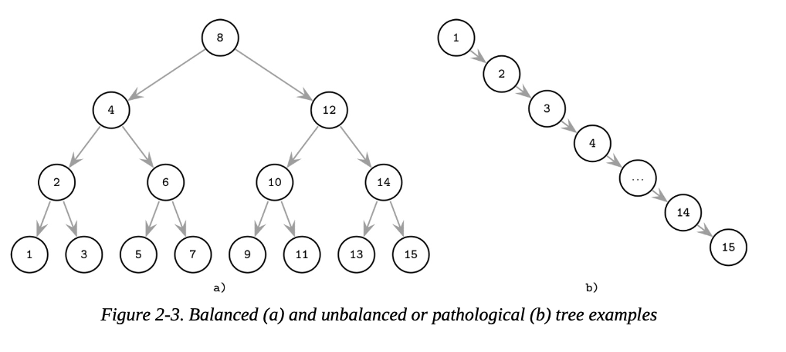
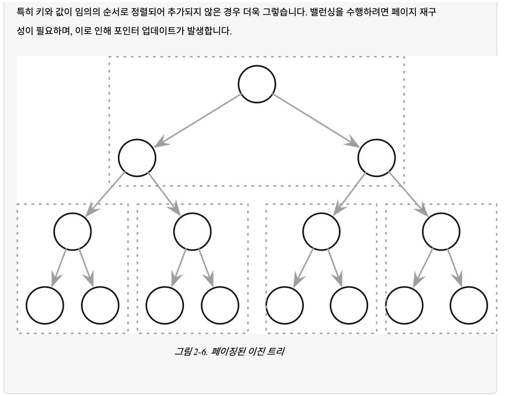
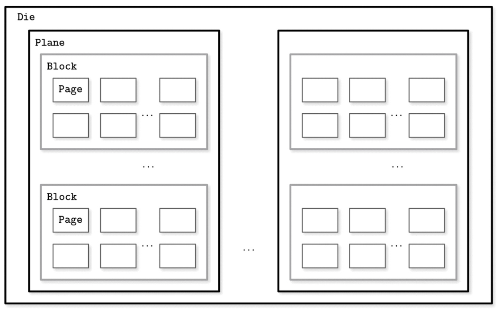
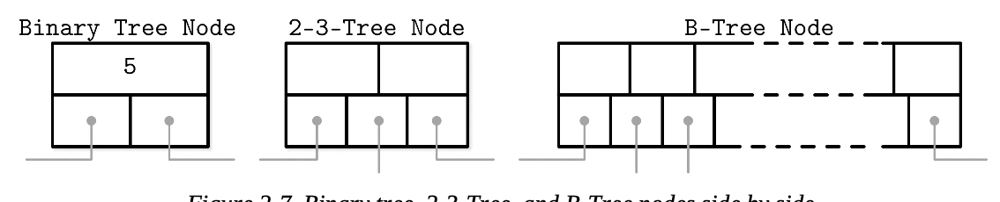
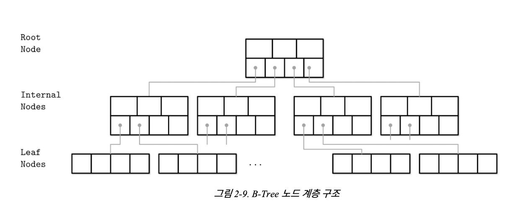

## B-Tree Basics
---
이전 챕터에서 스토리지 엔진을 mutable & immutable로 나누었음. immutablility(불변성)은 설계와 구현의 핵심 개념임. 대부분의 Mutable 스토리지 구조는 in-place update 메커니즘을 사용함. 생성, 수정, 삭제 연산이 데이터 레코드 파일 위치에 직접적으로 업데이트를 함. (새 위치에 생성, 기존 레코드 삭제 방식 x)

스토리지 엔진은 종종 같은 레코드의 다양한 버전을 허용하기도 한다. 

- multiversion concurrency control
    - 데이터를 timestamp 이용해 여러 버전으로 구성
    - 동시성 제어에 이점
- slotted page organization
    - 중앙에 빈 공간을 남겨두는 페이지 기법 (포인터 - 빈 공간 - 레코드)
    - 데이터 업데이트시 슬롯 포인터는 남겨두고 레코드만 새로 생성 가능
    - 레코드 위치 이동, 내용 수정, 가변 레코드 적용에 유리
    - 남는 낭비 공간 존재

단순하게 설명하기 위해 각 키는 하나의 레코드만 가지고 있고, 유니크하다고 가정한다.

가장 인기있는 스토리지 구조는 B-Tree 구조. 많은 오픈소스 데이터베이스 시스템은 B-Tree를 기반으로 하고 있다. 

그러나 B-Tree는 최근에 새로 생긴 것이 아님, 유서 깊은 자료구조. B-Tree를 깊게 파기 전에 우린 B-Tree 가 대신한 다른 전통적인 search tree에 대해 알 필요가 있다. 

- BST
- 2-3-Tree
- AVL Tree

### BST (Binary Search Trees)

이진 트리는 키-값 탐색에 효과적으로 사용되는 정렬된 인메모리 자료구조. 여러개의 노드로 구성되어 있고, 각각의 노드는 키로 표현된다. value는 이 키로 연결되어 있고, 두 개의 자식 포인터를 가진다. BST는 루트 노드라고 불리는 한 개의 노드에서 시작된다.

각 노드는 검색 공간을 왼쪽, 오른쪽 서브 트리로 나눈다. 해당 노드의 키보다 큰 노드는 오른쪽, 작은 노드는 왼쪽 서브 트리에 저장된다. 

왼쪽 포인터를 따라서 가장 아래 리프 노드로 접근하면 가장 작은 키와 값이 들어있다. 비슷하게 오른쪽 끝에는 가장 큰 값이 들어있다. 값은 모든 노드에 저장될 수 있다. 검색은 루트 노드부터 시작해서 가장 밑의 레벨(리프 노드) 까지 키를 찾을때까지 탐색한다.

### Tree Balancing



삽입 연산은 특별한 패턴이 없으며(정렬되지 않은 순서로 삽입 연산이 들어옴), 이는 unblanced한 트리 상황을 만들 수 있다. 최악의 상황에선 링크드 리스트와 같은 pathological tree 구조가 발생할 수도 있다. (이 경우 검색 시간 복잡도가 로그가 아닌 선형 O(n) 구조가 됨)

살작 과장된 예시긴 하지만, 왜 트리 노드가 균형잡혀야 하는지 보여준다. 모든 아이템이 한쪽에 쏠릴 일은 거의 없지만, 최소한 한쪽에 몰리는 일은 생길 수 있고 그 경우 검색이 매우 느려진다.

balanced tree는 log2N 의 height를 가지고, 각 두 서브트리의 height 차이가 1보다 크지 않은 트리라고 정의한다. balancing이 없다면 우리는 bst의 검색 퍼포먼스를 잃어버리고 삽입, 삭제 순서에 따라  트리 모양이 결정된다.

balanced tree는 왼쪽 혹은 오른쪽 포인터를 따라갈때마다 검색 범위가 반으로 줄어드므로 검색 복잡도는 O(log2N) 이다. 트리가 균형잡히지 않은 경우 O(N)까지 올라갈 수 있다.

새로운 요소를 트리 branch에 추가해서 한쪽을 길게 만들고 반대쪽은 비워두는 대신 각 작업 후에 트리의 균형을 맞춰야 한다. balancing은 트리 높이를 최소화하고, 각 사이드의 노드 수를 유지하는 방식으로 노드를 재구성하며 수행된다.

트리의 균형을 유지하는 방법 중 하나는 노드를 추가, 제거한 후 회전 단계를 수행하는 것. 삽입 등으로 인해 브랜치의 균형이 맞지 않는 경우(자식이 하나만 있는 경우) 가운데 노드를 중심으로 노드를 회전시킬 수 있다. 회전하는 동안 중간 노드가 한단계 위로, 부모는 오른쪽 자식 노드가 된다.

### Trees for Disk-Based Storage

앞에서 언급한 불균형 트리는 최악의 경우 복잡도가 O(N)이 된다. balanced tree는 평균 O(logN). BST는 fanout(최대로 허가된 자식 노드의 수)가 적기 때문에 우리는 밸런싱, 노드 위치 재조정, 포인터 업데이트를 더 자주 해야한다. 유지 보수에 들어가는 비용이 증가함에 따라, BST는 디스크 기반 스토리지의 자료구조로 실용적이지 않다.

디스크에서 BST를 유지하려면 문제가 생긴다. 

첫번째는 locality(지역성) 이다. 

요소가 임의의 순서로 추가되기 때문에, 새로 생성된 노드가 부모 노드에 가깝게 쓰여진다는 보장이 없다.
따라서 하위 노드들이 뒤죽박죽 여러 페이지에 쓰일 수 있다. 이는 트리 레이아웃을 수정, 페이징된 이진 트리를 사용하면 어느 정도 개선이 가능하다.

> 지역성(locality)란?


```jsx
for (int i = 0; i < 10; i++) {
    printf(arr[i]);
}
```

- 공간적 지역성
    - 한 번 접근한 공간의 인접한 공간을 순차적으로 접근할 확률이 높다는 것
    - arr[0] ~ arr[9]는 함께 조회할 확률 매우 높음
- 시간적 지역성
    - 최근 접근한 데이터가 가까운 시간 내에 다시 접근될 확률이 높다는 것
    - int i 는 짧은 시간 동안 자주 접근할 확률 매우 높음

캐싱할때 어떤 데이터에 접근할때 주변 데이터를 함께 가져오고, 자주 사용되는 데이터를 저장해놓으면 캐싱 성능이 향상된다.




두번째는 트리 높이이다. 

자식 포인터를 따라가는 비용과 밀접한 관련이 있다. 이진 트리는 fanout이 2이므로, 높이는 logN이며, 검색을 위해 같은 수의 탐색과 디스크 I/O를 수행해야 한다. 
(이는 2-3-Trees 및 기타 fanout이 낮은 트리도 비슷한 한계를 가짐) 인메모리 구조로는 유용하지만 스토리지에서 사용하기엔 비 실용적이다.

순수 BST로 온디스크 스토리지를 구현하면 지역성에 대한 개념이 내장되어 있지 않기 때문에 비교횟수만큼 디스크 탐색이 필요하다. 지역성을 고려한 더 나은 데이터 구조를 찾아야 한다.

디스크 구현에 더 적합한  트리는 다음과 같은 속성을 보여야만 한다.

- 높은 fanout → 인접한 키의 지역성을 개선
- 탐색 과정에서 디스크 조회를 줄이기 위한 낮은 높이

## Disk-Based Structures

---

지난번에 디스크 기반, 메모리 기반 스토리지에 대해 설명했다. 어떤 자료구조는 디스크에서, 어떤 자료구조는 메모리에서 더 적합하다.

저장 공간, 복잡성을 충족하는 모든 데이터구조가 디스크 기반 스토리지에 효과적으로 사용될 수 있는 것이 아니다. 데이터베이스에 사용되는 데이터구조는 여러 제한을 고려하여 조정되어야 한다.

디스크 기반 구조는 데이터 양이 너무 커서 전체 데이터를 메모리에 보관하는 것이 불가능하거나 힘들 경우 자주 사용된다. 일부만 메모리에 캐시할 수 있으며 나머지는 효율적으로 액세스 할 수 있는 방식으로 디스크에 저장해야 한다.

### Hard Disk Drives

대부분의 전통적인 알고리즘들은 회전식 디스크가 가장 널리 보급된 영구 저장 매체였을때 개발되었으며, 이는 설계에도 큰 영향을 미쳤다. 이후 플래시 드라이브와 같은 저장 매체의 새로운 개발은 새로운 알고리즘과 기존 알고리즘 수정에 영감을 주었다. 최근에는 비휘발성 바이트 주소 지정이 가능한 스토리지에서 작동하도록 최적화된 새로운 자료구조가 등장 중.

> nonvolatile byte-addressable storage?
> 

영구적이면서 바이트 단위 저장, 접근이 가능한 스토리지

ex) 3D XPoint (Intel Optane)

회전 디스크에서는 읽기/쓰기 헤드를 원하는 위치에 배치하기 위해 디스크 회전, 기계적인 헤드 이동이 필요하다.
따라서 랜덤 액세스 비용 증가한다. 그러나 이 작업 종료 후 연속된 바이트 읽기, 쓰기는 비교적 저렴하다.

회전 디스크의 가장 작은 저장 단위는 섹터이므로 일부만 읽거나 쓰고 싶어도 전체 섹터를 읽거나 써야한다. (섹터는 일반적으로 512 byte ~ 4KB 까지 다양함)

헤드 위치 지정은 HDD에서 가장 비용이 많이 드는 부분, 디스크에서 연속적인 메모리 세그먼트를 읽고 쓰는 *순차적 I/O*의 긍정적인 효과에 대해 자주 이야기하는 이유 중 하나이다.

### SSD(Solid State Drives)

SSD는 디스크가 움직이지 않는다. 즉 회전하는 디스크나 읽기 헤드가 없다. 일반적 SSD는 메모리 셀로 구성되며 String(일반적으로 32-64 cell)으로 연결되고, String은 Array로 , Array는 Page로 Page는 Block으로 결합된다.

실제로 어떤 기술을 사용했는지에 따라 셀헤는 하나 또는 여러 비트의 데이터가 저장될 수 있다. 페이지는 기기별로 다르지만 일반적으로 2-16kb. 블록은 일반적으로 64-512 페이지로 구성된다. 블록은 Plane을 구성하며 Plane이 모여 Die를 구성한다. 



읽거나 쓰는 가장 작은 단위는 페이지이다. 그러나 빈 메모리 셀에만 변경이 가능하다. 지우는 연산의 가장 작은 단위는 블록(페이지의 결합)이다. 종종 삭제 블록이라고 부른다. 빈 블록의 페이지들은 순차적으로 사용해야 한다. 

페이지 ID를 실제 주소에 매핑하고, 비어있는 페이지, 쓰여진 페이지, 삭제된 페이지를 추적하는 플래쉬 메모리 컨트롤러의 파트를 FTL (Flash Translation Layer). 또한 GC 역할도 담당하고, 안전하게 지워도 되는 블록을 찾는다. 블룩 중 일부에만 사용중인 페이지가 포함될 수 있으므로, 이러한 경우 사용중인 페이지를 새로 재배치하고, 페이지 ID가 해당 위치를 가리키도록 다시 매핑한다. 그리고 사용하지 않는 블록을 삭제해 쓰기에 사용할수 있도록 한다.

HDD SDD 모두 개별 바이트가 아닌 메모리 청크(블록 단위 액세스)를 다루기 때문에 대부분 OS에는 추상화 계층이 존재한다. (파일 시스템) 이는 내부 디스크 구조를 숨기고, I/O 작업을 내부적으로 버퍼링하므로 블록 장치에서 단일 word를 읽을때 블록 단위로 조회한다. 이는 무시할 수 없는 제약 조건이며, 디스크 기반 스토리지에서 작업할때 항상 고려해야 하는 부분이다.

SSD는 랜덤 액세스와 순차 조회의 지연시간 차이가 크지 않으므로 순차 I/O를 강조할 필요는 없다. 그러나 prefetching, 연속 페이지 읽기, 내부 병렬 처리 등으로 인해 약간의 차이는 여전히 존재.

GC는 일반적으로 백그라운드에서 실행되지만, 무작위 및 정렬되지 않은 쓰기 워크로드의 경우 쓰기 작업 퍼포먼스에 영향을 미칠 수 있다.

블록 단위로 쓰기 작업을 수행하면 I/O 작업의 수를 줄이는데 도움이 될 수 있고 다음 장에서 이를 위한 버퍼링과 불변성에 대해 설명할 예정이다.

### On-Disk Structures

디스크 액세스 자체 비용 외에도 효율적인 디스크 기반 스토리지 구조를 구축하기 위한 주요 조건은 디스크 작업의 가장 작은 단위가 블록이라는 사실이다. 블록 내의 특정 위치의 포인터를 따라가려면 블록 전체를 조회해와야 한다. 이걸 바꿀수는 없으므로 활용하기 위해 자료구조 레이아웃을 맞춰야 한다.

이 장에서 이미 여러번 포인터에 대해 언급했지만, 포인터는 디스크에선 약간 다른 의미를 가진다. 디스크에선 대부분의 겨우 데이터 레이아웃을 수동으로 관리한다. (메모리 매핑된 파일이 아니라면). 이는 일반적인 포인터 연산과 비슷하지만, 대상 포인터 주소를 직접 계산하고 명시적으로 따라가야 한다.

> 포인터를 수동으로 관리한다는 의미?
메모리에 저장된 변수 배열에서 5번째 저장된 값을 가져올때 arr[5] 와 같이 사용.
이는 고급 언어에서 제공하는 포인터 주소 계산 기능이나, 디스크에 접근하는 경우 이러한 기능하지 않는 경우가 대부분.
페이지의 첫번째 주소를 구한 후 직접 포인터 주소를 계산하고 명시적으로 따라가야 함. 


대부분의 경우 디스크 오프셋은 미리 계산되어 있거나 (포인터 값 생성 전에 정보를 먼저 저장) 디스크에플러시 될때까지 메모리에 캐싱되어 있다. 긴 의존성 체인을 만드는 (높이가 긴 트리, 링크드 리스트) 것은 코드와 구조 복잡성이 매우 증가하므로 포인터 수와 범위를 최소한으로 유지하는 것이 좋다. (재배치할때 복잡해짐)

요약하면 온디스크 구조는 대상 스토리지의 특성을 염두에 두고 설계되어 일반적으로 더 적은 디스크 액세스를 위해 최적화된다. 이를 위해 지역성을 개선하고, 구조의 내부 표현을 최적화(?)하며, 페이지 밖에서 접근하는 포인터의 수를 줄이면 된다.

BST에서 높은 fanout과 낮은 높이를 가져야 온디스크 자료구조에 바람직하다고 이야기 했다. 또 포인터로 인한 추가 공간 오버헤드와 밸런싱으로 인한 포인터 재매핑에 따른 유지관리 오버헤드에 대해서도 이야기 했다. 

B-Tree는 이런 아이디어를 결합한 자료구조이다. (fanout 증가, 노드 포인터 수 적음, 밸런싱 적음, 높이 낮음)

## **Ubiquitous B-Trees**

---

> We are braver than a bee, and a... longer than a tree… 
- 곰돌이 푸 -
> 

B-Tree는 도서관의 거대한 카탈로그 방이라고 생각하면 된다. 먼저 올바른 캐비넷을 고르고 올바른 선반을 고르고 선반의 올바른 서랍을 고른 후 카드를 탐색하여 항목을 찾아야 한다. B-Tree는 검색한 항목을 빠르게 찾을 수 있는 계층 구조를 구성한다.

BST에서 설명한 것처럼 B-Tree 는 균형잡힌 검색 트리를 토대로 만들어졌으며 fanout이 높고 height이 낮다는 차이가 있다. 

대부분의 표현에서 BST의 노드들은 원으로 그려진다. 모든 노드가 하나의 키를 가지고 두 부분으로 나눠지기 때문에 원으로 그리는게 충분하고 직관적이다. 반면 B-Tree의 노드는 사각형으로 자주 그려지며, 자식 노드사이의 관계를 보여주는 포인터 블록들이 명시되어 강조되어 있다.



이진 트리도 같은 방식으로 묘사할 수 있긴 하다. 두 구조 모두 포인터를 따라가는 방식, 의미는 유사하지만 balance를 유지하는 방식에서 차이가 존재한다. 두 경우 모두 키를 트리를 하위 트리로 분할하고 트리를 탐색하고 값을 찾는데 사용한다.

B-Tree는 정렬되어 있다. B-Tree 노드 내부의 키는 순서대로 저장되어 있다. 따라서 검색된 키를 찾기 위해서 이진 탐색 같은 알고리즘을 사용할 수 있다. 또 B-Tree의 조회가 대수적 복잡성을 갖는다는 것을 의미한다. (logN) 이러한 비교를 각각 수행할때마다 디스크를 검색해야 하면 속도가 느려지겠지만 B-Tree는 한 노드에 수십, 수백개의 키가 저장되므로 노드 하나를 이동할때마다 디스크 검색을 한번씩만 수행하면 된다. 뒷장에서 더 자세히 다룰 것.

B-Tree를 사용하면 포인트 쿼리 & 범위 쿼리를 모두 효율적으로 실행이 가능하다. 대부분의 쿼리 언어에서 ‘=’ 로 표현되는 포인트 쿼리는 단일 항목을 조회한다. 반면 ≤, ≥ 는 범위 쿼리를 표현하는데 사용되며 여러 데이터 항목을 순서에 따라 조회하는데 사용된다.

### **B-Tree Hierarchy**

B-Tree는 여러 노드로 구성된다. 각 노드는 최대 N개의 키와 하위 노드에 대한 N + 1 포인터를 보유한다.
노드들은 논리적으로 3 그룹으로 그룹화된다.



1. 루트 노드 : 부모가 없으며 트리의 최상위에 위치
2. 리프 노드 : 하위 노드가 없는 최하위 레이어 노드
3. 내부 노드 : 루트와 리프를 연결하는 모든 노드.

B-Tree는 페이지 구성을 위한 기술이기 때문에 (고정된 사이즈의 페이지를 구성, 탐색하는데 사용) 
종종 노드와 페이지를 같은 의미로 사용하는 경우가 있다. (실제로 보통 페이지 하나당 노드 1개를 저장한다.)

노드의 용량(capacity)과 노드가 실제로 보유하는 키 개수 사이의 관계를 occupancy (수용 능력) 이라고 부른다. 

B-Tree는 fanout을 정하는 것이 가능하다. fanout이 높을수록 트리의 균형을 유지하는데 필요한 구조 변경 비용을 상각(줄이다, 상환하다)하고 하위 노드에 대한 탐색 횟수를 줄이는데 도움이 된다. split or merge 같은 밸런싱 작업은 노드가 가득차거나 비어 있을때 트리거 된다.

> 추가 정보 

여기선 B-Tree 라는 용어를 포괄적으로 사용하지만, 방금 설명한 자료 구조의 정확한 명칭은 B+ Tree.
fanout이 높은 트리는 multi-weight tree라고도 부름.

B-Tree는 값을 루트, 내부, 리프 노드 어디에 저장해도 상관없음. B+ Tree는 리프 노드에만 값을 저장함. 내부 노드는 **seperate key**만 저장함. (검색 알고리즘에게 필요한 값이 있는 리프 노드에 위치를 알려줌)

B+ Tree는 값이 리프 노드에만 저장되므로 모든 작업(삽입, 수정, 제거) 등은 리프 노드에만 영향, split or merge 시에만 상위 수준으로 전파됨.

B+ Tree가 널리 사용되기 시작했고, 다른 문헌들도 그냥 B-Tree로 같이 부름. MySQL InnoDB 공식문서도 B-Tree라고 그냥 부름.  

### Seperator Keys

B-Tree 노드에 저장되는 키를 Index Entries, Seperator Key, Divider Cell 이라고 부른다. 이들은 트리를 서브 트리로 분할하고 상응하는 키 범위를 가지고 있다. 키들은 이진 탐색이 가능하도록 정렬된 상태로 저장된다. 서브트리는 상위 레벨에서부터 하위레벨로 상응하는 키를 찾아 포인터를 따라가면 찾을 수 있다.

노드의 첫번째 포인터는 첫번째 키보다 작은 항목을 보유한 서브 트리를 가리키고, 노드의 마지막 포인터는 마지막 키보다 크거나 같은 항목을 보유한 서브 트리를 가리킨다. 다른 포인터들은 두 키 사이를 참조한다. 


일부 B-Tree 변형에는 특히 리프레벨에서 범위 스캔을 최소화 하기 위해 형제 노드의 포인터가 있다. 다음 형제 노드를 찾기 위해 부모 노드로 되돌아가는걸 방지하는데 도움을 준다. 일부 구현은 양방향 포인터가 있어, 역방향 탐색도 가능하게 한다.

B-Tree의 BST와의 차별점은 아래에서 위로 구축된다는 점이다. 리프 노드의 수가 증가하면 이를 기반으로 내부 노드 수와 트리 높이가 증가한다.

B-Tree는 향후 삽입 및 업데이트를 위해 노드 내부에 미리 추가 공간을 준비해두기 때문에 트리 내부 공간 사용률은 50% 이하로 낮아질 수 있지만, 일반적으론 상당히 높다. 높은 수용 능력은 B-tree 성능에 부정적 영향을 끼치지 않는다.

### B-Tree Lookup Complexity

B-Tree의 조회 복잡성은 다음과 같은 두 가지 관점에서 볼 수 있다.

- 블록 전송 횟수
- 조회 중 수행되는 비교 연산 횟수

전송 횟수 측면에서 로그의 기저는 N. 새로운 레벨마다 K배 더 많은 노드가 있으며, 자식 포인터를 따라가면 검색 공간이 N배 만큼 줄어든다. 조회 중 검색된 키를 찾기 위해 최대 logkM 페이지가 처리된다. 루트에서 리프까지 탐색하기 위해 따라가는 포인터 수는 높이와 같다.

비교 횟수의 관점에서 보면, 각 노드 내부의 키 검색은 이진 탐색을 사용하므로 로그 기저는 2. 모든 비교는 검색 공간을 절반으로 줄이므로 복잡성은 log2M.

검색과 비교를 구분하면 검색이 어떻게 진행되는지 직관적으로 파악하고 조회 복잡성이 무엇인지 이해하는데 도움이 된다.

교과서와 아티클에서 보통 B-Tree 조회 복잡도는 log M으로 표현된다. 

O(|c| * n) = O(n) 인 것처럼, 로그 함수의 기저는 상수 배 정도의 차이를 만드므로 그리 중요하지 않다.

### B-Tree Lookup Algorithm

B-Tree의 구조와 내부 구현을 살펴봤으므로, 조회, 삽입, 삭제 알고리즘을 정의할 수 있다. B-Tree의 아이템을 찾기 위해선 루프에서 리프 노드까지 한 번의 탐색을 수행해야 한다. 이 검색의 목표는 검색하는 키 또는 predecessor (오른쪽 서브트리 중 가장 작은 값) 을 찾는 것. exact match를 사용한 조회는 포인트 쿼리, 업데이트, 삭제에 사용된다. predecessor를 찾는 것은 범위 스캔이나 삽입에 도움이 된다.

루트에서 이진 탐색을 함으로서 시작한다. (검색 값보다 큰 첫번째 separator key를 찾을때까지) 이것은 검색하려는 서브트리를 가리킨다. 인덱스 키들은 트리를 이웃된 두 키 사이의 범위를 가지는 서브트리로 나눈다. 서브트리를 찾자마자 상응하는 포인터를 따라가 목표가 되는 리프 노드를 찾을거나 키가 없어서 predecessor를 찾을때까지 같은 작업을 반복한다. 

트리의 루트에서 시작해서 키가 더 세부적인 범위를 나타내는 다음 수준으로 내려가다보면 마침네 데이터 레코드가 있는 리프 노드에 도착. 각 수준에서 트리를 더 자세하게 볼 수 있다.

포인트 쿼리는 검색된 키를 찾거나 실패하면 검색이 끝난다. 범위 스캔 중에는 가장 가까운 키-값 쌍에서 시작해서 범위의 끝까지 가거나, 범위가 끝날때까지 형제 포인터를 따라 반복을 계속한다.