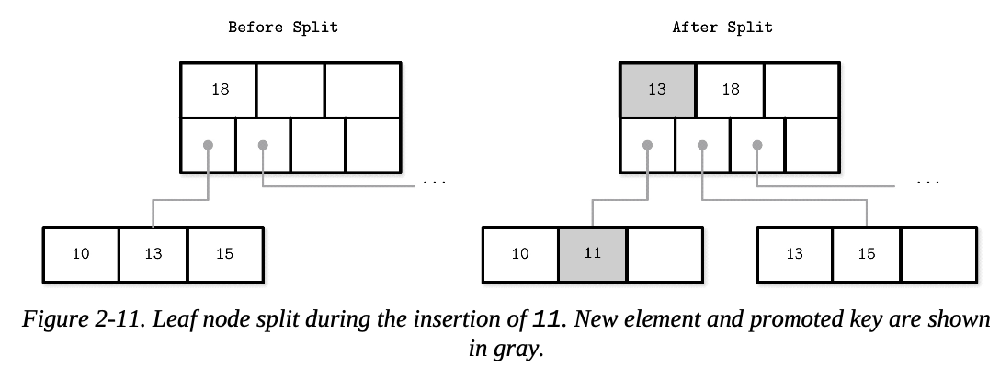
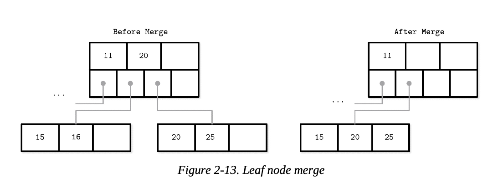

키 카운팅 방식
문헌들에 따라 키와 자식 오프셋 개수를 다르게 표현하는 경우가 있습니다.

Springer 논문에서는 최적의 페이지 크기를 나타내는 장치 의존적인 자연수 K를 언급합니다:
페이지는 k ~ 2k 개의 키를 가짐
부분적으로 채워질 수 있음
최소 k+1, 최대 2k+1개의 자식 노드 포인터를 가짐
루트 페이지는 1 ~ 2k 개의 키 보유 가능
후기 문헌에서는 l로 표현하며, 자식 노드가 아닌 모든 노드는 l+1개의 키를 가진다고 표현함
다른 문헌에서는 노드들이 N개의 구분자 키(separator keys)와 N+1개의 포인터를 가진다고 설명합니다.

두 접근법 모두 동일한 결과를 가져오지만, 각각 중점을 두는 부분이 다릅니다. 이 문서에서는 키 개수로 N을 사용하겠습니다.

B-Tree 노드 분할
값을 삽입하는 과정:

목표 리프 노드 찾기
삽입 지점 탐색
키와 값을 추가
B-Tree의 수정은 조회 알고리즘을 사용해 목표 리프 노드를 찾아 기존 키에 새 값을 연결하는 방식으로 수행됩니다.

목표 노드가 추가 불가능한 상황이면 **오버플로우(overflow)**가 발생하고 노드를 두 개로 분할합니다:

리프 노드: N개의 키-값 쌍을 저장할 수 있을 때, 하나 더 추가하면 N을 초과하는 경우
내부 노드: N+1개 포인터를 저장할 수 있을 때, 포인터 하나 추가가 N+1을 초과하는 경우
분할 과정:

새 노드 할당
기존 노드 요소의 절반을 새 노드로 전송
분할 지점의 첫 번째 키와 포인터를 부모 노드에 추가("승격(promoted)")
분할 지점 또는 중간 지점의 모든 요소는 새 노드로 이동
부모 노드가 가득 차서 승격된 키와 새 노드 포인터를 저장할 공간이 없으면 부모 노드도 분할해야 합니다. 이는 루트 노드까지 재귀적으로 전파될 수 있습니다.

루트 노드 분할 시:

분할 지점의 키를 가진 새 루트 노드 생성
기존 루트는 새 형제 노드와 함께 다음 레벨로 강등
트리 높이가 한 단계 증가

리프 노드에 요소 11 삽입 시 분할 과정

내부 노드와 루트 노드 분할 과정

분할 완료 후 삽입을 마무리하려면 적절한 노드를 선택해야 합니다. "구분 키 불변성(separator key invariants)"을 사용하여:

삽입 키가 승격된 키보다 작으면 원래 노드에 삽입
그렇지 않으면 새 노드에 삽입
분할 과정 요약:

새 노드 할당
분할 노드에서 새 요소 절반 복사
새 요소를 적절한 노드에 배치
분할 노드의 부모에 구분 키와 포인터 추가
B-Tree 노드 병합
삭제 과정:

대상 리프 노드 찾기
연결된 키와 값 제거
인접 노드의 값이 너무 적으면 형제 노드들이 병합됩니다. 이러한 상황을 **언더플로우(underflow)**라고 합니다.

다음 조건이 충족될 때 두 노드가 병합됩니다:

리프 노드: 최대 N개 키-값 쌍을 저장할 수 있을 때, 인접한 두 노드의 키-값 쌍 합이 N보다 작거나 같은 경우
내부 노드: 최대 N+1개 포인터를 저장할 수 있을 때, 인접한 두 노드의 포인터 개수 합이 N+1보다 작은 경우

리프 노드에서 요소 16 삭제 시 병합 과정

내부 노드에서 요소 10 삭제 시 병합 과정

내부 노드 병합 시 부모 노드의 일치하는 구분 키를 아래로 내릴 수 있습니다(강등). 분할과 마찬가지로 병합도 루트 레벨까지 전파될 수 있습니다.

병합 요약:

요소 제거
오른쪽 노드의 모든 요소를 왼쪽 노드로 복사
부모에서 오른쪽 노드 포인터 제거(내부 노드인 경우 구분 키 강등)
오른쪽 노드 제거
분할 및 병합 횟수를 줄이기 위해 B-Tree에서는 리밸런싱이라는 기술을 자주 구현합니다.

2장 요약
BST는 낮은 팬아웃과 리밸런싱으로 인한 포인터 업데이트가 많아 디스크에 적합하지 않음
B-Tree는 높은 팬아웃과 낮은 밸런싱 빈도로 이 문제들을 해결
트리 깊이를 최소화하고 기존 노드에 여유 공간이 있을 때 항목을 추가하는 방식
이 지식을 바탕으로 인메모리 B-Tree 구현 가능
디스크 기반 구현을 위해서는 B-Tree 노드를 디스크에 배치하고, 데이터 인코딩 형식을 사용한 온디스크 레이아웃 구성 방법 필요
3장 파일 포맷
B-Tree의 기본 구조 이해 후, 디스크 구현 방법을 알아봅니다. 디스크는 메모리와 다른 방식으로 접근합니다:

메모리 접근은 대부분 투명(transparent)하고 가상 메모리로 인해 오프셋을 직접 다룰 필요가 없음
디스크는 시스템 콜을 통해 접근하며, 파일 내 오프셋을 명시해야 함
메모리 형식으로 디스크 데이터를 변환할 필요가 있음
디스크 기반 자료구조의 포인터 사용 방식:

메모리 기반: 가상 메모리 주소를 직접 사용
디스크 기반: 파일 시작점에서의 오프셋 또는 (페이지 크기 × 페이지 번호)를 계산해 사용
효율적인 온디스크 구조를 설계하려면 구성, 수정, 해석이 쉬운 파일 형식이 필요합니다. 이 장에서는 B-Tree뿐 아니라 모든 온디스크 구조 설계에 도움되는 일반 원칙을 설명합니다.

온디스크 B-Tree는 페이지 관리 메커니즘으로 볼 수 있으며, 페이지와 페이지 포인터를 계산하고 배치해야 합니다. B-Tree의 복잡성은 주로 가변성에서 비롯되므로, 페이지 레이아웃, 분할, 재배치, 가변 데이터 구조에 적용 가능한 개념을 설명합니다.

이진 인코딩
디스크에 데이터를 효율적으로 저장하려면 압축, 직렬화, 역직렬화가 용이한 포맷으로 인코딩해야 합니다. 메모리와 달리 디스크는 malloc, free 같은 명령어가 아닌 read, write만 사용할 수 있어 데이터 접근 방식이 다릅니다.

효율적인 페이지 레이아웃을 만들기 위한 주요 원칙은 모든 이진 포맷에 적용됩니다. 페이지 구성 전에 키와 데이터 레코드의 이진 표현 방법, 복잡한 구조로의 결합 방법, 가변 크기 타입과 배열 구현 방법을 알아야 합니다.

원시 타입
키와 값은 integer, date, string 등의 타입을 가지며 이진 형식으로 직렬화/역직렬화가 가능합니다.

대부분 숫자 자료형은 고정 크기로 표현됩니다. 멀티바이트 숫자 값 사용 시 일관된 바이트 순서(endianness)가 중요합니다:

Big-endian: 최상위 바이트(MSB)부터 시작해 하위 바이트 순으로 저장
Little-endian: 최하위 바이트(LSB)부터 시작해 상위 바이트 순으로 저장

16진수 32비트 정수 0xAABBCCDD의 빅 엔디안과 리틀 엔디안 표현

스토리지 엔진을 변경할 경우 엔디안 차이로 인한 문제를 해결하기 위해 대부분의 스토리지 엔진은 엔디안 변환을 지원합니다. 예를 들어 RocksDB는 EndianTransform을 사용해 필요시 바이트 순서를 변환합니다.

cpp
inline uint64_t EncodeFixed64WithEndian(uint64_t val, bool big_endian,
                                     size_t size) {
  if (big_endian && port::kLittleEndian) {
    val = EndianTransform(val, size);
  } else if (!big_endian && !port::kLittleEndian) {
    val = EndianTransform(val, size);
  }
  return val;
}
부동 소수점(float, double)은 부호(sign), 가수(fraction), 지수(exponent)로 표현됩니다. IEEE 754 표준에 따라 32비트 float은 단정밀도, double은 배정밀도 값을 표현합니다. 부동 소수점은 가수를 사용한 계산으로 정확한 값이 아닌 근사치를 산출합니다.

문자열과 가변 크기 데이터
문자열과 가변 크기 데이터는 다음 방식으로 직렬화할 수 있습니다:

길이(Size) 값 저장
실제 데이터 저장
이런 표현은 "USCD String" 또는 "Pascal String"이라고 부릅니다:

String {
    size    uint_16
    data    byte[size]
}
Pascal String의 대안으로 "null-terminated string"이 있으며, 문자열 끝 기호까지 바이트 단위로 읽습니다.

Pascal String의 장점:

상수 시간(constant time)으로 문자열 길이 계산 가능
메모리에서 Size 바이트만큼 추출해 문자열 생성 가능
비트 패킹된 데이터: 부울, 열거형, 플래그
부울(Boolean) 자료형:

단일 바이트로 표현하거나 1(true)과 0(false)로 인코딩
효율성을 위해 8개의 부울 값을 하나의 바이트에 패킹하는 방식 사용
1비트는 set, 0비트는 unset 또는 empty라고 표현
열거형(Enum):

정수로 표현 가능
자주 반복되는 낮은 차수(cardinality)의 값 표현에 사용
예: B-Tree 노드 유형 인코딩
enum NodeType {
     ROOT,     // 0x00h
     INTERNAL, // 0x01h
     LEAF      // 0x02h
};
플래그(Flag):

부울과 열거형이 조합된 형태
상호 배타적이지 않은 명명된 부울 매개변수 표현
비트마스크와 비트 연산을 사용해 조작
int IS_LEAF_MASK         = 0x01h; // bit #1
int VARIABLE_SIZE_VALUES = 0x02h; // bit #2
int HAS_OVERFLOW_PAGES   = 0x04h; // bit #3
비트 조작 예:

// 비트 설정
flags |= HAS_OVERFLOW_PAGES;
flags |= (1 << 2);

// 비트 해제
flags &= ~HAS_OVERFLOW_PAGES;
flags &= ~(1 << 2);

// 비트 설정 여부 테스트
is_set = (flags & HAS_OVERFLOW_PAGES) != 0;
is_set = (flags & (1 << 2)) != 0;
