### General Principles

파일 포맷을 설계할때에는 addressing (주소 지정 방식) 을 결정하면서 시작한다. 
(파일을 동일한 크기의 페이지들로 분할할 것인지, 그리고 이 페이지들을 단일 블록이나 여러 개의 연속된 블록으로 표현할 것인지를 결정해야 합니다)

대부분의 in-place update(제자리 업데이트) storage 구조는 읽기, 쓰기를 간소화하기 위해 동일한 크기의 페이지를 사용한다.  Append-only storage 구조도 종종 데이터를 페이지 별로 쓰는데, 레코드가 차례대로 추가되고 페이지가 메모리에 가득차면 디스크에 플러시한다.

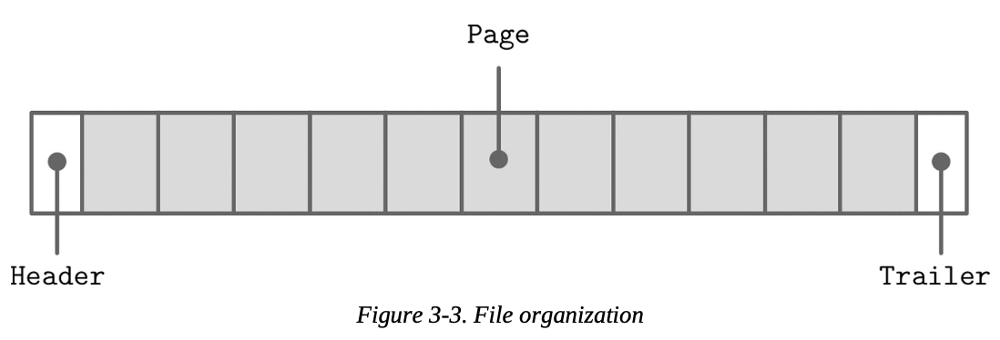

파일은 일반적으로 고정 크기 헤더로 시작하여 고정 크기 트레일러(Trailer)로 끝난다. 트레일러에는 나머지 부분을 디코딩하는데 필요하거나 빠르게 액세스되어야 하는 보조 정보들을 담고 있다. 나머지 파일들은 페이지로 분할된다. 

많은 데이터 저장소에는 테이블의 필드의 수, 순서, 유형을 명시하는 고정된 스키마가 있다. 고정 스키마는 디스크에 적재되는 데이터의 양을 줄이는데 도움을 준다. (필드의 이름을 반복해서 쓰는 대신 필드의 position identifier 를 사용하여) 

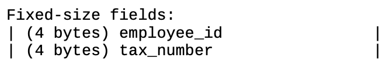

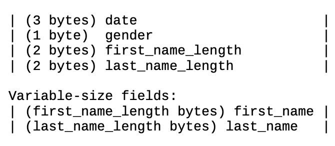

이제 first_name에 접근하려면 고정 크기 영역 뒤의 (first_name_length_bytes) 바이트를 슬라이스하면 된다. last_name에 접근하려면 그 앞의 가변 크기 필드의 크기를 확인하면 시작 위치를 찾을 수 있다. 여러 필드를 포함한 계산을 피하려면 fixed-size 영역에 오프셋과 길이를 같이 인코딩하면 된다. 이 경우 variable-sized field를 개별적으로 찾을 수 있다.

더 복잡한 구조를 만드는 경우 일반적으로 계층 구조를 포함한다. 

ex) primitive → field → cell → page → section → region

꼭 따라야 하는 엄격한 규칙은 없으며, 포맷을 구성하는 데이터의 종류에 따라 달라진다.

데이터베이스 파일은 종종 여러 부분으로 구성되며, 탐색을 돕기 위해 시작 offset을 가리키는 look-up 테이블이 있다.

> look-up 테이블이란?

값을 가져올 때 과정을 생략하기 위해 저장해놓는 보조 테이블. 주로 key-value 형식으로 데이터를 저장한다. 파일 헤더, 트레일러 혹은 별도의 파일에 저장된다.

### Page Structure

데이터베이스 시스템은 데이터 레코드를 데이터 및 인덱스 파일에 저장한다. 이 파일들은 페이지라고 하는 고정된 크기 단위로 분할되며, 페이지 사이즈는 보통 파일 시스템 블록 사이즈의 배수이다. (보통 4~16kb)

온디스크 B-Tree의 예시를 살펴보자. 구조적 관점에서 볼때 B-Tree는 리프 노드 (키 & 레코드)와 nonleaf 노드 (키 & 포인터) 로 구분된다. 각 B-Tree 노드는 하나의 페이지 또는 서로 연결된 여러 페이지를 차지하므로, B-Tree의 맥락에서 노드와 페이지 (블록)은 종종 혼용되어 사용된다.

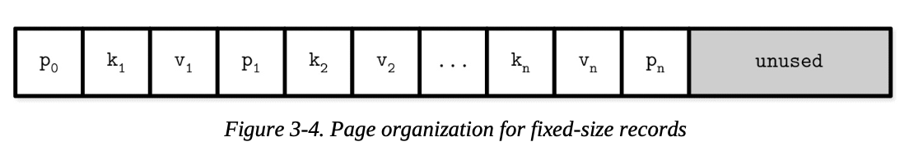

원본 B-Tree 논문에서는 고정된 크기의 데이터 레코드를 위한 단순한 페이지 구조를 제시한다. (키는 k, 값은 v, 하위 페이지 포인터는 p로 표시하며 페이지는 저 셋의 합)

이러한 방식은 따라하기 쉽지만 몇 가지 단점이 존재한다.

- 오른쪽이 아닌 곳에 키를 추가하려면 재배치가 필요하다.
- 고정 크기 데이터만 작동한다. (가변 크기 레코드를 사용할 수 없다.)

### Slotted Pages

가변 크기 레코드를 저장할때 가장 큰 문제는 free space 관리이다. (제거된 레코드가 사용했던 공간 회수) 사이즈가 m 이었던 레코드가 차지했던 공간에 n 크기의 레코드를 넣으려고 할때 m == n이 아니거나 크기가 정확히 m - n인 레코드를 찾을 수 없다면 공간이 낭비된다. 마찬가지로 m 보다 큰 크기 k 레코드가 들어올 경우 m 공간은 사용할 수 없으므로 unused에 삽입하고 공간이 낭비된다. (외부 단편화)

가변 크기 레코드의 공간 관리를 간소화하기 위해 페이지를 고정 크기 세그먼트로 다시 분할할 수 있다. 하지만 그럼에도 결국에 공간이 낭비될 것이다. 예를 들어 64 바이트의 세그먼트로 나눈다면, 레코드 크기가 64의 배수가 아닌 경우 (64 - n) 바이트가 낭비될 것이다. (n은 레코드 크기). 즉 레코드가 정확히 64 바이트가 아니라면 블록 중 하나는 부분적으로만 채워질 것이다. (내부 단편화)

공간 회수는 단순히 페이지에 값을 다시 작성하고 주변 레코드를 이동시키는 것으로 수행 가능하지만, 페이지를 가리키는 외부의 포인터가 페이지 오프셋을 활용하고 있을 수 있으므로, 페이지 오프셋을 유지해야만 한다. 공간 낭비를 최소화하면서 이걸 진행하는 것이 바람직하다.

요약하면 다음과 같은 조건을 만족하는 페이지 형식이 필요하다.

- 최소한의 오버헤드로 가변 레코드 저장
- 제거된 레코드가 차지한 공간 다시 활용
- 정확한 위치와 관계없이 페이지 레코드 참조

문자열, BLOB 과같은 가변 레코드를 효율적으로 저장하려면 slotted page 혹은 slot directory 라는 기법을 사용할 수 있다. 이 방식은 많은 데이터베이스 (ex: PostgreSQL) 에서 사용된다.

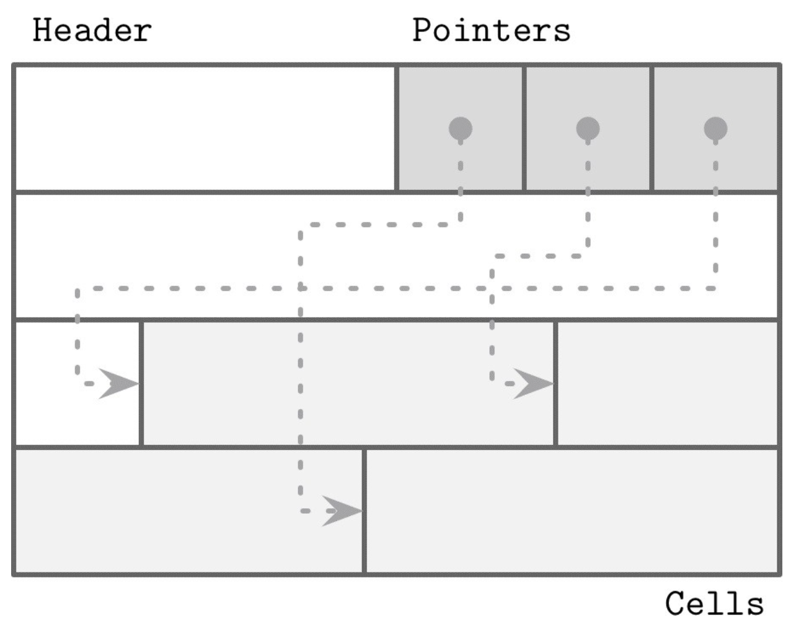

페이지를 슬롯 혹은 셀들의 모음으로 구성하고, 포인터와 셀을 페이지의 서로 다른 영역으로 분리한다. 실제 셀의 위치를 변경할 필요 없이 포인터만 재구성하면 되며, 레코드 삭제도 포인터만 삭제하면 된다.

slotted page에는 고정 크기 헤더가 존재하는데, 페이지와 셀에 대한 중요 정보를 담고 있다. 셀은 크기가 모두 다를 수 있으며 (키, 포인터, 레코드 등) 임의의 데이터를 저장할 수 있다. 위의 그림 처럼 모든 페이지는 헤더, 셀, 포인터를 가지고 있다.

이 방식을 통해 어떻게 위에서 언급한 문제를 해결할 수 있을까?

- 오버헤드 최소화: 유일한 오버헤드는 포인터 배열 뿐
- 공간 확보: defragmenting 혹은 페이지 다시 쓰기를 통해 공간 확보가 가능하다.
- 동적 레이아웃 : 페이지 외부에서 슬롯은 ID만 사용해서 참조, 정확한 위치는 페이지 내부에 있다.

> InnoDB의 페이지 구조

https://blog.jcole.us/2013/01/03/the-basics-of-innodb-space-file-layout/

### Cell Layout

flag, enum, primitives를 사용하여 셀 레이아웃을 디자인 한 하듬, 셀을 페이지로 결합하고 페이지로 트리를 구성할 수 있다. 셀 레벨에서 우리는 key cell과 key-value cell을 구분할 수 있다. key cell에는 구분키와 두 인접한 페이지 사이의 포인터가 들어있다. (가로 이동을 위해) key-value cell에는 키와 관련된 데이터 레코드가 저장된다. 

우리는 페이지 내의 모든 셀이 균일하다고 가정할 것이다. (ex 페이지 내의 모든 셀이 key cell이거나, key-value cell이다. 비슷하게 모든 셀이 고정크기이거나, 가변 크기이다. 혼합되는 경우는 제외). 이로서 우리가 메타데이터를 모든 셀에 중복으로 입력하는 대신 페이지에 한 번만 저장하면 된다.

key cell 을 구성하기 위해 알아야 할 것들

- 셀 타입 (페이지 메타데이터에서 유추 가능)
- 키 사이즈
- 이 셀이 가리키는 하위 페이지의 ID
- 키 바이트 (값)

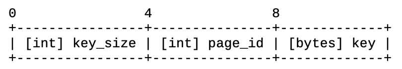

가변 사이즈의 key cell 레이아웃은 다음처럼 보일 수 있다. (고정 크기는 키 사이즈 x)

key-size 바이트와 함께 고정 크기 데이터 필드를 그룹화했다. 엄격하게 이야기해서 필수적인건 아니지만 오프셋 계산을 간단하게 해준다. (고정 크기 데이터는 필요 없지만, 가변 크기 데이터는 오프셋 계산을 위해서 필요하다)

key-value cell에는 하위 페이지 ID 대신 데이터 레코드가 저장된다. 그 외의 구조는 비슷하다.

- 셀 타입
- 키 사이즈
- 값 사이즈
- 키 바이트
- 데이터 레코드 바이트

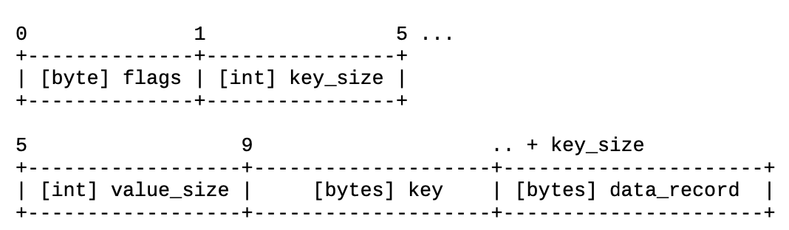

여기서 offset과 페이지 ID의 차이를 알아차렸을 것이다. 페이지는 크기가 고정되어 있고 페이지 캐시에 의해 관리되므로 페이지 ID만 알면 된다. (나중에 look-up 테이블에 의해 변환된다.) 그러나 cell offset은 페이지 내부에 있으므로 페이지 시작 offset에 상대적이다. 

(더 작은 int로 표현하면 더 컴팩트하게 저장이 가능하다)

> 참고

셀의 키와 값이 반드시 고정된 크기일 필요가 없다. 키, 값 모두 가변 크기를 가질 수 있다. 오프셋을 사용하여 고정 크기 셀 헤더에서 위치를 계산 가능

키를 찾으려면 헤더를 건너뛰고 key_size를 읽으면 된다. 값을 찾으려면 마찬가지로 헤더를 건너뛰고 key_size 읽고 더한 다음 value_size를 읽고 접근하면 된다.

다른 방식으로도 접근이 가능하다. 예를 들면 총 크기를 저장하고 빼기를 통해 접근도 가능. 결국 모든 셀을 하위 부분으로 나누고 인코딩된 데이터를 재구성하기 위한 충분한 정보를 확보하는 것이 중요.

### **Combining Cells into Slotted Pages**

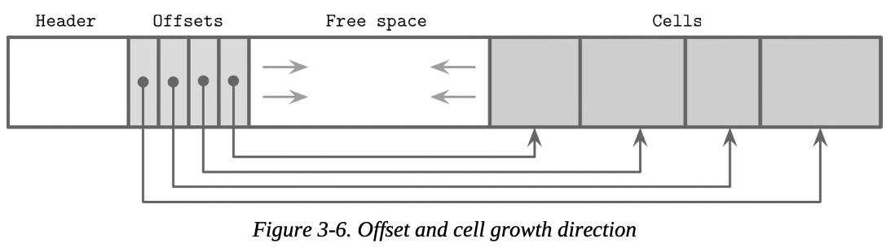

셀을 페이지로 구성하려면 앞서 설명한 slotted page 기법을 사용할 수 있다. 위의 그림 처럼 셀을 페이지 가장 오른쪽의 가장자리에 추가하고 셀 오프셋/포인터를 왼쪽 가장자리에 유지한다.

키들은 순서 없이 (무작위로) 삽입 될 수 있으며, 오프셋 포인터를 순서대로 정렬하여 논리적으로 정렬된 순서가 유지된다. 이 디자인은 최소한의 노력으로 페이지에 셀 추가가 가능하다. (삽입, 수정, 삭제 시에 Cell 을 직접 재배치할 필요가 없으므로)

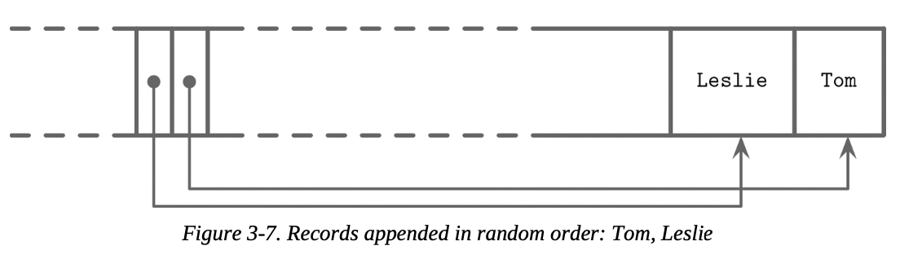

이름을 저장하고 있는 위의 예시 페이지를 보면 페이지에 Tom, Leslie 순서로 삽입되었다. 두 이름의 논리적 순서(알파벳)는 삽입 순서와 같지 않다. 셀은 삽입 순서대로 배치되지만 오프셋은 이진 탐색을 사용하기 위해 다시 정렬된다.

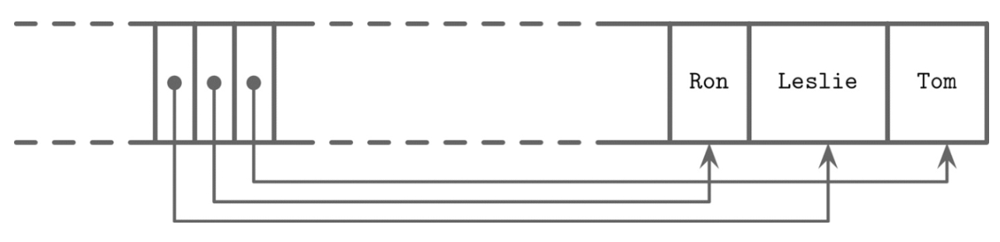

이제 우리는 Ron 이라는 이름을 하나 더 추가한다. 세 데이터는 페이지의 여유 공간의 가장 윗부분에 추가되지만 오프셋은 사전적 키 순서(Leslie, Ron, Tom)를 유지해야 한다. 이를 위해 우리는 offsest을 재정렬해야 한다. (Ron 셀에 대한 새 포인터를 위한 공간을 확보하기 위해 포인터를 오른쪽으로 이동)

### Managing Variable-Size Data

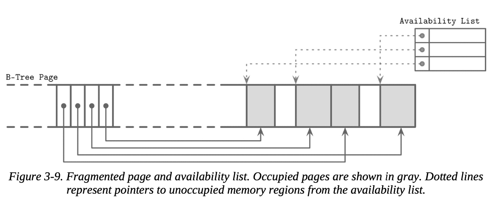

페이지에서 항목을 제거해도 실제 셀을 제거하고 다른 셀들을 이동하여 해제후 남은 공간을 재할당할 필요는 없다. 대신 셀이 삭제된 것으로 표시되고, 인 메모리 availability list 에 해제된 메모리의 양과 해제된 값에 대한 포인터를 수정한다. availability list 는 해제된 세그먼트들의 오프셋과 크기가 저장된다. 세 셀을 삽입할때에는 먼저 availability list를 확인하여 해당 셀이 들어갈 수 있는 세그먼트가 있는지 확인한다. 

SQLite는 비어있는 세그먼트 프리 블록을 호출하고 페이지 헤더에 프리 블록의 첫번째 포인터를 저장한다. 추가적으로 페이지 내의 사용가능한 총 바이트 수를 헤더에 같이 저장한다. (재조각화(defragmentation) 후 새 요소를 페이지에 맞출 수 있는 지(fit) 여부를 빠르게 계산하기 위해)
**
Fit은 전략에 따라 계산됨

- First Fit
    
    첫번째로 맞는 순서대로 저장. 그러나 더 큰 오버헤드가 발생할 수 있음. 첫번째 적합한 세그먼트를 재사용했더니 남은 공간이 너무 작아 다른 셀에 맞지 않고 낭비될 수 있음
    
- Best Fit
    
    가장 적합한 세그먼트를 찾음 (삽입 후 남은 부분이 가장 작은)
    

만약 우리가 적절한 연속된 바이트를 찾을 수 없지만 조각화된 바이트는 충분할 경우, live-cell 들은 다시 읽히고 쓰여지며 조각들을 모으고 새 쓰기를 위한 공간을 만든다. 재조각화 후에도 여유 공간이 충분하지 않다면 오버플로우 페이지를 만들어야 한다. 

> 참고

지역성을 개선하기 위해 (특히 키 크기가 작으면) 일부 구현은 키와 값을 리프 레벨에서 별도로 저장하기도 한다. 키끼리 함께 모아두는 것은 검색 중 지역성 향상 가능. 검색된 키를 찾은 후에는 해당 인덱스가 가리키는 값 셀에서 값을 찾을 수 있다. 가변 크기 키를 사용하면 추가적인 포인터를 저장하고 계산해야 한다. 

요약하면 B-Tree 레이아웃을 단순화하기 위해 각 노드가 하나의 페이지를 차지한다고 가정한다. 하나의 페이지는 고정 크기 헤더, 셀 포인터 블록, 셀 들로 이루어진다. 셀들은 하위 노드 또는 연결된 데이터 레코드를 나타내는 포인터를 저장한다. B-Tree는 간단한 포인터 구조를 사용한다. (트리 파일에서 자식 노드를 찾기 위한 페이지 식별자와 페이지 내에서 셀을 찾기 위한 오프셋)

### Version Control

DBMS는 지속적으로 발전중이며 개발자는 기능을 추가하고 버그, 성능 문제를 해결하려고 노력중이다. 그 결과 바이너리 파일 형식이 변경 될 수 있다. 대부분 모든 스토리지 엔진은 두 개 이상의 직렬화 포맷을 지원해야 한다. (현재와 예전 버전과의 호환성을 위해서) 이를 지원하기 위해선 어떤 버전의 파일에 대응하고 있는지 알아야 한다.

이것은 다양한 방법으로 수행 가능하다. 에를 들어 Apache Cassandra는 파일 이름에 버전 접두사를 사용한다. 이로서 파일을 열지도 않고 파일 버전을 알 수 있다. 4.0부터는 데이터 파일에는 na 접두사를 사용한다. 이전 버전은 접두사가 다르다. (3.0은 ma)

또는 버전을 아예 별도의 파일로 저장할 수 있다. 예를 들어 PostgreSQL은 PG_VERSION 파일에 버전을 저장한다.

인덱스 파일 헤더에 저장될 수도 있다. 이 경우 헤더의 일부 혹은 전체는 버전간에 절대로 변경되지 않는 방식으로 인코딩되어야 한다. 파일이 어떤 버전으로 인코딩되었는지 알아낸 다음에는 version-specific reader를 만들어 내용을 해석할 수 있다. 어떤 포맷은 매직 넘버를 사용해 버전을 구분하기도 한다.

### Checksumming

디스크의 파일은 하드웨어 failure 또는 소프트웨어 버그로 손상되거나 오염될 수 있다. 이러한 문제를 선제적을 식별하고 다른 노드나 하위 시스템으로 전파되는 것을 막기 위해 체크섬과 순환 중복 검사(CRC)를 사용할 수 있다.

일부 소스에서는 암호화/비암호화 해시 함수, CRC, 체크섬을 구분하지 않는다. 공통적으로 많은 데이터를 작은 숫자로 줄이지만, 유스 케이스, 목적, 보증 방식은 다르다.

체크섬은 가장 약한 형태의 보증을 제공하며 여러 비트가 손상된 경우 감지할 수 없다. 일반적으로 패리티 검사 또는 summation(합산) 과 XOR을 이용해 계산한다.

CRC는 burst error (연속된 여러 비트의 손상)을 감지할 수 있으며, 일반적으로 lookup table과 다항식 나눗셈을 사용한다. 통신 네트워크 및 저장 장치에서 발생하는 대부분의 오류는 이런 식이기 때문에 멀티 비트 오류를 감지하는 것은 중요하다.

> 데이터 변조 여부 확인을 위해 비암호화 해시, CRC를 사용해서는 안된다. 반드시 암호화 해시를 사용해야 한다. CRC의 주요 용도는 에러 탐지이다. 공격 혹은 의도적 데이터 변경을 확인하기 위해 설계되지 않았다.

데이터를 디스크에 쓰기 전에 우리는 체크섬을 같이 계산해서 기록한다. 데이터를 읽을 때에는 체크섬을 다시 계산해서 기록된 것과 비교한다. 체크섬이 불일치하면 손상이 발생했으므로 읽은 데이터를 사용해서는 안된다.

전체 파일에 대해 체크섬을 계산하는 것은 보통 비현실적이고, 우리가 접근할때마다 전체 콘텐츠를 다 읽을 가능성은 적다. 그래서 보통 페이지 단위 체크섬이 페이지 헤더에 저장된다. 이렇게 하면 데이터의 더 작은 단위로 수행되므로 더 강력해지고, 단일 페이지 손상으로 전체 파일을 제거하지 않아도 된다.

### Summary

이번 장에선 기본 데이터 우형을 직렬화하고 셀로 결합하고, 셀을 이용해 slotted page를 만들고, 이러한 구조를 탐색하는 방법 등 이진 데이터 구성에 대해 알아봤다.

문자열, 바이트 시퀀스, 배열 같은 가변 길이 데이터 타입을 처리하고 다루는 방법(값의 크기를 저장하는 특수 셀을 구성하는 방법)을 배웠다.

페이지 외부에서 셀 ID 별로 개별 셀을 참조하고, 삽입 순서대로 저장하고, 셀 오프셋을 정렬하여 키 순서를 유지하는 슬롯 페이지 형식에 대해 배웠다.’

이러한 원칙은 디스크 기반 자료구조와 네트워크 프로토콜을 위한 이진 형식을 구성하는데도 사용할 수 있다.