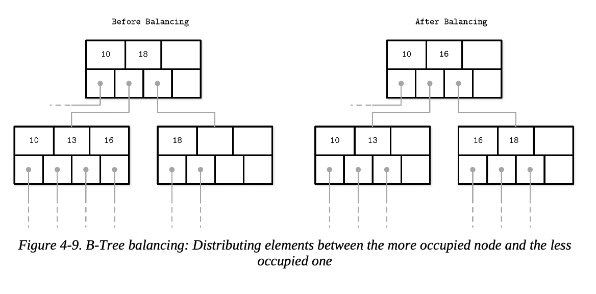
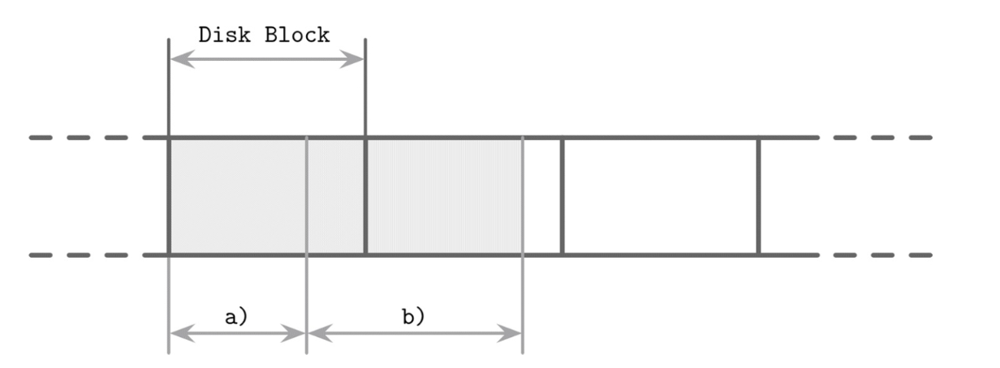
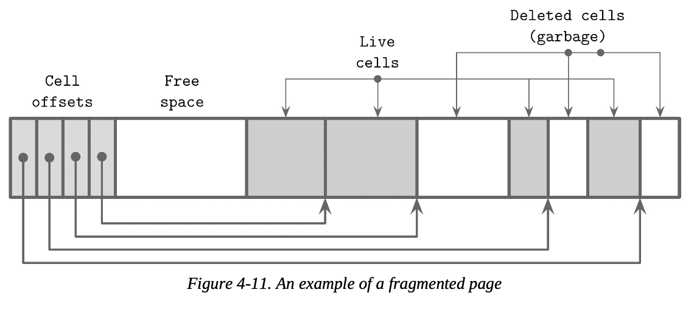

# Ch4. B-Tree Implements - 3

## Rebalancing

---

몇몇 B-Tree 구현들은 리밸런싱에 들어가는 비용을 최대한 낮추기 위해 분할 및 병합 작업을 미룬다. (같은 레벨 내에서 요소들을 리밸런싱 하거나, 요소들이 많이 있는 노드에서 적은 노드로 이동시키면서 가능한 늦게 병합, 분할을 수행하도록 한다). 이는 노드 점유율 (occupancy, 한 개의 노드가 가지고 있는 요소 수) 을 향상시키며, 잠재적으로 리밸런싱 비용을 조금 높이더라도 트리의 높이를 낮춘다.

삽입, 삭제 작업 중에 로드 밸런싱도 수행할 수 있다. 공간 활용도를 높이기 위해 오버플로우가 발생했을때 노드를 분할하는 대신, 일부 노드를 형제 노드로 이동시켜 삽입을 위한 공간을 확보할 수 있다. 마찬가지로 삭제 시에도 형제 노드를 병합하는 대신 인접 노드에서 일부 요소를 이동시켜 노드가 절반 이상 차있도록 유지시킬 수 있다.

B*-Tree는 두 형제 노드가 모두 가득 찰 때까지 이웃간 데이터를 분배한다. 그 다음 알고리즘은 단일 노드를 반쯤 비어 있는 두 개의 노드로 분할하는 대신, 두 노드를 각각 3분의 2가 채워진 세 개의 노드로 분할한다. SQLite는 이 방법을 조금 변형해 구현했다. 이 방식은 분할을 미뤄 평균 점유율을 향상시키지만, 추가적인 추적, 밸런싱 로직이 필요하다. 사용률(점유율)이 높을수록 검색 효율이 높아진다. (트리의 높이가 작아지고, 리프까지 도달하기 위해 이동해야 하는 페이지 수가 줄어든다)

그림은 요소가 더 많은 왼쪽 노드에서 더 적은 오른쪽 노드로 요소를 분배하는 것을 보여준다. 요소는 점유율이 더 높은 노드에서 더 작은 노드로 이동한다. 밸런싱은 형제 노드의 최소,최대 키 값을 변경하므로, 부모 노드의 키, 포인터도 업데이트해야한다.

로드 밸런싱은 많은 데이터베이스 구현에서 사용된다. 예를 들어 SQLite는 이번 섹션 내용과 유사한 *balance-siblings* 알고리즘을 구현한다. 밸런싱은 코드에 약간의 복잡성을 더할 수 있지만, 유스 케이스가 분리되어 있어 나중 단계에서 최적화로 구현할 수 있다.

## Right-Only Appends

---

많은 데이터베이스들은 primary 인덱스 키로 auto-incremented 를 사용한다. 이 경우 모든 삽입은 인덱스의 끝 (가장 오른쪽 리프 노드)에서만 일어나기 때문에 대부분의 분할은 각 레벨의 가장 오른쪽 노드에서 발생하므로 최적화의 기회가 열린다. 게다가 키가 단로좁게 증가하기 때문에 추가에 비해서 키 업데이트, 삭제 연산의 비율이 매우 낮다. 따라서 리프가 아닌 페이지도 무작위 순서 키에 비해 파편화, 조각화가 덜 발생한다.

PostgreSQL은 이 케이스를 fast path라고 부른다. 

- 삽입된 키는 가장 오른쪽 페이지의 첫번째 키보다 반드시 큼이 보장된다.
- 가장 오른쪽 페이지는 새로운 키를 추가할 공간이 충분하다

이 경우 새로운 엔트리 (요소, 레코드) 는 경로 탐색을 생략하고 미리 캐시되어 있는 가장 오른쪽 포인터에 즉시 추가된다.

SQLite도 비슷한 개념을 가지고 있으며 이를 quickbalance 라고 부른다. 만약 엔트리가 맨 오른쪽 끝에 삽입되고 대상 노드가 가득 차면 (삽입 시 트리에서 가장 큰 항목이면) 노드를 리밸런싱하거나 분할하는 대신, 가장 오른쪽에 새로운 노드를 할당하고 그 포인터를 부모에 추가한다. 이렇게 하면 새로 생성된 페이지는 거의 비어있지만 (분할의 경우는 반이 차있음) 노드가 곧바로 채워질 가능성이 매우 높다.

### Bulk Loading

만약 우리가 이미 정렬된 데이터들을 대량으로 로드(입력?) 하거나, 트리를 다시 작성해야 하는 경우 (ex: defragmentation) 오른쪽에만 추가하는 아이디어를 더 발전시킬 수 있다. 트리를 만드는데 필요한 데이터들은 이미 정렬되어 있으므로, 트리의 가장 오른쪽에만 데이터를 추가하면 된다.

이 경우 분할과 병합을 모두 피할 수 있고, 트리를 아래에서 위로 작성할 수 있다. (레벨별로 트리를 작성하거나, 충분한 크기의 하위 노드의 포인터를 확보하는 즉시 상위 레벨 노드를 작성한다)

대량 로딩을 구현하는 한가지 방법은 요소를 개별로 삽입하는 대신, 리프 레벨에 미리 정렬된 데이터를 페이지 단위로 작성하는 것이다. 리프 페이지를 작성한 후에는 첫 번째 키를 부모에게 전파하고 일반적인 알고리즘을 사용해 B-Tree의 더 높은 레벨을 구현한다.

모든 키들은 정렬된 순서대로 추가되므로, 모든 분할은 가장 오른쪽 노드에서만 발생한다.

B-Tree는 항상 하위 레벨부터 생성이 시작되기 때문에, 상위 레벨 노드가 구성되기 전에 완전한 리프 노드를 생성할 수 있다. 따라서 상위 레벨 노드가 구현되기 전에 하위 포인터를 모두 준비할 수 있다. 이 접근 방식의 주요 장점은 디스크 데이터를 분할이나 병합할 필요가 없으며, 동시의 트리의 최소한만 (현재 채우고 있는 리프노드의 모든 부모 노드) 메모리에 유지하고 있으면 된다.

불변 B-Tree 역시 같은 방식으로 만들 수 있지만 변경이 가능한 일반 B-Tree와 다르게 모든 연산이 항상 최종적 (final) 이므로 후속 작업, 수정을 위한 여유 공간을 필요로 하지 않는다. 모든 페이지를 완전히 다 채울 수 있으므로 점유율이 향상되고, 결과적으로 성능이 더 향상된다.

## Compression

---

압축되지 않은 데이터를 저장하는 것은 상당한 오버헤드를 발생시킬 수 있으며, 많은 데이터베이스에서 공간을 절약하기 위해 데이터를 압축하는 방식을 제공한다. 접근 속도와 압축률에 대한 명백한 트레이드 오프가 존재한다. (압축률이 높을수록 데이터 크기가 향상되어 (크기가 줄어드는 것을 이야기 하는 듯함) 한 번의 액세스로 더 많은 데이터를 가져올 수 있지만, 압축과 압축 해제를 위해 더 많은 RAM과 CPU 사이클이 필요할 수 있다.)

압축은 다양한 세분화 레벨 (granularity level)에서 수행할 수 있다. 전체 파일을 압축하는 것이 더 나은 압축률을 제공할 수 있지만, 업데이트 시에 전체 파일을 다시 압축해야 하므로 응용이 제한적이다. 일반적으로 큰 데이터 셋에선 세분화된 압축이 더 적합하다.

전체 인덱스 파일을 압축하는 것은 비현실적이고 효율적으로 구현하기 힘들다. 특정 페이지를 가리키기 위해선 전체 파일(또는 압축 메타데이터가 포함되어 있는 섹션)에 액세스하여 압축을 풀고 사용해야 한다.

다른 대안은 데이터를 페이지 단위로 압축하는 것이다. 우리가 지금까지 논의한 알고리즘들이 고정 크기 페이지를 사용함을 가정하므로, 이 방법이 지금까지 논의한 방법과 잘 맞는다. 페이지를 서로 독립적으로 압축, 압축 해제할 수 있으므로, 압축과 페이지 로딩, 플러싱을 결합할 수 있다. 그러나 압축된 페이지는 디스크 블록의 일부만 차지하게 될 수 있으며, 일반적으로 전송은 디스크 블록 단위로 이루어지기 때문에 페이지 조회 시 불필요 바이트가 추가될 수 있다.

그림에선 디스크 블록 크기보다 작게 압축된 페이지 a를 볼 수 있다. 이 페이지를 로드할때 다른 페이지에 속하는 추가 바이트가 페이지에 추가된다. 위의 예시의 b 처럼 여러 디스크 블록에 걸쳐있는 페이지를 읽을때에는 아예 추가적인 블록을 읽어야 한다.

또 다른 방법으로는 데이터를 로우 단위로 (전체 레코드 단위) 압축 또는 컬럼 단위 (열들을 개별적으로 압축) 하는 것이다. 이 경우 페이지 관리와 압축이 분리된다. 

이 책을 집필하며 참고한 대부분의 오픈 소스 데이터베이스들은 Snappy, zLib, lz4 등의 라이브러리를 사용하여 pluggable한 압축 방법을 사용한다. 

- pluaggable이란? - claude
    
    Pluggable compression은 데이터베이스가 다양한 압축 알고리즘을 모듈 형태로 선택하고 교체할 수 있도록 하는 아키텍처 패턴입니다. "플러그인처럼" 필요에 따라 압축 방식을 끼우고 빼는 것이 가능하다는 의미입니다.
    

압축 알고리즘은 데이터셋과 잠재적인 목표 (압축률, 성능, 메모리 오버해드 등)에 따라 다른 결과를 산출하므로, 우린 이 책에서는 자세한 구현에 대해 설명하거나 비교하지 않을 것이다. 다양한 블록 크기에 대해서 여러 압축 알고리즘을 평가하는 많은 개요(overviews)가 있으며, 일반적으로 네 가지 지표 (메모리 오버헤드, 압축 / 압축 해제 퍼포먼스, 압축률) 에 포커스를 맞춘다. 이러한 지표는 압축 라이브러리를 선택할 때 고려해야 할 중요 사항들이다.

## **Vacuum and Maintenance**

---

지금까지는 주로 B-Tree의 사용자 대면 작업(user-facing operation)에 대해 이야기했습니다.  그러나 데이터베이스에는 데이터 무결성 유지, 저장 공간 회수, 오버헤드 감소, 페이지 정렬 유지 등을 위해 쿼리와 병렬적으로 수행되는 작업들이 있다. 이러한 작업을 백그라운드에서 수행하면 시작을 절약하고 삽입, 수정, 삭제 시 공간 정리에 대한 비용을 줄일 수 있다.

책에서 서술한 slotted page 디자인은 페이지를 좋은 형태로 유지하기 위해 유지 관리를 수행해야만 한다. 예를 들어 우리가 계속 조각화라고 이야기한 것 처럼 내부 노드에서 분할 및 병합을 수행하거나, 리프 노드에서 삽입, 수정, 삭제 연산시 논리적 공간은 충분하지만 연속된 공간이 충분하지 않아질 수 있다. 그림은 이런 상황의 예시를 보여준다. 페이지에 여전히 사용 가능한 논리적 공간이 있지만 파편화되어 있고, 삭제된 레코드와 남아있는 레코드 사이, 헤더/포인터와 셀들 간의 사이에 빈 공간으로 나누어져 있다.

B-Tree는 루트 레벨에서 부터 탐색을 시작한다. 루트 노드에서 부터 내려가서 접근될 수 있는 데이터들은 살아있다(live, addressable) 라고 한다. Noaddressable 한 데이터 레코드를 가비지 라고 부른다. 이 레코드들은 어디에도 참조되지 않고 읽거나 해석되지 않으므로 내용이 무효화되는 것과 같다. 

위 그림에서 이 차이를 알 수 있다. 제거되거나 덮어쓴 데이터들과 달리 여전히 포인터가 있는 셀들은 addressable 하다. 가비지 영역에 0 채우기 (아마도 데이터를 초기화하는 것을 의미하는 듯 함)는 성능상의 이유로 종종 생략된다. 결국 없는 데이터로 취급해 새로 덮어씌우기 때문이다.

### **Fragmentation Caused by Updates and Deletes**

어떤 상황에서 페이지들이 nonadressable 한 데이터들이 생겨 압축(역 파편화)해야 하는 상황이 생기는지 한 번 생각해보자. 리프 레벨에서 삭제 연산은 실제 셀은 그대로 남겨두고 셀 오프셋(포인터)만 제거한다. 이후에 해당 셀은 더 이상 addressable 하지 않는다. 해당 셀의 내용들은 쿼리의 결과로 나타나지 않으며 무효화하거나 이웃 첼로 이동시키는 것은 필수적이지 않다.

페이지가 분할될 때 오프셋들만 다듬어지고 페이지의 남아있는 부분(들은 addressable 하지 않게 된다. 오프셋들이 잘려나간 셀들은 더 이상 도달할 수 없고, 따라서 새로운 데이터가 도착하면 덮어씌워지거나 vacuum 프로세스가 실행될때 가비지 컬렉터에 의해 회수된다. 

[참고] 

어떤 데이터베이스들은 가비지 컬렉션에 의존하며, 삭제되거나 업데이트된 셀을 동시성 제어를 위해 남겨두기도 한다. 셀들은 동시에 진행되는 남아있는 트랜잭션들을 위해 업데이트가 완전히 끝난 후에도 다른 스레드의 접근이 더 이상 없을때까지 여전히 접근 가능한 상태로 남아있는다.  몇몇 데이터베이스들은 ghost 레코드를 추적한는 구조를 유지한다. (해당 레코드를 본 가능성이 있는 모든 트랜잭션이 완료되는 즉시 수집된다.)

삭제가 셀 오프셋만 삭제하고 여유공간을 위해 남은 셀을 재배치하거나 물리적으로 제거하지 않기 때문에 해제된 바이트들은 페이지 전체에 흩어져있다. 이 경우 페이지가 조각화(fragment)되어 있고 defragmentation이 필요하다고 한다. 

쓰기를 위해서는 셀 크기에 맞는 연속적인 바이트 블록이 필요한 경우가 많다. 해제된 바이트들을 다시 모으고 이 상황을 해결하기 위해선 페이지 자체를 다시 작성해야 한다.

삽입 연산은 삽입 순서대로 튜플(레코드)을 남긴다. 이것은 그다지 큰 영향을 끼치지는 않지만 자연스럽게 정렬된 튜플을 가지는 것은 연속 읽기 (sequential reads) 과정에서의 캐시 프리패치에 도움을 줄 수 있다.

- 정렬된 순서대로 삽입시 slotted page의 셀들도 정렬되어 저장되고, sequential reads 등의 상황에서 공간적 지역성을 더 높일 수 있다는 이야기.

수정 연산은 대부분 리프 레벨에서 일어난다. 내부 노드의 키들은 경로 탐색을 도와고 하위 트리의 경계를 정의하기 위해서만 사용된다. 추가적으로 업데이트는 키 단위로 수행되므로 오버 플로우 페이지 생성 외에는 일반적으로 트리의 구조를 바꾸지 않는다. 그러나 리프 레벨에서 수정 연산은 셀의 순서를 바꾸지 않고, 페이지 다시 쓰기를 피하려고 시도한다. 이것은 주소 지정은 하나만 가능한 여러 버전의 셀들이 저장될 수 있다는 것을 의미한다.

- 수정 연산은 리프 노드에서만 수행되며, 수정 연산으로 셀 값이 변경될 시 실제 셀 내용을 다시 쓰는 것이 아닌, 뒷 부분에 덮어쓰기 후 포인터 위치 바꾸기 등으로 구현한다. (append only 처럼)

### Page Defragmentation

페이지 재작성 및 공간 확보를 처리하는 프로세스를 *compaction*, *vacuum*, 혹은 *maintenance* 라고 이야기한다. 페이지 재작성은 (불필요한 오버 플로우 페이지 방지를 위해) 삽입 연산 시 페이지 공간이 충분하지 않은 경우 동기적으로 수행될 수 있지만, compaction은 대부분 별도의 비동기적인 프로세스로 묘사된다. (페이지를 훝어보고, 가비지 컬렉션을 수행하고, 내용들을 다시 작성하는)

이 프로세스는 죽은 셀들에 의해 사용되고 있던 공간들을 확보하고, 셀들을 논리적 순서에 따라 다시 작성한다. 페이지가 재작성될 때 보통 파일 내에서 새로운 위치를 재부여 받는다. 사용되지 않는 인메모리 페이지는 사용 가능해지며 페이지 캐시에서 반환된다. 새로 사용 가능한 온디스크 페이지 ID는 free page list 목록에 추가된다. 이 정보들은 노드 충돌과 재시작에서 살아남고 할당 가능한 공간들을 잃어버리거나 누수가 일어나지 않도록 잘 보존되어야 한다.

## Summary

---

이번 챕터에서 우리는 디스크 기반 B-Tree의 구현에 대해서 배웠다.

Page Header

- 어떤 정보들이 일반적으로 여기에 저장되는가

Rightmost pointers

- 키와 쌍이 되지 않는 이 포인터들을 어떻게 다룰 것인가

High keys

- 해당 노드에서 저장할 수 있는 최대 키 값 정의

Overflow pages

- 크기가 매우 크거나 가변 크기 레코드를 고정 크기 페이지에 저장하는 법

또한 루트에서 리프 노드로 탐색하는 것과 관련된 몇가지 세부 사항에 대해 다뤘다.

- 내부 포인터들 사이에서 이진 탐색이 어떻게 수행되는가
- 어떻게 부모 노드 포인터나 bradcrumbs를 이용해 트리 구조를 추적하는가

마지막으로 최적화와 유지보수에 대한 테크닉을 다뤘다.

리밸런싱

- 분할, 병합을 줄이기 위해 이웃 노드들 사이의 요소 이동

Right-only appends

- 빠르게 찰 것으로 추정되는 상황에서 분할 대신에 가장 오른쪽 셀을 추가하기

Bulk loading

- 정렬된 데이터들을 기반으로 B-Tree를 효율적으로 만드는 기술

Garbage collection

- 페이지를 다시 쓰고, 셀들을 키 순서에 맞춰 집어넣고, 주소를 지정할 수 없는 셀들의 공간을 회수

이 개념들은 기본적인 B-Tree 알고리즘과 실제 구현 사이의 간극을 메우고, B-Tree 기반 스토리지 시스템이 어떻게 작동하는지 더 잘 이해하는 데 도움이 될 것이다.