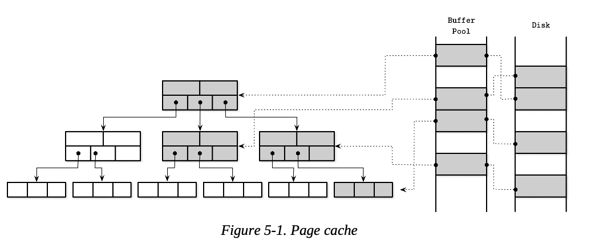
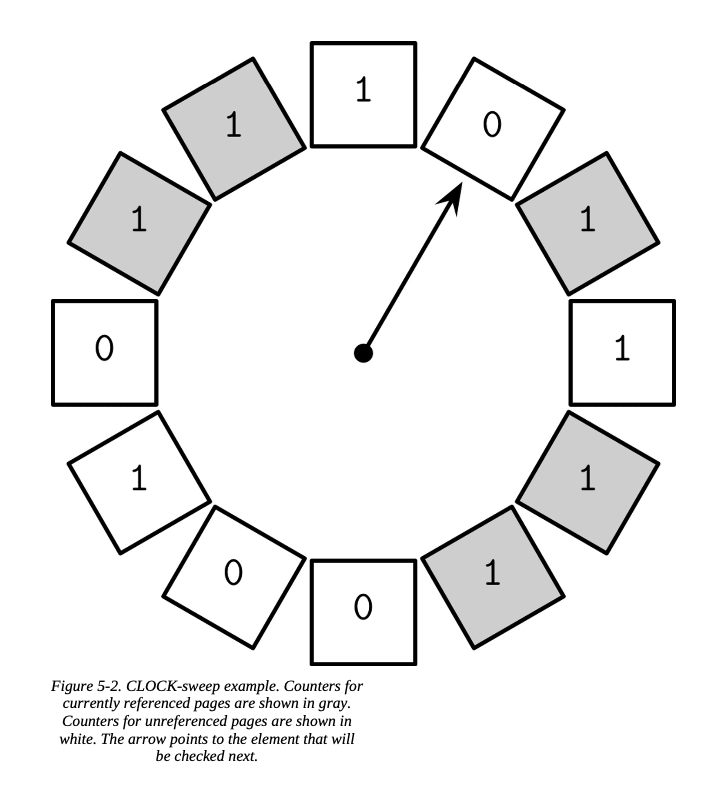
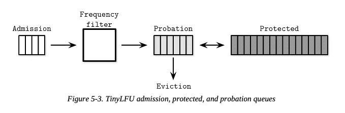

# Chapter 6. Transaction Processing and Recovery

---

지금까지 이 책에서 우리는 바텀 업 접근법을 통해 데이터 베이스 개념에 대해 다뤘다. 먼저 스토리지 구조들에 대해서 배웠었다. 이제는 하이 레벨 컴포넌트로 이동할 준비가 됐다. 데이터베이스 트랜잭션에 대해 이해하기 위해 필수적인 버퍼관리, 락 관리와 리커버리 등을 다룰 예정이다.

트랜잭션은 여러 작업을 하나의 단계로 표현할 수 있도록 하는 데이터베이스 동작의 분할할 수 없는 논리적 단위이다. 데이터 베이스에 레코드를 읽고 쓰는 작업들은 트랜잭션에 의해 실행된다. 데이터베이스 트랜잭션은 반드시 원자성, 일관성, 고립성, 영속성을 가져야만 한다. 이 속성들은 일반적으로 ACID라고 불린다.

Atomicity (원자성)

- 트랜잭션은 더 이상 나눌 수 없다. 즉 트랜잭션의 모든 작업들은 **모두 성공하거나, 모두 실패해야 한다**. 다른 말로 트랜잭션은 부분적으로 적용되어선 안된다. 트랜잭션은 각각 커밋(트랜 잭션이 진행되는 동안 진행된 모든 쓰기 작업을 반영하기) 혹은 취소 (아직 반영되지 않은 모든 트랜잭션의 부가 효과를 되돌리기) 만 될 수 있다. 커밋은 최종 작업이다. 취소된 후에는 트랜잭션은 재시도 될 수 있다.

Consistency (일관성)

- 일관성은 어플리케이션 단에서의 보증이다. 트랜잭션은 데이터베이스를 **오직 유효한 상태에서 다른 유효한 상태로만 바꿔야 한다**. 모든 불변 하는 것들은 트랜잭션 중에 유지되어야 한다. (제약 조건, 참조 무결성 등) 일관성은 가장 약하게 정의된 속성이다. (유일하게 데이터베이스 혼자서 만들어 낼 수 있는게 아닌 유저에 의해서 제어되는 속성이기 때문)

Isolation (고립성, 독립성)

- 동시에 여러 트랜잭션이 실행되어도 혼자서만 실행되는 것처럼 방해 없이 동작해야 한다. 고립성은 동시 트랜잭션 중에서 데이터베이스 상태 변경이 언제 “ 반영되는지 어떤 변경점들이 반영되는지 정의한다. 많은 데이터베이스들은 고립성 레벨 (isolation level) 을 사용하여 고립성의 정의보다 낮은 단계로 제공하는데, 성능상 이유 때문이다. 동시성 제어를 위해 사용하는 방법과 접근 방식에 따라서 트랜잭션의 변경사항들이 다른 트랜잭션에서 반영 될 수도, 안 될 수도 있다.

Durability (영속성, 지속성)

- 일단 트랜잭션이 커밋되면, 모든 데이터베이스 상태 변경 사항은 디스크에 영구적으로 지속되어야 하고 전원 차단, 시스템 중단, 충돌 등에도 살아있어야 한다.

디스크에 데이터를 저장하고 관리하는 스토리지 구조 외에도 데이터베이스에서 트랜잭션을 구현하기 위해선 여러 컴포넌트들이 함께 동작해야만 한다. 트랜잭션 매니저는 해당 노드 안에서 트랜잭션들과 각각의 단계들을 통합하고, 스케줄링하고 추적한다.

락 매니저는 이러한 자원들에 대한 접근을 보호하고, 데이터 무결성 문제를 위반할 수 있는 동시성 문제를 예방한다. 락이 요청될 때마다 락 매니저는 공유 혹은 배타적 모드에 있는 다른 트랜잭션이 이미 점유하고 있는지 확인하고, 액세스 레벨 결과(?)가 문제가 없을 시 접근 권한을 부여한다. 배타적 락들은 주어진 순간에 최대 한 개의 트랜잭션만 점유할 수 있기 때문에 다른 요청 트랜잭션들은 락이 해제될때까지 기다리거나 재시도 후에 취소되어야만 한다. 락이 풀리자마자 혹은 트랜잭션이 종료되자마자 락 매니저는 대기중인 트랜잭션에게 공지하고, 다시 락을 요구하고 진행하도록 한다.

페이지 캐시는 영구 저장소 (디스크) 와 스토리지 엔진의 빈 공간의 중개자 역할을 한다. 메인 메모리에서 상태 변경을 저장해두고, 영구 저장소와 동기화된 적 없는 페이지들을 캐시로 제공한다. 데이터베이스 상태에 대한 모든 변경 사항은 먼저 페이지 캐시에 적용된다.

로그 매니저는 충돌이 나는 경우 소실되는 경우를 막기 위해 영구 저장소에 아직 동기화 된적 없는 캐시된 페이지들에만 적용된 작업 이력들을 저장한다 (로그 엔트리). 다른 말로 로그들은 시스템 시작 시 이러한 작업들을 다시 적용하고 캐시 상태를 재 생성하기 위해 사용된다. 로그 엔트리들은 또한 취소된 트랜잭션들의 변경사항을 되돌리기 위해서도 사용된다.

분산된 트랜잭션들은 추가적인 관리와 원격 실행을 요구한다. 13 챕터에서 분산 트랜잭션에 대해 다룰 예정이다.

## Buffer Management

---

대부분의 데이터베이스는 2 단계 메모리 계층을 사용해 만들어졌다. 

- 느리지만 영구적인 저장소 (디스크)
- 빠른 메인 메모리 (RAM)

영구 저장소에 접근하는 횟수를 줄이기 위해 페이지들은 메모리에 캐시된다. 한 번 조회된 페이지가 다시 요청되면 캐시된 복사본이 반환된다.

메모리에 캐시된 페이지들은 다른 프로세스가 디스크 데이터를 수정하지 않는다는 가정하에 재사용된다. 이러한 접근은 종종 가상 디스크로서 참조된다 (라고 불린다). 가상 디스크는 메모리에 복사되어 사용 가능한 페이지가 없을때에만 물리적인 디스크에 실제로 접근한다. 이러한 개념은 조금 더 보편적으로 “페이지 캐시” 혹은 “버퍼 풀” 이라고 불린다. 페이지 캐시는 디스크에서 읽은 페이지를 메모리에 캐싱하는 역할을 한다. 데이터베이스 시스템이 충돌하거나 비정상적으로 종료되면 캐시된 콘텐츠가 손실된다.

페이지 캐시라는 용어가 이 구조의 목적을 더 잘 반영하기 때문에 이 책은 이 이름을 기본으로 사용한다. 버퍼 풀이라는 용어는 빈 버퍼를 내용을 공유하지 않고 풀링하여 재사용하는 것이 주된 목적인 것처럼 들린다. (쓰레드 풀, 커넥션 풀 처럼) 이는 페이지 캐시의 유용한 부분이 될 수도 있고 별도의 구성 요소로 사용될 수도 있지만, 전체 목적을 정확하게 반영하는건 아니다.

페이지 캐싱이라는 문제는 DB에만 국한된 문제가 아니다. OS도 페이지 캐시라는 개념을 가지고 있다. OS는 I/O 시스템 콜 성능 향상을 위해 *사용되지 않는* 메모리 세그먼트를 활용하여 투명하게 디스크 내용을 캐시한다.

> 투명하게(transparently) 캐시한다는게 무슨 의미일까?

정확히는 보이지 않게 라는 뜻이 맞는듯 함. 즉 어플리케이션이 알지 못하게 OS 단에서 캐시를 처리한다. 어플리케이션은 OS에 file.read(), write() 등의 요청을 보내 디스크 I/O 요청을 해도, OS는 메모리에 캐시되어 있는 페이지가 있다면 캐시된 페이지를 제공한다. 그리고 캐시된 메모리에서 주는지, 디스크에서 직접 읽어서 주는지 어플리케이션은 모른다는 의미.
> 

캐시되지 않은 페이지들은 디스크에서 읽어올때 캐시에 저장(paged)된다. 만약 캐시된 페이지에 어떤 변화가 발생한다면, 이러한 페이지들은 디스크에 해당 변화가 반영(flush)될 때까지 dirty page라고 부른다.

캐시된 페이지가 저장되는 메모리 영역은 일반적으로 전체 데이터셋보다 훨씬 작다. 따라서 페이지 캐시는 결국 꽉 채워지고 새 페이지를 호출하려면 캐시된 페이지 중 하나가 삭제되야 한다. B-Tree 페이지의 논리적 표현, 캐시된 버전, 디스크의 페이지 간의 관계를 확인할 수 있다. 그림 5-1 처럼 페이지 캐시는 페이지를 메모리의 자유로운 공간에 로드하므로 디스크에 페이지들이 어떻게 정렬되어 있는지 상관없이 저장된다. (디스크와 순서대로 매핑이 되지 않는다)

페이지 캐시의 주요 기능은 아래처럼 요약된다.

- 캐시된 페이지 내용을 메모리에 저장해둔다.
- 디스크 페이지에 대한 수정사항을 함께 버퍼링해두고, 캐시된 버전으로 동작하게 한다.
- 요청된 페이지가 메모리에 없고 사용 가능한 충분한 공간이 있을 경우 페이지 캐시에 올려두고 캐시된 버전을 반환한다.
- 이미 캐시된 페이지가 요청 될 경우 캐시된 버전을 반환한다.
- 만약  새로운 페이지를 위한 충분한 공간이 없을 경우, 다른 페이지들을 제거하고, 내용을 디스크에 반영한다.

> 커널 페이지 캐시 건너뛰기 (By passing)
> 

많은 데이터베이스는 `O_DIRECT` 플래그를 사용해 파일을 연다. 이 플래그는 I/O 시스템 콜이 페이지 캐시를 건너뛰고 디스크에 직접적으로 접근하도록 한다. 그리고 데이터베이스의 자체적인 버퍼 관리를 사용한다. 일부 운영 체제 개발자들은 `O_DIRECT`의 사용을 비판하기도 한다. 

Linus Torvalds 는 `O_DIRECT`가 비동기적이지 않고, read-ahead와 같이 커널에 접근 패턴을 지시할 수 있는 메커니즘이 부족하다고 지적한다. 그러나 OS가 더 나은 메커니즘을 제공하기 전까지는 여전히 유용하게 사용될 것이다. 

우리는 `fadvise`를 사용하여 커널이 캐시에서 페이지를 삭제하는 방식을 어느 정도 제어할 수 있지만, 이렇게 하면 커널에게 우리의 의견을 고려하도록 요청할 수 있을 뿐 실제로 그렇게 될 것이라는 보장은 없다. I/O를 수행할 때 시스콜을 피하기 위해 메모리 매핑을 사용할 수 있지만, 그러면 캐싱에 대한 제어력을 잃게 된다. (??)

### Caching Semantics

버퍼에서 일어난 모든 변경은 결국 디스크로 다시 쓰여지기 전까지 메모리에 계속 유지된다. 다른 프로세스가 이 파일을 변경하는 것이 허락되지 않으므로, 이 동기화는 단방향 프로세스이다. (메모리 → 디스크, 반대는 허락 X) 페이지 캐시를 사용하면 데이터베이스가 메모리 관리 및 디스크 액세스를 더 잘 제어할 수 있다. 커널 페이지 캐시를 어플리케이션 레벨에서 구현했다고 생각하면 된다. (디스크에 직접 접근함, 유사한 기능 구현, 유사한 목적 제공)
DB의 페이지 캐시는 디스크 접근을 추상화하고, 논리적 쓰기 연산과 물리적 연산을 분리한다.

> 논리와 물리 연산의 분리? → 논리 연산은 write() 함수 제공, 물리 연산은 실제로 디스크에 쓰기즉 쓰기 요청과 실제 디스크에 쓰는 시점을 분리한다.
> 

페이지 캐싱은 알고리즘 변경이나, 메모리에서 객체를 새로 만들지 않고도 트리를 부분적으로 메모리에 유지하는데 도움이 된다. 디스크 액세스를 페이지 캐시에 대한 호출로 변경하기만 하면 된다. 

스토리지 엔진이 페이지에 접근 (요청)하면 페이지 내용이 이미 캐시되어 있는지 확인하고, 캐시된 페이지 내용이 있는 경우 해당 내용을 반환한다. 아직 캐시되지 않은 경우 해당 페이지의 논리적 주소, 혹은 페이지 번호를 물리적 주소로 변환하고 (offset 계산) 해당 페이지를 메모리에 로드한 후 캐시 버전을 스토리지 엔진에 반환한다. 반환된 후에는 캐시된 페이지가 있는 버퍼는 “참조되었다” 라고 한다. (스토리지 엔진이 사용 중이다) 스토리지 엔진이 다 사용하고 나면 이를 다시 페이지 캐시로 넘기거나 참조를 해제해야 한다. 페이지 캐시는 이 페이지를 고정하여 페이지가 삭제되지 않도록 할 수도 있다. (시간적 지역성을 활용하기 위해)

> 스토리지 엔진이 사용하고 다시 캐시로 반환한다는 것의 의미?
> 

스토리지 엔진이 페이지를 사용하는 동안 중간에 삭제되지 않도록 유지한다. (참조를 유지한다)

다 사용하면 소유권을 반환하거나 참조를 해제해야 한다. → 더 안쓰니 반환할 수 있도록

소유권을 반환한다는 것의 의미? (짧은 시간 락 등 해제), latch 에 대해 공부해보자

> 특정 페이지가 삭제되지 않게 고정하는 이유?
> 

시간적, 공간적 지역성을 살리기 위해, 스토리지 엔진의 접근이 예상되는 페이지들을 고정해둘 수 있음

페이지가 수정되는 경우 (셀이 추가되는 등) 해당 페이지는 dirty로 표시된다. 페이지에 설정된 더티 플래그는 해당 페이지의 디스크와 동기화되어 있지 않아, 영속성을 위해 플러시해야 함을 이야기한다.

### Cache Eviction

캐시를 계속 채우는 것은 좋다. 영구 저장소를 조회하지 않고도 더 많은 읽기를 제공할 수 있고, 더 많은 같은 페이지 쓰기를 버퍼링 할 수 있다. 그러나 페이지 캐시의 용량은 제한되어 있으며, 나중에 새 내용을 저장하기 위해선 예전 캐시들은 제거되어야 한다. 만약 페이지 내용이 디스크와 동기화되어 있고 (이미 플러시되었거나, 수정된 적이 없는 경우)  페이지가 고정되거나 참조되어 있지 않은 경우 제거될 수 있다. 

Dirty Page는 제거되기 전에 flush 되어야 한다. 참조중인 페이지는 다른 스레드가 사용하는 동안은 제거되면 안된다.

제거가 발생할때마다 flush를 하는것은 성능에 좋지 않으므로, 일부 데이터베이스는 삭제될 가능성이 있는 dirty page들을 순회하며 디스크 버전을 업데이트하는 백그라운드 프로세스를 사용한다. 예를 들어 PostgreSQL은 “background flush writer” 가 그러한 역할을 한다.

또 다른 신경써야할 속성 중 하나는 영속성이다. 만약 데이터베이스가 충돌로 인해 종료된다면, flush 되지 않은 데이터들은 모두 유실된다. 모든 변경 사항이 영구적으로 지속되게 하려면 flush는 체크 포인트 프로세스에 의해 조정되어야 한다. 이 체크포인트 프로세스는 쓰기 선행 로그(WAL)와 **페이지 캐시**를 제어하며, 이들이 **연동하여 작동하도록(work in lockstep)** 보장한다. 플러시된 캐시 페이지에 적용된 작업과 관련된 로그 레코드만 WAL에서 제거될 수 있다. 더티 페이지는 이 프로세스가 완료될 때까지 제거할 수 없다.

> WAL과 페이지 캐시 제어?
> 

쓰기 선행 로그(WAL)는 변경 사항이 디스크에 플러시되기 전에 모든 데이터베이스 작업 기록을 **순차적으로 기록하는 디스크 저장하는 로그 기록**. 이는 log manager에 의해 관리되며, 캐시된 페이지에 적용되었지만 아직 영구 저장소와 동기화되지 않은 작업들의 이력을 보관합니다.

“Only log records associated with operations applied to cached pages that were flushed can be discarded from the WAL”

WAL에 기록된 로그 레코드들이 **관련된 메모리 내 페이지 변경 사항이 디스크에 안전하게 플러시(기록)된 후에만** WAL에서 **제거(discarded)**될 수 있다는 것을 의미한다.

이것은 여러 목표들 사이에는 항상 트레이드 오프가 있다는 것을 의미한다

- 플러시를 연기하여 디스크 액세스 횟수 줄이기
- 페이지를 빠르게 플러시하여 빠른 캐시 삭제
- 삭제할 페이지를 선택하고 최적의 순서로 플러시하기
- 캐시 크기를 메모리 한계 이내로 유지하기
- 데이터 손실 방지하기

앞의 3가지 특성을 향상시키면서 나머지 두 가지를 유지하는데 도움을 주는 몇가지 테크닉을 살펴보자.

### Locking Pages in Cache

읽기, 쓰기 작업마다 디스크 I/O를 수행하는 것은 비 실용적이다. 후속 읽기 작업이 동일한 페이지를 요청할 수 있으며, 후속 쓰기 작업이 동일한 페이지를 수정할 수도 있기 때문이다. B-트리는 상단으로 갈수록 “좁아지므로” 상위 레벨 노드들은 대부분의 읽기 작업 시 자주 접근된다. 분할(splits) 및 병합(merges) 작업 또한 궁극적으로 상위 레벨 노드로 전파된다. 이는 트리의 최소 한 부분이 항상 캐시에 존재하면 상당한 이점을 얻을 수 있다는 것을 의미한다.

우리는 가까운 시일 내에 사용될 확률이 높은 페이지들을 '잠글'(lock) 수 있다. 캐시 내에서 페이지를 잠그는 것을 고정(pinning)이라고 한다. 고정된 페이지는 메모리에 더 오래 유지되어 디스크 접근 횟수를 줄이고 성능을 향상시키는 데 도움이 된다.

각 하위 B-트리 노드 레벨은 상위 레벨보다 기하급수적으로 더 많은 노드를 가지며, 상위 레벨 노드는 트리 전체의 작은 부분(fraction)에 불과하기 때문에, 트리의 이 부분은 메모리에 영구적으로 저장할 수 있으며, 다른 부분은 필요할때만 페이지인(paged in)될 수 있다. 이는 쿼리를 수행하기 위해 h번(트리 높이) 디스크 접근을 할 필요 없이, 페이지가 캐시되지 않은 하위 레벨만 디스크를 참조하면 된다는 것을 의미한다.

서브트리에 대해 수행되는 작업은 서로 상반되는 구조적 변경을 초래할 수 있다. (ex: 여러 삭제 작업으로 인한 병합 후 반대로 쓰기 작업으로 다시 분할) 다른 서브트리에서 전파되는 구조적 변경(비슷한 시간에 발생하며, 트리의 다른 부분에서 발생하여 위로 전파되는) 도 마찬가지이다. 이러한 작업은 변경 사항을 메모리에서만 적용함으로써 함께 버퍼링될 수 있으며, 이는 디스크 쓰기 횟수를 줄이고 작업 비용을 상쇄시킬 수 있다. 여러 번의 쓰기 대신 한 번의 쓰기만 수행될 수 있기 때문이다.

> 즉 분할했다 다시 병합하는 뻘짓? 이 일어나는 경우 페이지 캐싱을 통해 실제 분할, 병합을 디스크에서 처리하지 않고 맨 마지막 변경만 반영하는게 가능해짐을 의미
> 

> **PREFETCHING 및 즉시 제거(IMMEDIATE EVICTION)**
> 

페이지 캐시는 또한 스토리지 엔진이 프리패칭 및 즉시 제거에 대해 세밀한 제어를 할 수 있도록 한다. 접근되기 전에 페이지를 미리 로드하도록 지시할 수 있다. 예를 들어, 범위 스캔(range scan)에서 리프 노드를 순회할 때 다음 리프를 미리 로드할 수 있다. 마찬가지로, 유지보수 프로세스가 페이지를 로드한 경우, 해당 프로세스가 완료된 후 즉시 페이지를 제거할 수 있다. (진행 중인 쿼리에 유용할 가능성이 낮으므로)  예를 들어 PostgreSQL은 대규모 순차 스캔에 원형 버퍼(즉, FIFO 페이지 교체 정책)를 사용한다. 

### **Page Replacement**

"캐시 용량에 도달했을 때, 새로운 페이지를 로드하려면 오래된 페이지는 제거되어야 한다. 하지만 곧 다시 접근될 가능성이 가장 낮은 페이지를 제거하지 않는다면, 불필요하게 여러 번 로드하는 상황이 발생할 수 있다. 우리는 이를 최적화하기 위해 다음 페이지 접근 가능성을 추정하는 방법을 찾아야 한다.

이를 위해, 페이지는 축축 **정책(eviction policy)**(혹은 페이지 교체 정책(page-replacement policy)에 따라 축출된다. 이 정책은 곧 다시 접근될 가능성이 가장 낮은 페이지를 찾는다. 캐시에서 페이지가 축출되면, 그 자리에 새로운 페이지가 로드될 수 있다.

페이지 캐시 구현이 효율적이려면, 성능 좋은 페이지 교체 알고리즘이 필요하다. 이상적인 페이지 교체 전략은 페이지가 접근될 순서를 예측하고 가장 오랫동안 접근되지 않을 페이지만을 축출하는 “수정 구슬(crystal ball)” 을 요구한다. 요청이 반드시 특정 패턴이나 분포를 따르지 않기 때문에 동작을 정확하게 예측하는 것은 어렵지만, 올바른 페이지 교체 전략을 사용하면 축출 횟수를 줄일 수 있다.

단순히 더 큰 캐시를 사용하면 축출 횟수를 줄일 수 있다고 생각하는 것이 논리적으로 맞는 말 같아 보인다. 그러나 항상 그렇지는 않다. 이 딜레마를 보여주는 예 중 하나가 “벨라디의 변칙(Bélády’s anomaly)”이다. 이는 사용된 페이지 교체 알고리즘이 최적이 아니라면 페이지 수를 늘리는 것이 오히려 축출 횟수를 증가시킬 수 있음을 보여준다. 곧 필요할 수 있는 페이지가 축출된 다음 다시 로드될 경우, 페이지들은 캐시 내에서 공간을 놓고 경쟁하기 시작한다. 이 때문에 우리는 상황을 개선하는 알고리즘을 현명하게 선택해야 한다.

> 벨라디의 변칙이란?
> 

### **FIFO 및 LRU**

가장 단순한 페이지 교체 전략은 FIFO(first in, first out)이다. FIFO는 페이지 ID의 큐를 삽입 순서대로 유지하며, 새로운 페이지를 큐의 꼬리에 추가한다. 페이지 캐시가 가득 차면, 큐의 맨 앞에서 요소를 가져와 가장 오래전에 추가된 페이지를 찾는다. 이 알고리즘은 나중에 있을 페이지 접근을 고려하지 않고 오직 페이지 추가 시점만 고려하기 때문에 대부분의 실제 시스템에서는 비실용적이다. 예를 들어, 루트 및 최상위 레벨 페이지는 가장 먼저 추가되므로, 트리 구조상 곧바로 다시 추가될 가능성이 높음에도 불구하고 이 알고리즘에 따르면 가장 먼저 축출 대상이 된다

FIFO 알고리즘의 자연스러운 확장으로 LRU(least-recently used)가 있다. LRU 또한 축출 후보 페이지의 큐를 삽입 순서대로 유지하지만, 반복적으로 접근된 페이지는 마치 처음 페이지인된 것처럼 큐의 꼬리로 다시 이동시킨다. 그러나 동시성 환경에서 모든 접근마다 참조를 업데이트하고 노드를 다시 연결하는 것은 비용이 많이 들 수 있다.

다른 LRU 기반 캐시 축출 전략도 있다. 예를 들어, 2Q (Two-Queue) LRU는 두 개의 큐를 유지하며, 초기 접근 시에는 페이지를 첫 번째 큐에 넣고, 후속 접근 시에는 hot queue로 이동시켜 최근 접근 페이지와 자주 접근 페이지를 구별할 수 있게 한다.  **LRU-K**는 마지막 K개의 접근을 추적하여 자주 참조되는 페이지를 식별하고, 이 정보를 사용하여 페이지별 접근 시간을 추정한다.

### CLOCK

일부 상황에서는 정밀도보다 효율성이 더 중요할 수 있다. CLOCK 알고리즘 변형은 **간결하고, 캐시 친화적이며, 동시성에 강력한** LRU **대안**으로 사용된다. 예를 들어, 리눅스는 CLOCK 알고리즘의 변형을 사용한다.

CLOCK-sweep은 원형 버퍼에 페이지에 대한 참조와 관련 접근 비트(access bits)를 유지한다. 일부 변형은 빈도를 고려하기 위해 비트 대신 카운터를 사용한다. 페이지가 접근될 때마다 해당 접근 비트는 1로 설정된다. 이 알고리즘은 원형 버퍼를 순회하면서 접근 비트를 확인한다.

- 접근 비트가 1이고 페이지가 참조되지 않은 경우, 0으로 설정되고 다음 페이지가 검사된다.
- 접근 비트가 이미 0인 경우, 해당 페이지는 후보가 되며 축출을 위해 스케줄된다.
- 페이지가 현재 참조 중인 경우, 접근 비트는 변경되지 않는다. 접근된 페이지의 접근 비트는 0이 될 수 없으므로 축출될 수 없다고 가정한다. 이는 참조된 페이지가 교체될 가능성을 줄인다.

원형 버퍼를 사용하는 장점은 클락 핸드 포인터(clock hand pointer)와 내용 **모두 compare-and-swap 작업으로 수정할 수 있어 추가 잠금 메커니즘이 필요하지 않다는 것이다**.(?) 이 알고리즘은 이해하고 구현하기 쉽고, 종종 교과서 및 실제 시스템에서 사용된다.

(동시성 제어를 위해 CAS 연산을 사용할 수 있다는 말)

LRU가 데이터베이스 시스템에 항상 최적의 교체 전략은 아니다. 때로는 예측 요소로서 최근성(recency)보다는 사용 빈도(usage frequency)를 고려하는 것이 더 실용적일 수 있다. 결국, 과부하 상태의 데이터베이스 시스템에서 최근성은 항목이 접근된 순서만을 나타낼 뿐 그다지 좋은 지표가 아닐 수 있다.

### LFU

이러한 상황을 개선하기 위해, 페이지인 이벤트 대신 **페이지 참조 이벤트**를 추적할 수 있다. 이러한 방식 중 하나는 가장 자주 접근된 페이지를 추적하는 **LFU (least-frequently used)이다.** 

**TinyLFU (**빈도 기반 페이지 축출 정책)은 페이지인 최근성을 기반으로 페이지를 축출하는 대신, 사용 빈도에 따라 페이지 순서를 정한다. 이는 인기 있는 자바 라이브러리인 Caffeine에도 구현되어 있다.

TinyLFU는 전체 기록을 유지하는 것이 비현실적으로 비쌀 수 있기 때문에, **빈도 히스토그램(frequency histogram)** 을 사용하여 캐시 접근 기록을 간결하게 유지한다.

요소는 다음 세 가지 큐 중 하나에 있을 수 있습니다**6**:

- **Admission**: LRU 정책으로 구현된 새로 추가된 요소를 유지한다
- **Probation**: 축출될 가능성이 가장 높은 요소를 보관한다
- **Protected**: 큐에 더 오래 머물러야 하는 요소를 보관한다

매번 어떤 요소를 축출할지 선택하는 대신, 이 접근 방식은 보존을 위해 어떤 요소를 승격시킬지 선택한다. 승격의 결과로 축출될 항목보다 빈도가 더 큰 항목만 프로베이션 큐로 이동할 수 있다. 후속 접근 시 항목은 프로베이션에서 프로텍티드 큐로 이동할 수 있다. 프로텍티드 큐가 가득 차면, 그중 하나의 요소는 다시 프로베이션으로 돌아가야 한다. 더 자주 접근된 항목은 보존될 가능성이 높고, 덜 자주 사용된 항목은 축출될 가능성이 높다. 

위 그림은 어드미션, 프로베이션, 프로텍티드 큐, 빈도 필터 및 축출 간의 논리적 연결을 보여준다.

최적의 캐시 축출을 위해 사용할 수 있는 다른 많은 알고리즘이 있다. 페이지 교체 전략의 선택은 **지연 시간(latency)** 및 수행되는 **I/O 작업 수**에 상당한 영향을 미치므로 반드시 잘 생각해야 한다.