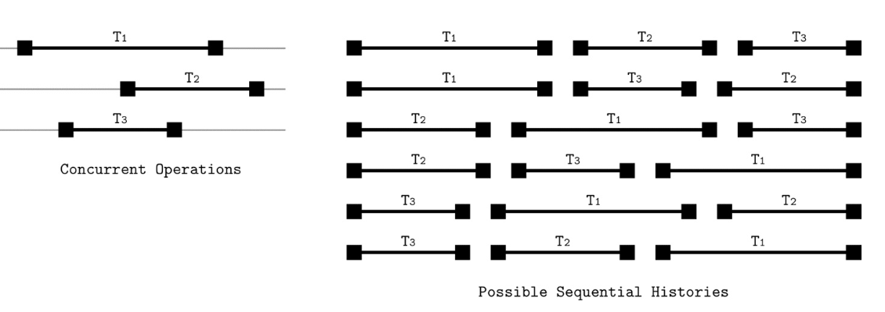
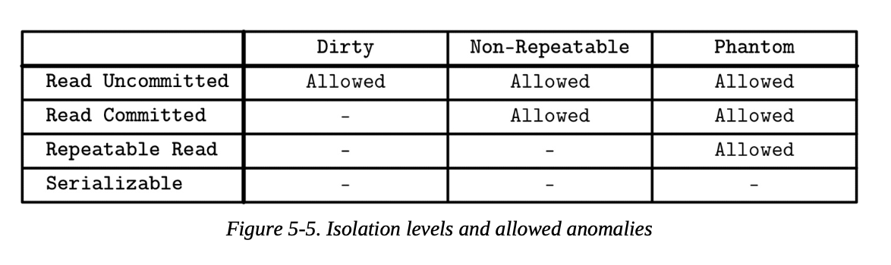

## Recovery

---

DB는 여러 하드웨어, 소프트웨어 계층 위에 구축되어 있다. 따라서 안정성 및 신뢰성 문제등이 일어날 수 있다. DB뿐 아니라 DB 아래의 여러 하드웨어, 소프트웨어 컴포넌트에서도 문제가 일어날 수 있다. 데이터베이스를 구현하는 사람들은 이러한 오류 시나리오들을 고려해서 쓰기로 약속된 (promised) 데이터가 실제로 쓰여졌는지 확인해야 한다.

WAL (write-ahead-log) 는 충돌 및 트랜잭션 복구를 위해 사용되는 append-only 디스크 기반 보조 구조이다. 페이지 캐시는 메모리의 변경사항을 버퍼링할 수 있다. 캐시된 내용이 디스크에 플러시 될 때까지 연산 기록을 기록하는 디스크 상주 복사본이 WAL에 저장된다. 많은 DBMS는 append-only WAL를 사용한다. (ex: PostgreSQL, MySQL 등)

**WAL 의 주요기능은 아래와 같다.**

- 페이지 캐시가 더 넓은 맥락에서 **영속성(durability)**을 보장하면서 디스크 페이지 업데이트를 버퍼링하도록 허용
- 해당 작업으로 인해 영향을 받은 페이지가 디스크에 동기화될 때까지 **모든 작업을 디스크에 유지**
데이터베이스 상태를 수정하는 모든 작업은 페이지가 수정되기 전에 먼저 디스크에 로그로 남아야 한다.
(즉 선 로그 → 후 캐시 페이지 변경  /  나중에 flush로 디스크 반영 → 로그 삭제)
- 충돌 발생 시 로그로부터 손실된 메모리 내 변경 사항을 재구성

이러한 기능 외에도 WAL 는 트랜잭션 처리에서 중요한 역할을 한다. WAL의 중요성은 과장하기 어렵다. (아무리 강조해도 지나치치 않다). 왜냐하면 데이터가 영구 저장소에 확실히 저장되도록 보장하고 크래시 발생 시에도 데이터를 사용할 수 있게 해주기 때문이다. 커밋되지 않은 데이터는 로그에서 재실행되어 크래시 이전의 데이터베이스 상태가 완전히 복원된다. 이번 섹션에서 우리는 종종 ARIES (Algorithm for Recovery and Isolation Exploiting Semantic)를 언급할 예정이다. ARIES는 널리 사용되는 최신 복구 알고리즘이다.

~~(여기 문장구조 진짜 왜 이러냐???)~~

> **PostgreSQL vs FSYNC()**
> 

PostgreSQL은 체크포인트를 사용하여 인덱스 및 데이터 파일이 로그 파일의 특정 레코드까지 모든 정보로 업데이트되었는지 확인한다. 모든 더티 페이지를 한 번에 디스크로 플러시하는 작업은 체크포인트 프로세스에 의해 주기적으로 수행된다. 더티 페이지 콘텐츠를 디스크와 동기화하는 작업은 fsync() 커널 호출을 통해 이루어지며, 이는 더티 페이지를 디스크에 동기화하고 커널 페이지의 더티 플래그를 해제하는 역할을 한다. 예상대로 fsync는 페이지를 디스크에 플러시할 수 없는 경우 오류를 반환한다.

Linux 및 일부 다른 운영 체제에서 fsync는 I/O 오류가 발생하더라도 성공적으로 플러시되지 않은 페이지의 더티 플래그를 해제한다. 또한 오류는 실패 시 열려 있던 파일 디스크립터에만 보고되므로, fsync는 호출된 디스크립터가 열리기 전에 발생한 오류는 반환하지 않는다.

체크포인터는 항상 모든 파일을 열어두는 것이 아니므로 오류 알림을 놓칠 수 있다. 더티 페이지 플래그가 지워지기 때문에 체크포인터는 데이터가 디스크에 성공적으로 기록되었다고 가정하지만, 실제로는 그렇지 않을 수 있다.

이러한 동작의 조합은 잠재적으로 복구 가능한 오류가 있는 경우 데이터 손실 또는 데이터베이스 손상의 원인이 될 수 있다. 이러한 동작은 감지하기 어려울 수 있으며, 이로 인해 발생하는 일부 상태는 복구 불가능할 수 있다. 때로는 이러한 동작을 유발하는 것조차 쉽지 않을 수 있다. 복구 메커니즘을 개발할 때는 항상 추가적인 주의를 기울여 모든 가능한 실패 시나리오를 철저히 고려하고 테스트해야 한다.

https://www.percona.com/blog/postgresql-fsync-failure-fixed-minor-versions-released-feb-14-2019/

PostgreSQL은 기본적으로 O_DIRECT를 사용하지 않고, OS file cache를 사용함. 따라서 위에서 말하는 dirty page는 os 단의 캐시임. 따라서 dirty page를 flush 해야 하거나 WAL을 기록할때 등 디스크에 강제로 데이터를 반영해야 할때에는 fsync() 함수를 호출해줘야 함. 

그런데 이전 버전의 리눅스 커널은 fsync() 함수에 문제가 있었음. 
(몇몇 특수한 상황에서 오류가 발생해도 page를 지워버리거나, 오류 자체를 반환하지 않는 문제) 

커널 4.13 버전 이후에서는 커널이 안정적으로 오류를 반환함. 그리고 postgreSQL은 fsync()에서 오류를 감지하면 PANIC 상태로 전환, 즉 시스템을 중지하고 충돌에 의한 데이터 복구에 들어감.

### **Log Semantics**

WAL는 append-only 로그이며 불변이므로, 모든 쓰기 작업이 순차적(sequential)이다. 또한 reader는 writer가 마지막에 데이터를 계속 추가하는 동안에도 최신 쓰기 임계값 (latest write threshold) 전까지는 안전하게 접근할 수 있다.

WAL은 **로그 레코드**로 구성된다. 각 레코드에는 고유하고 단조적으로 증가하는 LSN (Log Sequence Number)가 있다. 일반적으로 LSN은 내부 카운터 또는 타임스탬프로 표현된다. 로그 레코드가 반드시 전체 디스크 블록을 차지하는 것은 아니므로, 해당 내용은 로그 버퍼에 캐시되며, 강제(force) 작업 시에 디스크에 플러시된다. 강제 작업은 로그 버퍼가 가득 찰 때 발생하며, 트랜잭션 관리자 또는 페이지 캐시가 요청할 수 있다. 모든 로그 레코드는 LSN 순서로 디스크에 플러시되어야 합다.

개별 작업 레코드 외에도 WAL은 트랜잭션 완료를 나타내는 레코드를 포함한다. 트랜잭션은 커밋 레코드의 LSN까지 로그가 강제 적용(force up) 되기 전에는 커밋된 것으로 간주될 수 없다.

(즉 트랜잭션 commit 이라는 로그 레코드가 디스크에 쓰여진 후에야 트랜잭션이 커밋 된 것으로 간주)

시스템이 롤백 또는 복구(recovery) 중에 충돌이 일어나도 올바르게 작동할 수 있도록 일부 시스템은 CLR (*compensation log records)* 를 사용하고 이를 로그에 저장한다.

> CLR이란?
> 

롤백 혹은 복구 중 충돌에도 대응하기 위해 언두(undo) 작업 중 로그에 저장되는 특별한 로그 기록. 즉 undo 작업의 실행을 기록하는 로그. undo를 시행중에 충돌이 일어나는 경우, undo가 실행이 완료되었는지, 혹은 중간에 중단되었는지 여부를 확인할 수 있다. 즉 undo의 undo를 막을 수 있다. (선선예매? 제로제로콜라? ㅋㅋ)

WAL은 체크포인트에 도달할 때마다 로그를 trimming 할 수 있는 인터페이스를 통해 기본 저장 구조와 결합된다.
(trimming한다 → 체크포인트에 도달할때마다 스토리지에서 다 사용한 로그를 잘라낸다)

로깅은 데이터베이스의 가장 중요한 정확성 측면 중 하나이며, 제대로 구현하기가 다소 까다롭다. 로그 trimming과 데이터가 디스크에 기록되었는지 확인하는 것 사이의 아주 미세한 불일치라도 데이터 손실을 유발할 수 있다.

체크포인트는 로그가 특정 지점까지 완전히 유지되었으며 더 이상 필요하지 않음을 알리는 방법으로, 데이터베이스 시작 시 필요한 작업량을 크게 줄여준다. 보통 모든 더티 페이지를 디스크에 플러시하는 프로세스는 **동기화 체크포인트 (***sync checkpoint)* 라고 불린다.

전체 내용을 디스크에 플러시하는 것은 비실용적이며, 체크포인트가 완료될 때까지 모든 실행 중인 작업을 일시 중지해야 한다. 따라서 대부분의 데이터베이스 시스템은 **퍼지 체크포인트(***fuzzy checkpoints)*를 구현한다. 

- 로그 헤더에 last_checkpoint 포인터라는 마지막으로 성공한 체크포인트에 대한 정보를 포함한다.
- 퍼지 체크포인트는 시작을 지정하는 특별한 begin_checkpoint 로그 레코드로 시작하며, 더티 페이지 및 트랜잭션 테이블의 내용을 포함하는 end_checkpoint 로그 레코드로 끝난다
- 이 레코드로 지정된 모든 페이지가 플러시될 때까지 해당 체크포인트는 완료되지 않은 것으로 간주된다.
- 페이지는 비동기적으로 플러시되며, 이 작업이 완료되면 last_checkpoint 레코드는 begin_checkpoint 레코드의 LSN으로 업데이트되며, 충돌 시 복구 프로세스는 거기서부터 시작된다.

> bigin_checkpoint가 last_checkpoint로 업데이트 되는가?
> 

재실행 시의 안정성을 위해서, 일부러 한 번 더 실행하는 것으로 이해. 맞는지는 모르겠음

멱등하게 구현되어 있다면 문제는 없을 듯함

### **Operation Versus Data Log**

일부 데이터베이스 시스템 (ex: System R)은 **섀도우 페이징(***shadow paging)*을 사용한다. 이는 데이터 내구성 및 트랜잭션 원자성을 보장하는 **copy-on-write** 기술이다.  업데이트시 새로운 내용은 우선 섀도우 페이지 (unpublish 페이지)에 배치되고 이전 페이지에서 업데이트된 내용을 담고 있는 페이지로 포인터를 전환한 후에 보여진다.

모든 상태 변경은 before-image 와 after-image로, 또는 **redo** 및 **undo** 작업으로 표현될 수 있다. before-image에 redo 작업을 적용하면 after-image가 생성된다. 마찬가지로 after-image에 undo 작업을 적용하면 befor-image가 생성된다.

우리는 **물리 로그**(전체 페이지 상태 또는 바이트 단위 변경 사항을 저장) 또는 **논리 로그**(현재 상태에 적용해야 할 작업을 저장)를 사용하여 레코드나 페이지를 한 상태에서 다른 상태로, 시간상 역방향 및 순방향으로 이동시킬 수 있다. 물리 및 논리적로그 레코드를 적용할 수 있는 페이지의 정확한 상태를 추적하는 것이 중요하다.

물리 로깅은 비포 및 애프터 이미지를 직접 기록하며, 작업에 의해 영향을 받는 전체 페이지를 로깅해야 한다. 논리적 로그는 페이지에 적용되어야 할 작업을 지정하며, 예를 들어 연산으로 `insert a data record X for key Y` 를 기록하고, undo 연산으로 `remove the value associated with Y`하는 방식이다.

- 물리 로깅
    - 변경 전, 후 기록, undo 시에는 변경전 데이터를 이용하여 복구
    - `페이지 ID: 0xFFFF0000, 변경 전 페이지 X1, 변경 후 X2`
- 논리 로깅
    - 어떤 연산이 수행되었는지 기록, undo 시에는 어떤 연산을 수행해야 하는지도 같이 기록
    - `operation=update data record X2 for key Y` `undo=update data record X1 for key Y`

실제로 많은 데이터베이스 시스템은 이 두 가지 접근 방식을 조합하여 사용한다. 즉, 동시성 및 성능을 위해 논리적 로깅으로 undo를 수행하고, 복구 시간을 개선하기 위해 물리적 로깅으로 redo를 수행한다.

### **Steal and Force Policies**

메모리에서 변경된 내용을 디스크에 언제 플러시해야 하는지 결정하기 위해 DB는 **steal/no-steal** 및 **force/no-force** 정책을 정의한다. 이러한 정책은 대부분 페이지 캐시에 적용되지만, Recovery 챕터에서 언급하는게 더 적절하다. 왜냐하면 이 정책들이 어떤 복구 정책이 사용될 수 있는지에 대해 큰 영향을 미치기 때문이다.

트랜잭션에 의해 수정된 페이지를 트랜잭션이 커밋되기 전에도 플러시할 수 있도록 허용하는 복구 방법을 **스틸(steal) 정책**이라고 한다. **노-스틸(no-steal) 정책**은 커밋되지 않은 트랜잭션 내용을 디스크에 플러시하는 것을 허용하지 않는다. 더티 페이지를 스틸한다는 것은 (트랜잭션이 끝나기 전에) 메모리 내용을 디스크에 플러시하고 그 자리에 다른 페이지를 디스크에서 로드하는 것을 의미한다.

**포스(force) 정책**은 트랜잭션이 커밋되기 전에 트랜잭션에 의해 수정된 모든 페이지가 디스크에 플러시할 것을 요구한다. 반면에 **노-포스(no-force) 정책**은 트랜잭션 중에 수정된 일부 페이지가 아직 디스크에 플러시되지 않았더라도 트랜잭션이 커밋되는 것을 허용한다. 여기서 더티 페이지를 포스한다는 것은 커밋하기 전에 디스크에 플러시하는 것을 의미한다.

헷갈리니까 다시 정리

- steal vs no-steal
    - steal : dirty page를 트랜잭션 커밋 전에 flush 허용
    - no-steal : dirty page가 트랜잭션 커밋 전에 flush 되는 것을 금지
- force vs no-force
    - force : dirty page가 모두 플러시 되지 않으면 트랜잭션 커밋을 금지
    - no-force : dirty page가 모두 플러시 되지 않아도 트랜잭션이 커밋되는 것을 허용

스틸 및 포스 정책은 트랜잭션 undo 와 redo에 대한 영향을 이해하는 데 중요하다. Undo는 커밋된 트랜잭션에 대해 forced page (이미 플러시 된 페이지)에 대한 업데이트를 롤백하는 반면, Redo는 커밋된 트랜잭션이 수행한 변경사항을 디스크에 적용한다.

no-steal 정책을 사용하면 재실행(redo) 항목만을 사용하여 복구를 구현할 수 있다. 즉, 이전 사본은 디스크의 페이지에 포함되어 있고 수정 사항은 로그에 저장된다. 

(no-steal → 커밋이 될때까지 flush 금지 → recovery 시에 메모리 내용(혹은 WAL) 그대로 flush 하면 됨)

no-force 정책을 사용하면 여러 페이지에 대한 업데이트를 지연시킴으로써 잠재적으로 버퍼링할 수 있다. 이 시간 동안 페이지 내용이 메모리에 캐시되어야 하므로 더 큰 페이지 캐시가 필요할 수 있다.

포스 정책이 사용될 때, 충돌 복구는 커밋된 트랜잭션의 결과를 재구성하기 위한 추가 작업이 필요하지 않다. 이는 해당 트랜잭션에 의해 수정된 페이지가 이미 플러시되었기 때문이다. 이 접근 방식의 주요 단점은 I/O가 매번 필요해 트랜잭션 커밋에 더 오랜 시간이 걸린다는 것이다.

일반적으로 트랜잭션이 커밋될 때까지는 그 결과를 되돌릴 수 있는 충분한 정보가 있어야 한다. 트랜잭션에 의해 접근된 페이지 중 일부가 플러시된 경우, 트랜잭션이 커밋될 때까지 실행 취소(undo) 정보를 로그에 유지하여 롤백할 수 있도록 해야 한다. 그렇지 않으면 트랜잭션이 커밋될 때까지 재실행(redo) 기록을 로그에 유지해야 한다. 두 경우 모두 실행 취소 또는 재실행 기록이 로그 파일에 기록될 때까지 트랜잭션은 커밋될 수 없다.

- Steal 정책 사용 → 트랜잭션 끝나기 전에도 flush 가능 → 만약 트랜잭션이 롤백 될 경우 디스크 정보도 롤백해야 함 → undo 정보를 로그에 기록해둬야만 함
- no-force 정책 사용 → 트랜잭션이 끝나도 flush 안 된 데이터 존재 가능 → 충돌 발생시 커밋 내용 손상 가능 → redo 정보를 로그에 기록해두어야 함

### **ARIES**

**ARIES**는 스틸/노-포스(steal/no-force) 복구 알고리즘이다. (트랜잭션 커밋 전에 flush 가능 & 전부 flush 하지 않아도 커밋 가능) ARIES는 복구 성능 향상을 위해 물리적 재실행(physical redo)을 사용하고(변경 사항을 더 빠르게 설치할 수 있기 때문에), 정상 작동 중 동시성 개선을 위해 논리적 실행 취소(logical undo)를 사용한다. (논리적 실행 취소 작업은 페이지에 독립적으로 적용될 수 있기 때문에) 또한 복구 중 이력 반복(repeating history)을 구현하고, 커밋되지 않은 트랜잭션을 실행 취소하기 전에 데이터베이스 상태를 완전히 재구성하며, 실행 취소 중에 보상 로그 레코드(CLR)를 생성하기 위해 WAL 레코드를 사용한다.

- redo는 물리 로그를 사용함 (최종 값과 위치를 저장해두기 때문)
- undo는 논리 로그를 사용함 (페이지에 독립적, 중간에 페이지 데이터가 변경되어도 undo가 가능함)

데이터베이스 시스템이 충돌 후 다시 시작될 때, 복구는 세 단계로 진행된다.

1. **분석 단계(Analysis phase)**: 페이지 캐시의 더티 페이지와 충돌 당시 진행 중이던 트랜잭션을 찾는다. 더티 페이지에 대한 정보는 재실행 단계 시작 지점을 식별하는 데 사용된다. 진행 중인 트랜잭션 목록은 실행 취소 단계 에서 미완료 트랜잭션을 롤백하는 데 사용된다.
2. **재실행 단계(Redo phase)**: 충돌 시점까지의 이력을 반복하고 데이터베이스를 이전 상태로 복원한다. 이 단계는 미완료 트랜잭션뿐만 아니라 커밋되었지만 내용이 영구 저장소에 플러시되지 않은 트랜잭션에도 적용된다. (no-force → 트랜잭션 커밋 되었지만 아직 flush 안된 데이터 존재 가능)
3. **실행 취소 단계(Undo phase)**: 모든 미완료 트랜잭션을 롤백하고 데이터베이스를 마지막 일관된 상태로 복원한다. 모든 작업은 시간 역순으로 롤백된다. 복구 중에 데이터베이스가 다시 충돌하는 경우, 트랜잭션을 실행 취소하는 작업도 다시 반복되는 것을 방지하기 위해 로깅된다. (CLR)
    
    (steal → 트랜잭션 커밋 전에도 flush 된 데이터 존재 가능 → undo로 롤백해야 함)
    
     
    

ARIES는 LSN을 사용하여 로그 레코드를 식별하고, 실행 중인 트랜잭션에 의해 수정된 페이지를 더티 페이지 테이블에서 추적하며, 물리적 재실행, 논리적 실행 취소 및 퍼지 체크포인트를 사용한다. 이 시스템을 설명하는 논문이 1992년에 발표되었음에도 불구하고, 대부분의 개념, 접근 방식 및 패러다임은 오늘날의 트랜잭션 처리 및 복구에서도 여전히 사용된다.

## **Concurrency Control**

---

1장 DBMS 구조 파트에서 트랜잭션 매니저와 락 매니저가 동시성 제어를 위해 함께 작동한다고 배웠다. 동시성 제어는 동시에 실행되는 여러 트랜잭션 사이의 상호작용을 관리하기 위한 기술들의 집합이다. 이러한 테크닉들은 대략 아래와 같은 그룹으로 나눌 수 있다.

- OCC (*Optimistic concurrency control) - 낙관적 동시성 제어*
    - 여러 읽기, 쓰기 작업이 동시에 실행되는 것을 허용하고, 결합된 실행 결과가 직렬화 될 수 있는지 여부를 결정한다. 즉 트랜잭션이 서로를 block 하지 않고 그들의 연산 기록을 유지하며, 커밋 시에 충돌 가능성을 판단한다. 실행 결과 충돌이 발생하면 트랜잭션 중 하나가 취소된다.
- MVCC (*Multiversion concurrency control) - 멀티버젼 동시성 제어*
    - 여러 타임스탬프 버전의 레코드가 존재할 수 있도록 해, 특정 타임스탬프 시점에서 일관된 보기를 보장한다. 오직 하나의 업데이트 혹은 커밋 트랜잭션만 승리할 수 있도록 검사하는 기술을 이용해 구현한다. 락이 없는 timestamp ordering 혹은 락을 이용한 two phase locking을 사용하여 구현할 수 있다.
- PCC (*Pessimistic (also known as conservative) concurrency control) - 비관적 동시성 제어*
    - 락기반과 락 없는 (비잠금, 보수적인) 방식이 있으며 그에 따라 공유된 자원을 어떻게 관리하고, 접근 권한을 부여하는지가 다르다. 락 기반 접근법은 트랜잭션이 데이터베이스 레코드에 대한 락을 유지하여, 다른 트랜잭션들이 잠긴 레코드를 수정하거나 수정 중인 레코드에 접근하는 것을 방지한다. 비잠금 방식은 아직 끝나지 않은 트랜잭션 스케줄에 따라 읽기와 쓰기 연산 리스트들을 유지하고 실행을 제한해야 한다. 비관적 스케줄들 (Pessimistic schedules)은 여러 트랜잭션들이 서로의 락 점유가 종료될때까지 기다리면서 데드락을 유발할 수 있다.

이번 챕터에서 우리는 로컬 노드에서의 동시성 제어 기술에 대해서만 다룬다. 다중 노드에 대한 동시성 제어에 대한 정보는 13 챕터에서 찾을 수 있다. (deterministic concurrency control)

동시성 제어에 대해 이야기를 나누기 전에, 우리는 우리가 해결하려고 하는 몇가지 문제점들을 정의하고, 어떻게 트랜잭션 연산들이 겹치고, 이러한 겹침이 어떤 결과를 가져오는지 이야기해봐야 한다.

### **Serializability**

트랜잭션은 데이터베이스 상태에 대해 실행되는 읽기 및 쓰기 작업과 비즈니스 로직(읽은 내용에 대한 변경)으로 구성된다. 스케줄은 데이터베이스 시스템 관점에서 트랜잭션들을 실행하기 위해 필요한 연산들(읽기, 쓰기, 커밋 혹은 취소 작업)의 리스트이다. (해당 연산들 외의 다른 모든 작업은 부작용이 없는 것으로 가정된다. 즉, 데이터베이스 상태에 영향을 미치지 않는다)

스케줄은 포함된 트랜잭션에서 실행된 모든 작업을 포함할 때 완료된(complete) 것으로 간주된다. 올바른 스케줄은 원래 연산들의 목록의 논리적으로 같다. 그러나 ACID 속성과 개별 트랜잭션 결과의 정확성을 위반하지 않는 한, 최적화를 위해 일부 연산들을 병렬로 실행하거나 재정렬할 수 있다.

스케줄은 트랜잭션이 완전히 독립적으로 그리고 어떠한 상호 간섭(*interleaving*) 없이 실행될 때 직렬적(*serial*) 이라고 한다. (즉, 모든 이전 트랜잭션들 완전히 실행된 후에 다음 트랜잭션이 시작될 때). 직렬 실행은 이해하기 매우 쉽다 (여러 단계의 트랜잭션들의 상호 간섭과 대조적으로) 그러나 항상 트랜잭션을 하나씩 실행하는 것은 시스템 처리량(throughput)을 크게 제한하고 성능을 저해할 것이다.

- 예를 들면 아래와 같은 두 트랜잭션을 생각해보자. (A = 100일때)
    - Transaction1 : A → A + 100
    - Transaction2 : A → A * 2
- 둘을 직렬로 실행시 A의 값은 아래와 같이 변한다
    - t1 : 조회 (A = 100) → 계산 (100 + 100 = 200) → 수정 (A = 200)
    - t2 : 조회 (A = 200) → 계산 (200 * 2 = 400) → **수정 (A = 400)**
- 둘을 병렬로 실행하면 두 트랜잭션들의 연산들이 여러 가능성을 가지고 섞인다.
    - t1 조회 (A = 100) , t2 조회 (A = 100)
    - t1 계산 (100 + 100 = 200),  t2 계산 (100 * 2 = 200)
    - t1 수정 (A = 200),  **t2 수정 (A = 200)**
- 직렬 수행은 결과를 예측하기 쉬우나 성능에 문제가 큼, 병렬 실행은 트랜잭션끼리 서로 간섭 가능

트랜잭션 작업을 동시에 실행하면서 직렬 스케줄의 정확성과 단순성을 유지하는 방법을 찾아야 한다. 이는 직렬화 가능한 스케줄(*serializable schedules*)을 통해 달성할 수 있다. 어떤 스케줄이 스케줄내의 트랜잭션들을 특정 순서로 직렬화해서 실행한 것과 결과가 동등할 때 직렬화 가능하다고 한다. ****다시 말해, 직렬화 가능한 스케줄은 일련의 트랜잭션을 어떤 순서로든 하나씩 실행한 것과 동일한 결과를 생성한다. 그림은 세 가지 동시 트랜잭션과 가능한 실행 이력을 보여준다. (3! = 6가지 순서)

이게 무슨 말이냐면

- 트랜잭션들이 동시에 수행될때 트랜잭션 내부의 연산들로 스케줄을 생성한다.
- 해당 스케줄을 그대로 수행했을때 (동시, 병렬 처리도 하면서)
- 결과가 특정한 순서로 직렬 수행한것과 같으면? → 직렬화 가능한 스케줄 (serializable schedule)이다.

위의 예시를 다시 들어서 설명해보면

- Transaction1 : A → A + 100
- Transaction2 : A → A * 2

두 트랜잭션을 직렬 실행했을때

- t1 → t2 순으로 직렬 실행되면 결과는 A = 100 → 200 → 400
- t2 → t1 순으로 직렬 실행되면 결과는 A = 100 → 200 → 300

이때 t1, t2를 스케줄화 해서 병렬로 실행했을때 결과가 400 혹은 300 이라면 직렬화 가능한 스케줄

위의 예시처럼 이상하게 꼬여서 결과가 200 이 나오면 안된다는 이야기

### **Transaction Isolation**

트랜잭션을 구현하는 DBMS는 다양한 격리 수준(isolation level)을 허용한다. 격리 수준은 어떻게 그리고 언제 트랜잭션 작업의 일부가 다른 트랜잭션에 보일 수 있는지 정의한다. 다른말로 격리 수준은 트랜잭션이 동시에 실행중인 다른 트랜잭션들로부터 격리되는 정도와 어떤 이상 현상(anomalies) 들이 실행중에 발생할 수 있는지에 대해 묘사한다.

격리를 구현하는 것에는 비용이 따른다. 트랜잭션 경계를 넘어서 전파되는 완료되지 않거나 일시적인 쓰기 작업을 예방하기 위해, 우리는 성능에는 악영향을 주는 추가적인 조정과 동기화가 필요하다. 

### **Read and Write Anomalies**

SQL 표준은 동시 트랜잭션 실행 중 발생할 수 있는 읽기 이상 현상(read anomalies)으로 **dirty reads**, **nonrepeatable reads** 그리고 **phantom reads**를 언급하고 설명한다.

Dirty Read는 트랜잭션이 다른 트랜잭션의 **커밋되지 않은 변경 사항**을 읽을 수 있는 상황이다. 예를 들어, 트랜잭션 T1이 사용자 레코드의 주소 필드를 새로운 값으로 업데이트하고, 트랜잭션 T2가 T1이 커밋하기 전에 이 업데이트된 주소를 읽는 경우가 있다. 만약 트랜잭션 T1이 중단(abort)되고 실행 결과가 롤백된다면, T2는 이미 이 값을 읽었으므로, ****한 번도 커밋되지 않은 값에 접근한 것이 된다.

Nonrepeatable Read (혹은 fuzzy read) 는 트랜잭션이 동일한 행을 두 번 조회했지만 다른 결과를 얻는 상황이다. 예를 들어, 트랜잭션 T1이 행을 읽은 다음, 트랜잭션 T2가 이를 수정하고 변경 사항을 커밋하는 경우에 이런 상황이 발생할 수 있다. 만약 T1이 실행을 완료하기 전에 동일한 행을 다시 요청하면, 같은 레코드이지만 이전 실행과 다른 결과를 얻게 된다.

만약 트랜잭션 도중에 범위 읽기(즉, 단일 데이터 레코드가 아닌 범위로 조회)를 사용할 때 phantom records 를 볼 수 있다. Phantom Read 는 트랜잭션이 동일한 로우 세트를 두 번 조회했지만 다른 결과를 받는 것을 말한다. 이는 Nonrepeatable Read와 유사하지만, 범위 쿼리의 경우를 이야기한다.

유사한 의미를 가진 쓰기 이상 현상들(write anomalies)도 있다

- lost update
- dirty write
- write skew

Lost Update 는 트랜잭션 T1과 T2가 모두 값 V를 업데이트하려고 시도할 때 발생한다. T1과 T2는 모두 V의 값을 읽는다. T1이 V를 업데이트하고 커밋하며, 그 후에 T2가 V를 업데이트하고 커밋합니다. 트랜잭션들이 서로의 존재를 알지 못하므로, 둘 다 커밋이 허용되면 T1의 결과는 T2의 결과에 의해 덮어쓰여지고 T1의 업데이트는 손실됩니다. (같은 레코드에 대한 업데이트가 동시에 실행될 때 첫번째 업데이트가 사라지는 현상, 처음 예시와 동일)

Dirty Write 는 트랜잭션 중 하나가 아직 커밋되지 않은 값을 조회하고(dirty read), 이를 수정한 후 저장하는 상황이다. 즉 트랜잭션 결과가 한 번도 커밋되지 않은 값에 기반하는 경우를 이야기한다.

Write Skew 는 각 개별 트랜잭션이 필요한 불변식(invariants, 제약 사항으로 이해하면 될 듯 함)을 준수하지만, 이들의 조합이 해당 불변식을 충족하지 못할 때 발생한다. 예를 들어, 트랜잭션 T1과 T2가 두 계정 A1과 A2의 값을 수정하는 경우를 생각해보자. A1은 100달러로 시작하고 A2는 150달러로 시작하며, 두 계정의 합계가 음수가 아니면 계정 값이 음수가 될 수 있다고 가정하자. (A1 + A2 >= 0). T1과 T2는 각각 A1과 A2에서 200달러를 인출하려고 시도한다. 이 트랜잭션들이 시작될 때 A1 + A2는 250달러이므로, 총 250달러가 사용 가능합니다. 두 트랜잭션 모두 자신들이 불변식을 유지한다고 가정하고 커밋이 허용된다. 커밋 후, A1은 -100달러, A2는 -50달러가 되어, 계정 합계를 양수로 유지해야 한다는 요구 사항을 명확히 위반한다.

### **Isolation Levels**

가장 낮은(약한) 격리 수준은 *read uncommitted 이다.* 이 격리 수준에선 시스템은 한 트랜잭션이 동시에 실행중인 다른 트랜잭션의 커밋되지 않은 변경사항을 조회하는 것이 허용된다. 다른말로 dirty read가 허용된다.

우리는 특정한 트랜잭션에 의해 수행되는 어떠한 읽기도 이미 커밋된 변경사항만 읽을 수 있도록 확실하게 함으로 몇몇 이상 현상을 피할 수 있다. 그러나 그것은 만약 그 트랜잭션이 같은 데이터를 나중에 다시 조회했을때 같은 값을 읽어올 것이라고 보장하지는 않는다. (Nonrepeatable Read) 만약 같은 트랜잭션내의 두 조회, 두개의 쿼리 사이에 변경사항이 커밋될 경우 다른 결과를 가져올 것이다. 다른 말로 dirty reads는 막지만, phantom read nonrepeatable reads는 막을 수 없다. 이러한 격리 수준을 *read commited* 라고 부른다. 만약 여기서 nonrepeatable reads 또한 허용하지 않는다면 *repeatable read* 격리 수준이라고 부른다.

가장 강한 격리 수준은 *serializability* 이다. 우리가 이전 챕터 Serializability에서 언급한 것 처럼 이것은 트랜잭션 결과들이 마치 트랜잭션들이 특정한 순서에 따라 직렬적으로 수행된 것 처럼 나타나는 것을 보장한다. 동시 실행을 허락하지 않는 것은 디비 퍼포먼스에 상당히 부정적인 영향을 끼칠 수 있다. 트랜잭션들은 내부 불변속성 (제약 조건) 이 유지되고 동시에 실행될 수 있는 한, 재정렬될 수 있다. 하지만 전체 결과는 특정한 순서로 직렬 실행된 것처럼 나타나야 한다.

> 왜 repeatable reads도 phantom reads는 허용할까?

의존성을 가지지 않는 트랜잭션들은 결과가 완전히 독립적이기 때문에 어떤 순서로도 실행될 수 있다. 분산 시스템에서 설명할 선형화 가능성 (linearizability) 과는 다르게, 직렬화 가능성 (serializability)은 임의의 순서로 실행되는 다수의 연산들에 대한 속성이다. 그것은 실행중인 트랜잭션에 대해 특정한 순서를 도입하는 것을 의미하지 않는다. ACID의 고립성(Isolation)은 serializability를 의미한다. 불행하게도 serializability를 구현하는 것은 조정이 요구된다. 다른말로 동시에 실행중인 트랜잭션들은 불변 규칙들을 지키고, 충돌하는 연산들에 대한 순차적인 순서를 부여하기 위해 조정되어야 한다. 

일부 데이터베이스는 스냅샷 격리 개념을 사용한다. 스냅샷 격리에선 트랜잭션이 시작된는 시점에 다른 모든 트랜잭션들이 커밋했던 상태 변경을 관측할 수 있다. 각각의 트랜잭션은 데이터 스냅샷을 가지고, 그것에 대해 쿼리를 수행한다. 이 스냅샷은 트랜잭션 실행중에는 변경되지 않는다. 트랜잭션은 수정하려는 값이 트랜잭션이 실행되는 동안 변경되지 않았을때만 커밋할 수 있다. 아닌 경우에 그 트랜잭션은 취소되거나 롤백된다.

만약 두개의 트랜잭션이 같은 값을 수정하려고 시도하면, 오직 하나만 커밋이 허락된다. 이것은 lost update를 방지한다. 예를 들어 트랜잭션 T1과 T2 모두 V라는 값을 수정하길 시도한다고 해보자. 그들은 동시에 V의 현재 값을 스냅샷에서 부터 읽어온다. (해당 트랜잭션들이 시작하기 전에 커밋된 모든 트랜잭션들의 변경 내용을 포함하는 스냅샷) 어떤 트랜잭션이 먼저 커밋을 시도하거나 커밋해도, 나머지 하나는 취소된다. 대신 실패한 트랜잭션은 덮어씌워진 값으로 재시도한다.

그러나 스냅샷 격리에서도 write skew 이상 현상은 발생할 수 있다. (만약 두 트랜잭션들이 로컬 상태를 읽고, 독립적으로 레코드를 수정하고, 로컬 제약사항을 지키고, 둘 다 커밋이 허락되면) 분산 트랜잭션에서의 더 자세한 스냅샷 격리에 대해 나중에 다시 다룰 예정이다.